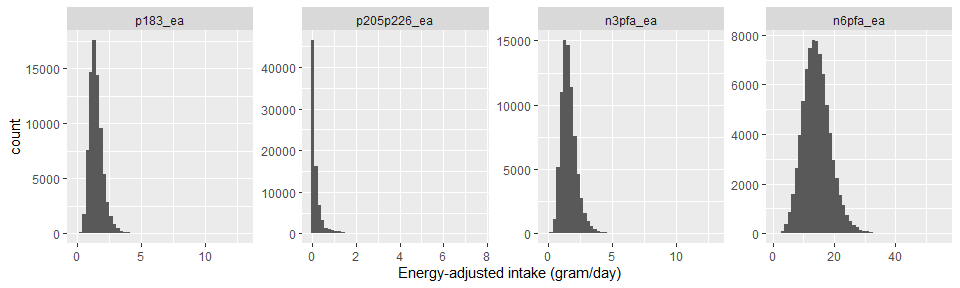

AHS-2 lupus study 2
================

## Dataset

-   Filename: `lupus-initial-dataset-v1-2022-04-25.csv`
    -   Data received on 4/25/2022
    -   Includes *n* = 93467 subjects and 115 variables
    -   No imputations
-   To create an analytic file:
    -   Included only non-Hispanic White or Black
    -   Excluded if age at baseline \< 30 years
    -   Excluded extreme energy intake of \<500 or \>4500 kcal
    -   Excluded any subjects with missing gender, education, smoking
        history, dietary pattern and BMI
    -   This resulted in *n* = 77795 subjects (15672 subjects were
        excluded)
-   **For now, both males and females are included in the analytic
    dataset**

## Outcome

-   Prevalent cases of SLE were identified using the baseline
    questionnaire
    -   Includes only those who “have been treated for SLE in the last
        12 months” at baseline
    -   (“Years since the 1st diagnosis” was not used, following the
        case definition in the manuscript)
-   There were 237 prevalent cases (0.3%) of SLE

## Descriptive table

-   Descriptive table stratified by cases/non-cases
    -   Variables were categorized following the original manuscript

<table>
<thead>
<tr>
<th style="text-align:left;">
</th>
<th style="text-align:left;">
level
</th>
<th style="text-align:left;">
No
</th>
<th style="text-align:left;">
Yes
</th>
<th style="text-align:left;">
p
</th>
<th style="text-align:left;">
test
</th>
</tr>
</thead>
<tbody>
<tr>
<td style="text-align:left;">
n
</td>
<td style="text-align:left;">
</td>
<td style="text-align:left;">
77558
</td>
<td style="text-align:left;">
237
</td>
<td style="text-align:left;">
</td>
<td style="text-align:left;">
</td>
</tr>
<tr>
<td style="text-align:left;">
age (mean (SD))
</td>
<td style="text-align:left;">
</td>
<td style="text-align:left;">
58.65 (14.28)
</td>
<td style="text-align:left;">
57.33 (12.15)
</td>
<td style="text-align:left;">
0.1539
</td>
<td style="text-align:left;">
</td>
</tr>
<tr>
<td style="text-align:left;">
agecat (%)
</td>
<td style="text-align:left;">
30-39
</td>
<td style="text-align:left;">
7619 ( 9.8)
</td>
<td style="text-align:left;">
14 ( 5.9)
</td>
<td style="text-align:left;">
0.0218
</td>
<td style="text-align:left;">
</td>
</tr>
<tr>
<td style="text-align:left;">
</td>
<td style="text-align:left;">
40-59
</td>
<td style="text-align:left;">
35187 (45.4)
</td>
<td style="text-align:left;">
126 (53.2)
</td>
<td style="text-align:left;">
</td>
<td style="text-align:left;">
</td>
</tr>
<tr>
<td style="text-align:left;">
</td>
<td style="text-align:left;">
\>=60
</td>
<td style="text-align:left;">
34752 (44.8)
</td>
<td style="text-align:left;">
97 (40.9)
</td>
<td style="text-align:left;">
</td>
<td style="text-align:left;">
</td>
</tr>
<tr>
<td style="text-align:left;">
black (%)
</td>
<td style="text-align:left;">
White
</td>
<td style="text-align:left;">
56736 (73.2)
</td>
<td style="text-align:left;">
140 (59.1)
</td>
<td style="text-align:left;">
\<0.0001
</td>
<td style="text-align:left;">
</td>
</tr>
<tr>
<td style="text-align:left;">
</td>
<td style="text-align:left;">
Black
</td>
<td style="text-align:left;">
20822 (26.8)
</td>
<td style="text-align:left;">
97 (40.9)
</td>
<td style="text-align:left;">
</td>
<td style="text-align:left;">
</td>
</tr>
<tr>
<td style="text-align:left;">
sex (%)
</td>
<td style="text-align:left;">
Female
</td>
<td style="text-align:left;">
50322 (64.9)
</td>
<td style="text-align:left;">
220 (92.8)
</td>
<td style="text-align:left;">
\<0.0001
</td>
<td style="text-align:left;">
</td>
</tr>
<tr>
<td style="text-align:left;">
</td>
<td style="text-align:left;">
Male
</td>
<td style="text-align:left;">
27236 (35.1)
</td>
<td style="text-align:left;">
17 ( 7.2)
</td>
<td style="text-align:left;">
</td>
<td style="text-align:left;">
</td>
</tr>
<tr>
<td style="text-align:left;">
smkever (%)
</td>
<td style="text-align:left;">
Never
</td>
<td style="text-align:left;">
61942 (79.9)
</td>
<td style="text-align:left;">
173 (73.0)
</td>
<td style="text-align:left;">
0.0107
</td>
<td style="text-align:left;">
</td>
</tr>
<tr>
<td style="text-align:left;">
</td>
<td style="text-align:left;">
Ever
</td>
<td style="text-align:left;">
15616 (20.1)
</td>
<td style="text-align:left;">
64 (27.0)
</td>
<td style="text-align:left;">
</td>
<td style="text-align:left;">
</td>
</tr>
<tr>
<td style="text-align:left;">
educat3 (%)
</td>
<td style="text-align:left;">
HS or less
</td>
<td style="text-align:left;">
16933 (21.8)
</td>
<td style="text-align:left;">
48 (20.3)
</td>
<td style="text-align:left;">
0.3841
</td>
<td style="text-align:left;">
</td>
</tr>
<tr>
<td style="text-align:left;">
</td>
<td style="text-align:left;">
Some college
</td>
<td style="text-align:left;">
30943 (39.9)
</td>
<td style="text-align:left;">
105 (44.3)
</td>
<td style="text-align:left;">
</td>
<td style="text-align:left;">
</td>
</tr>
<tr>
<td style="text-align:left;">
</td>
<td style="text-align:left;">
Col grad
</td>
<td style="text-align:left;">
29682 (38.3)
</td>
<td style="text-align:left;">
84 (35.4)
</td>
<td style="text-align:left;">
</td>
<td style="text-align:left;">
</td>
</tr>
<tr>
<td style="text-align:left;">
vegstat3 (%)
</td>
<td style="text-align:left;">
Vegetarians
</td>
<td style="text-align:left;">
29782 (38.4)
</td>
<td style="text-align:left;">
68 (28.7)
</td>
<td style="text-align:left;">
0.0078
</td>
<td style="text-align:left;">
</td>
</tr>
<tr>
<td style="text-align:left;">
</td>
<td style="text-align:left;">
Pesco
</td>
<td style="text-align:left;">
7457 ( 9.6)
</td>
<td style="text-align:left;">
24 (10.1)
</td>
<td style="text-align:left;">
</td>
<td style="text-align:left;">
</td>
</tr>
<tr>
<td style="text-align:left;">
</td>
<td style="text-align:left;">
Non-veg
</td>
<td style="text-align:left;">
40319 (52.0)
</td>
<td style="text-align:left;">
145 (61.2)
</td>
<td style="text-align:left;">
</td>
<td style="text-align:left;">
</td>
</tr>
<tr>
<td style="text-align:left;">
take_fo (%)
</td>
<td style="text-align:left;">
No
</td>
<td style="text-align:left;">
69406 (89.5)
</td>
<td style="text-align:left;">
191 (80.6)
</td>
<td style="text-align:left;">
\<0.0001
</td>
<td style="text-align:left;">
</td>
</tr>
<tr>
<td style="text-align:left;">
</td>
<td style="text-align:left;">
Yes
</td>
<td style="text-align:left;">
8152 (10.5)
</td>
<td style="text-align:left;">
46 (19.4)
</td>
<td style="text-align:left;">
</td>
<td style="text-align:left;">
</td>
</tr>
<tr>
<td style="text-align:left;">
bmi (mean (SD))
</td>
<td style="text-align:left;">
</td>
<td style="text-align:left;">
27.22 (6.03)
</td>
<td style="text-align:left;">
29.86 (9.19)
</td>
<td style="text-align:left;">
\<0.0001
</td>
<td style="text-align:left;">
</td>
</tr>
<tr>
<td style="text-align:left;">
bmicat (%)
</td>
<td style="text-align:left;">
Normal
</td>
<td style="text-align:left;">
31158 (40.2)
</td>
<td style="text-align:left;">
74 (31.2)
</td>
<td style="text-align:left;">
0.0020
</td>
<td style="text-align:left;">
</td>
</tr>
<tr>
<td style="text-align:left;">
</td>
<td style="text-align:left;">
Overweight
</td>
<td style="text-align:left;">
26937 (34.7)
</td>
<td style="text-align:left;">
82 (34.6)
</td>
<td style="text-align:left;">
</td>
<td style="text-align:left;">
</td>
</tr>
<tr>
<td style="text-align:left;">
</td>
<td style="text-align:left;">
Obese
</td>
<td style="text-align:left;">
19463 (25.1)
</td>
<td style="text-align:left;">
81 (34.2)
</td>
<td style="text-align:left;">
</td>
<td style="text-align:left;">
</td>
</tr>
<tr>
<td style="text-align:left;">
kcal (mean (SD))
</td>
<td style="text-align:left;">
</td>
<td style="text-align:left;">
1805.09 (719.61)
</td>
<td style="text-align:left;">
1790.44 (745.65)
</td>
<td style="text-align:left;">
0.7543
</td>
<td style="text-align:left;">
</td>
</tr>
</tbody>
</table>

## Diagnosis of SLE and use of fish oil supplement

-   Among those who were diagnosed with SLE and takes fish oil
    supplement, a crosstab was created between years since diagnosis and
    the duration of fish oil supplement use:

<table>
<thead>
<tr>
<th style="text-align:left;">
</th>
<th style="text-align:center;">
0-1 year
</th>
<th style="text-align:center;">
2-4 years
</th>
<th style="text-align:center;">
5-9 years
</th>
<th style="text-align:center;">
10+ years
</th>
<th style="text-align:center;">
Total
</th>
</tr>
</thead>
<tbody>
<tr>
<td style="text-align:left;">
Diagnosed with SLE
</td>
<td style="text-align:center;">
</td>
<td style="text-align:center;">
</td>
<td style="text-align:center;">
</td>
<td style="text-align:center;">
</td>
<td style="text-align:center;">
</td>
</tr>
<tr>
<td style="text-align:left;">
\<5 years ago
</td>
<td style="text-align:center;">
7
</td>
<td style="text-align:center;">
7
</td>
<td style="text-align:center;">
2
</td>
<td style="text-align:center;">
3
</td>
<td style="text-align:center;">
19
</td>
</tr>
<tr>
<td style="text-align:left;">
5-9 years ago
</td>
<td style="text-align:center;">
1
</td>
<td style="text-align:center;">
2
</td>
<td style="text-align:center;">
0
</td>
<td style="text-align:center;">
1
</td>
<td style="text-align:center;">
4
</td>
</tr>
<tr>
<td style="text-align:left;">
10-14 years ago
</td>
<td style="text-align:center;">
3
</td>
<td style="text-align:center;">
4
</td>
<td style="text-align:center;">
0
</td>
<td style="text-align:center;">
1
</td>
<td style="text-align:center;">
8
</td>
</tr>
<tr>
<td style="text-align:left;">
15-19 years ago
</td>
<td style="text-align:center;">
2
</td>
<td style="text-align:center;">
1
</td>
<td style="text-align:center;">
0
</td>
<td style="text-align:center;">
0
</td>
<td style="text-align:center;">
3
</td>
</tr>
<tr>
<td style="text-align:left;">
20+ years ago
</td>
<td style="text-align:center;">
2
</td>
<td style="text-align:center;">
1
</td>
<td style="text-align:center;">
2
</td>
<td style="text-align:center;">
1
</td>
<td style="text-align:center;">
6
</td>
</tr>
<tr>
<td style="text-align:left;">
Total
</td>
<td style="text-align:center;">
15
</td>
<td style="text-align:center;">
15
</td>
<td style="text-align:center;">
4
</td>
<td style="text-align:center;">
6
</td>
<td style="text-align:center;">
40
</td>
</tr>
</tbody>
</table>

## Energy-adjusted fatty acid intake

-   The nutrient intake data include the following fatty acids
    -   Each FA has both dietary and supplement intake

<table>
<thead>
<tr>
<th style="text-align:left;">
fa_name
</th>
<th style="text-align:left;">
lipid
</th>
<th style="text-align:left;">
note
</th>
</tr>
</thead>
<tbody>
<tr>
<td style="text-align:left;">
ALA
</td>
<td style="text-align:left;">
p183
</td>
<td style="text-align:left;">
Omega-3
</td>
</tr>
<tr>
<td style="text-align:left;">
SDA
</td>
<td style="text-align:left;">
p184
</td>
<td style="text-align:left;">
Omega-3
</td>
</tr>
<tr>
<td style="text-align:left;">
EPA
</td>
<td style="text-align:left;">
p205
</td>
<td style="text-align:left;">
Omega-3
</td>
</tr>
<tr>
<td style="text-align:left;">
DPA
</td>
<td style="text-align:left;">
p225
</td>
<td style="text-align:left;">
Omega-3
</td>
</tr>
<tr>
<td style="text-align:left;">
DHA
</td>
<td style="text-align:left;">
p226
</td>
<td style="text-align:left;">
Omega-3
</td>
</tr>
<tr>
<td style="text-align:left;">
LA
</td>
<td style="text-align:left;">
p182
</td>
<td style="text-align:left;">
Omega-6
</td>
</tr>
<tr>
<td style="text-align:left;">
AA
</td>
<td style="text-align:left;">
p204
</td>
<td style="text-align:left;">
Omega-6
</td>
</tr>
</tbody>
</table>

-   For each FA, its dietary intake was energy-adjusted by the residual
    method, while partitioning zero intake ([Jaceldo-Siegl et al.,
    2011](https://www.ncbi.nlm.nih.gov/pmc/articles/PMC3433053/)). Due
    to its highly right-skewed distribution, non-zero intake was
    log-transformed before being regressed on the total energy intake.
    Residuals were added by the mean of log and then back-transformed to
    obtain energy-adjusted dietary intake. Energy-adjusted dietary
    intake was added with (unadjusted) supplement intake to form
    energy-adjuste total intake.
    -   Energy-adjusted total omega-3 fatty acid intake was calculated
        as the sum of the following energy-adjusted FAs: ALA, SDA, EPA,
        DPA and DHA.
    -   Energy-adjusted total omega-6 fatty acid intake was calculated
        as the sum of the following energy-adjusted FAs: LA, AA
-   Distributions of energy-adjusted ALA, EPA + DHA, total omega-3, and
    total omega-6 are highly right-skewed:

<!-- -->

-   Density plots by prevalent SLE status are shown below. Note that the
    x-axis is in a pseudo-log scale:

<!-- -->

-   A Spearman correlation matrix among energy-adjusted ALA, EPA + DHA,
    total omega-3, and total omega-6 is shown below
    -   ALA is moderately positively correlated with omega-3 and omega-6
        fatty acids.

<table>
<thead>
<tr>
<th style="text-align:left;">
</th>
<th style="text-align:right;">
p183_ea
</th>
<th style="text-align:right;">
p205p226_ea
</th>
<th style="text-align:right;">
n3pfa_ea
</th>
<th style="text-align:right;">
n6pfa_ea
</th>
</tr>
</thead>
<tbody>
<tr>
<td style="text-align:left;">
p183_ea
</td>
<td style="text-align:right;">
1.000
</td>
<td style="text-align:right;">
0.009
</td>
<td style="text-align:right;">
0.887
</td>
<td style="text-align:right;">
0.736
</td>
</tr>
<tr>
<td style="text-align:left;">
p205p226_ea
</td>
<td style="text-align:right;">
0.009
</td>
<td style="text-align:right;">
1.000
</td>
<td style="text-align:right;">
0.347
</td>
<td style="text-align:right;">
-0.100
</td>
</tr>
<tr>
<td style="text-align:left;">
n3pfa_ea
</td>
<td style="text-align:right;">
0.887
</td>
<td style="text-align:right;">
0.347
</td>
<td style="text-align:right;">
1.000
</td>
<td style="text-align:right;">
0.607
</td>
</tr>
<tr>
<td style="text-align:left;">
n6pfa_ea
</td>
<td style="text-align:right;">
0.736
</td>
<td style="text-align:right;">
-0.100
</td>
<td style="text-align:right;">
0.607
</td>
<td style="text-align:right;">
1.000
</td>
</tr>
</tbody>
</table>

-   Median (IQR) intake (gram/day) of energy-adjusted ALA, EPA + DHA,
    total omega-3, and total omega-6 by cases/non-cases:
    -   For EPA + DHA and total omega-3, those with SLE had
        significantly higher intake than those without SLE.

<table class="gmisc_table" style="border-collapse: collapse; margin-top: 1em; margin-bottom: 1em;">
<thead>
<tr>
<td colspan="4" style="text-align: left;">
Median (IQR) energy-adjusted intake of fatty acids (gram/day)
</td>
</tr>
<tr>
<th style="border-bottom: 1px solid grey; border-top: 2px solid grey;">
</th>
<th style="font-weight: 900; border-bottom: 1px solid grey; border-top: 2px solid grey; text-align: center;">
No  (n = 77,558)
</th>
<th style="font-weight: 900; border-bottom: 1px solid grey; border-top: 2px solid grey; text-align: center;">
Yes  (n = 237)
</th>
<th style="font-weight: 900; border-bottom: 1px solid grey; border-top: 2px solid grey; text-align: center;">
P-value
</th>
</tr>
</thead>
<tbody>
<tr>
<td style="text-align: left;">
ALA
</td>
<td style="text-align: center;">
1.41 (1.11 - 1.77)
</td>
<td style="text-align: center;">
1.40 (1.15 - 1.79)
</td>
<td style="text-align: center;">
0.63
</td>
</tr>
<tr>
<td style="text-align: left;">
DHA + EPA
</td>
<td style="text-align: center;">
0.03 (0.00 - 0.18)
</td>
<td style="text-align: center;">
0.09 (0.01 - 0.26)
</td>
<td style="text-align: center;">
\< 0.0001
</td>
</tr>
<tr>
<td style="text-align: left;">
DHA + EPA dietary
</td>
<td style="text-align: center;">
0.02 (0.00 - 0.14)
</td>
<td style="text-align: center;">
0.04 (0.00 - 0.17)
</td>
<td style="text-align: center;">
0.002
</td>
</tr>
<tr>
<td style="text-align: left;">
Omega-3
</td>
<td style="text-align: center;">
1.56 (1.23 - 1.98)
</td>
<td style="text-align: center;">
1.63 (1.31 - 2.08)
</td>
<td style="text-align: center;">
0.018
</td>
</tr>
<tr>
<td style="text-align: left;">
Omega-3 dietary
</td>
<td style="text-align: center;">
1.52 (1.20 - 1.90)
</td>
<td style="text-align: center;">
1.56 (1.24 - 1.91)
</td>
<td style="text-align: center;">
0.28
</td>
</tr>
<tr>
<td style="border-bottom: 2px solid grey; text-align: left;">
Omega-6
</td>
<td style="border-bottom: 2px solid grey; text-align: center;">
14.11 (11.27 - 17.14)
</td>
<td style="border-bottom: 2px solid grey; text-align: center;">
13.62 (10.59 - 16.85)
</td>
<td style="border-bottom: 2px solid grey; text-align: center;">
0.098
</td>
</tr>
</tbody>
<tfoot>
<tr>
<td colspan="4">
P-values were from Mann-Whitney tests
</td>
</tr>
</tfoot>
</table>

-   Proportions of (energy-adjusted) dietary intake out of the total
    intake (dietary + supplement) are shown below.
    -   Over 90% of the total intake were from dietary intake, not
        supplements.

<table>
<thead>
<tr>
<th style="text-align:left;">
var
</th>
<th style="text-align:right;">
mean
</th>
</tr>
</thead>
<tbody>
<tr>
<td style="text-align:left;">
p183_diet_ratio
</td>
<td style="text-align:right;">
0.9984
</td>
</tr>
<tr>
<td style="text-align:left;">
p205p226_diet_ratio
</td>
<td style="text-align:right;">
0.9181
</td>
</tr>
<tr>
<td style="text-align:left;">
n3pfa_diet_ratio
</td>
<td style="text-align:right;">
0.9739
</td>
</tr>
<tr>
<td style="text-align:left;">
n6pfa_diet_ratio
</td>
<td style="text-align:right;">
0.9996
</td>
</tr>
</tbody>
</table>

-   Intake of fatty acids (dietary and total) among those who use fish
    oil supplement:
    -   Total intake of EPA + DHA is much greater, and most of its
        intake is from supplementary sources

<table class="gmisc_table" style="border-collapse: collapse; margin-top: 1em; margin-bottom: 1em;">
<thead>
<tr>
<td colspan="4" style="text-align: left;">
Median (IQR) energy-adjusted intake of fatty acids (gram/day)
</td>
</tr>
<tr>
<th style="border-bottom: 1px solid grey; border-top: 2px solid grey;">
</th>
<th style="font-weight: 900; border-bottom: 1px solid grey; border-top: 2px solid grey; text-align: center;">
No  (n = 8,152)
</th>
<th style="font-weight: 900; border-bottom: 1px solid grey; border-top: 2px solid grey; text-align: center;">
Yes  (n = 46)
</th>
<th style="font-weight: 900; border-bottom: 1px solid grey; border-top: 2px solid grey; text-align: center;">
P-value
</th>
</tr>
</thead>
<tbody>
<tr>
<td style="text-align: left;">
DHA + EPA
</td>
<td style="text-align: center;">
0.43 (0.30 - 0.62)
</td>
<td style="text-align: center;">
0.48 (0.31 - 0.82)
</td>
<td style="text-align: center;">
0.17
</td>
</tr>
<tr>
<td style="text-align: left;">
DHA + EPA dietary
</td>
<td style="text-align: center;">
0.09 (0.01 - 0.20)
</td>
<td style="text-align: center;">
0.11 (0.03 - 0.25)
</td>
<td style="text-align: center;">
0.22
</td>
</tr>
<tr>
<td style="text-align: left;">
Omega-3
</td>
<td style="text-align: center;">
2.01 (1.61 - 2.51)
</td>
<td style="text-align: center;">
2.07 (1.62 - 2.55)
</td>
<td style="text-align: center;">
0.64
</td>
</tr>
<tr>
<td style="border-bottom: 2px solid grey; text-align: left;">
Omega-3 dietary
</td>
<td style="border-bottom: 2px solid grey; text-align: center;">
1.58 (1.25 - 1.98)
</td>
<td style="border-bottom: 2px solid grey; text-align: center;">
1.62 (1.23 - 2.05)
</td>
<td style="border-bottom: 2px solid grey; text-align: center;">
0.90
</td>
</tr>
</tbody>
<tfoot>
<tr>
<td colspan="4">
P-values were from Mann-Whitney tests
</td>
</tr>
</tfoot>
</table>

-   Three ratios of fatty acids, Omega-3/Omega-6, (DHA + EPA)/Omega-6,
    ALA/Omega-6, were calculated based on energy-adjusted intake, i.e.,
    both the numerator and denominator were energy-adjusted values.
    -   Distribution of the three ratios were highly right-skewed:

<!-- -->

-   A Spearman correlation matrix among three ratio variables is shown
    below.
    -   Omega-3/omema-6 ratio is highly correlated with ALA/omega-6
        ratio.

<table>
<thead>
<tr>
<th style="text-align:left;">
</th>
<th style="text-align:right;">
o3_o6
</th>
<th style="text-align:right;">
p205p226_o6
</th>
<th style="text-align:right;">
p183_o6
</th>
</tr>
</thead>
<tbody>
<tr>
<td style="text-align:left;">
o3_o6
</td>
<td style="text-align:right;">
1.000
</td>
<td style="text-align:right;">
0.548
</td>
<td style="text-align:right;">
0.856
</td>
</tr>
<tr>
<td style="text-align:left;">
p205p226_o6
</td>
<td style="text-align:right;">
0.548
</td>
<td style="text-align:right;">
1.000
</td>
<td style="text-align:right;">
0.170
</td>
</tr>
<tr>
<td style="text-align:left;">
p183_o6
</td>
<td style="text-align:right;">
0.856
</td>
<td style="text-align:right;">
0.170
</td>
<td style="text-align:right;">
1.000
</td>
</tr>
</tbody>
</table>

-   Median (IQR) ratio of energy-adjusted fatty acids by
    cases/non-cases:
    -   For all ratios, those with SLE had significantly higher intake
        than those without SLE.

<table class="gmisc_table" style="border-collapse: collapse; margin-top: 1em; margin-bottom: 1em;">
<thead>
<tr>
<td colspan="4" style="text-align: left;">
Median (IQR) ratio of energy-adjusted fatty acid intake
</td>
</tr>
<tr>
<th style="border-bottom: 1px solid grey; border-top: 2px solid grey;">
</th>
<th style="font-weight: 900; border-bottom: 1px solid grey; border-top: 2px solid grey; text-align: center;">
No  (n = 77,558)
</th>
<th style="font-weight: 900; border-bottom: 1px solid grey; border-top: 2px solid grey; text-align: center;">
Yes  (n = 237)
</th>
<th style="font-weight: 900; border-bottom: 1px solid grey; border-top: 2px solid grey; text-align: center;">
P-value
</th>
</tr>
</thead>
<tbody>
<tr>
<td style="text-align: left;">
Omega-3/Omega-6
</td>
<td style="text-align: center;">
0.1121 (0.0944 - 0.1340)
</td>
<td style="text-align: center;">
0.1185 (0.0997 - 0.1501)
</td>
<td style="text-align: center;">
0.0002
</td>
</tr>
<tr>
<td style="text-align: left;">
(DHA + EPA)/Omega-6
</td>
<td style="text-align: center;">
0.0020 (0.0002 - 0.0135)
</td>
<td style="text-align: center;">
0.0060 (0.0004 - 0.0199)
</td>
<td style="text-align: center;">
\< 0.0001
</td>
</tr>
<tr>
<td style="border-bottom: 2px solid grey; text-align: left;">
ALA/Omega-6
</td>
<td style="border-bottom: 2px solid grey; text-align: center;">
0.1032 (0.0889 - 0.1187)
</td>
<td style="border-bottom: 2px solid grey; text-align: center;">
0.1064 (0.0902 - 0.1227)
</td>
<td style="border-bottom: 2px solid grey; text-align: center;">
0.024
</td>
</tr>
</tbody>
<tfoot>
<tr>
<td colspan="4">
P-values were from Mann-Whitney tests
</td>
</tr>
</tfoot>
</table>

## Quartiles of FA ratios

-   The three FA ratio variables were categorized into quartile groups.
    Frequency tables by SLE status were shown below
    -   For omega-3/omega-6 and (DHA + EPA)/omega-6, the SLE group had
        significantly more subjects in higher quartile groups, compared
        to the non-SLE group.

<table>
<thead>
<tr>
<th style="text-align:left;">
</th>
<th style="text-align:left;">
level
</th>
<th style="text-align:left;">
No
</th>
<th style="text-align:left;">
Yes
</th>
<th style="text-align:left;">
p
</th>
<th style="text-align:left;">
test
</th>
</tr>
</thead>
<tbody>
<tr>
<td style="text-align:left;">
n
</td>
<td style="text-align:left;">
</td>
<td style="text-align:left;">
77558
</td>
<td style="text-align:left;">
237
</td>
<td style="text-align:left;">
</td>
<td style="text-align:left;">
</td>
</tr>
<tr>
<td style="text-align:left;">
o3_o6_cat (%)
</td>
<td style="text-align:left;">
1
</td>
<td style="text-align:left;">
19404 (25.0)
</td>
<td style="text-align:left;">
45 (19.0)
</td>
<td style="text-align:left;">
0.0011
</td>
<td style="text-align:left;">
</td>
</tr>
<tr>
<td style="text-align:left;">
</td>
<td style="text-align:left;">
2
</td>
<td style="text-align:left;">
19398 (25.0)
</td>
<td style="text-align:left;">
51 (21.5)
</td>
<td style="text-align:left;">
</td>
<td style="text-align:left;">
</td>
</tr>
<tr>
<td style="text-align:left;">
</td>
<td style="text-align:left;">
3
</td>
<td style="text-align:left;">
19393 (25.0)
</td>
<td style="text-align:left;">
56 (23.6)
</td>
<td style="text-align:left;">
</td>
<td style="text-align:left;">
</td>
</tr>
<tr>
<td style="text-align:left;">
</td>
<td style="text-align:left;">
4
</td>
<td style="text-align:left;">
19363 (25.0)
</td>
<td style="text-align:left;">
85 (35.9)
</td>
<td style="text-align:left;">
</td>
<td style="text-align:left;">
</td>
</tr>
<tr>
<td style="text-align:left;">
p205p226_o6_cat (%)
</td>
<td style="text-align:left;">
1
</td>
<td style="text-align:left;">
19409 (25.0)
</td>
<td style="text-align:left;">
40 (16.9)
</td>
<td style="text-align:left;">
0.0047
</td>
<td style="text-align:left;">
</td>
</tr>
<tr>
<td style="text-align:left;">
</td>
<td style="text-align:left;">
2
</td>
<td style="text-align:left;">
19396 (25.0)
</td>
<td style="text-align:left;">
53 (22.4)
</td>
<td style="text-align:left;">
</td>
<td style="text-align:left;">
</td>
</tr>
<tr>
<td style="text-align:left;">
</td>
<td style="text-align:left;">
3
</td>
<td style="text-align:left;">
19381 (25.0)
</td>
<td style="text-align:left;">
68 (28.7)
</td>
<td style="text-align:left;">
</td>
<td style="text-align:left;">
</td>
</tr>
<tr>
<td style="text-align:left;">
</td>
<td style="text-align:left;">
4
</td>
<td style="text-align:left;">
19372 (25.0)
</td>
<td style="text-align:left;">
76 (32.1)
</td>
<td style="text-align:left;">
</td>
<td style="text-align:left;">
</td>
</tr>
<tr>
<td style="text-align:left;">
p183_o6_cat (%)
</td>
<td style="text-align:left;">
1
</td>
<td style="text-align:left;">
19397 (25.0)
</td>
<td style="text-align:left;">
52 (21.9)
</td>
<td style="text-align:left;">
0.1724
</td>
<td style="text-align:left;">
</td>
</tr>
<tr>
<td style="text-align:left;">
</td>
<td style="text-align:left;">
2
</td>
<td style="text-align:left;">
19389 (25.0)
</td>
<td style="text-align:left;">
60 (25.3)
</td>
<td style="text-align:left;">
</td>
<td style="text-align:left;">
</td>
</tr>
<tr>
<td style="text-align:left;">
</td>
<td style="text-align:left;">
3
</td>
<td style="text-align:left;">
19397 (25.0)
</td>
<td style="text-align:left;">
52 (21.9)
</td>
<td style="text-align:left;">
</td>
<td style="text-align:left;">
</td>
</tr>
<tr>
<td style="text-align:left;">
</td>
<td style="text-align:left;">
4
</td>
<td style="text-align:left;">
19375 (25.0)
</td>
<td style="text-align:left;">
73 (30.8)
</td>
<td style="text-align:left;">
</td>
<td style="text-align:left;">
</td>
</tr>
</tbody>
</table>

-   Cut-off values of quartiles were shown below:

<table>
<thead>
<tr>
<th style="text-align:left;">
o3_o6_cat
</th>
<th style="text-align:right;">
min
</th>
<th style="text-align:right;">
max
</th>
</tr>
</thead>
<tbody>
<tr>
<td style="text-align:left;">
1
</td>
<td style="text-align:right;">
0.0123213
</td>
<td style="text-align:right;">
0.0944276
</td>
</tr>
<tr>
<td style="text-align:left;">
2
</td>
<td style="text-align:right;">
0.0944280
</td>
<td style="text-align:right;">
0.1120813
</td>
</tr>
<tr>
<td style="text-align:left;">
3
</td>
<td style="text-align:right;">
0.1120822
</td>
<td style="text-align:right;">
0.1340812
</td>
</tr>
<tr>
<td style="text-align:left;">
4
</td>
<td style="text-align:right;">
0.1340813
</td>
<td style="text-align:right;">
1.5989165
</td>
</tr>
</tbody>
</table>
<table>
<thead>
<tr>
<th style="text-align:left;">
p205p226_o6_cat
</th>
<th style="text-align:right;">
min
</th>
<th style="text-align:right;">
max
</th>
</tr>
</thead>
<tbody>
<tr>
<td style="text-align:left;">
1
</td>
<td style="text-align:right;">
0.0000000
</td>
<td style="text-align:right;">
0.0002002
</td>
</tr>
<tr>
<td style="text-align:left;">
2
</td>
<td style="text-align:right;">
0.0002002
</td>
<td style="text-align:right;">
0.0020488
</td>
</tr>
<tr>
<td style="text-align:left;">
3
</td>
<td style="text-align:right;">
0.0020489
</td>
<td style="text-align:right;">
0.0135019
</td>
</tr>
<tr>
<td style="text-align:left;">
4
</td>
<td style="text-align:right;">
0.0135022
</td>
<td style="text-align:right;">
1.0617338
</td>
</tr>
</tbody>
</table>
<table>
<thead>
<tr>
<th style="text-align:left;">
p183_o6_cat
</th>
<th style="text-align:right;">
min
</th>
<th style="text-align:right;">
max
</th>
</tr>
</thead>
<tbody>
<tr>
<td style="text-align:left;">
1
</td>
<td style="text-align:right;">
0.0119299
</td>
<td style="text-align:right;">
0.0888628
</td>
</tr>
<tr>
<td style="text-align:left;">
2
</td>
<td style="text-align:right;">
0.0888631
</td>
<td style="text-align:right;">
0.1032511
</td>
</tr>
<tr>
<td style="text-align:left;">
3
</td>
<td style="text-align:right;">
0.1032512
</td>
<td style="text-align:right;">
0.1186923
</td>
</tr>
<tr>
<td style="text-align:left;">
4
</td>
<td style="text-align:right;">
0.1186936
</td>
<td style="text-align:right;">
1.4032401
</td>
</tr>
</tbody>
</table>

## Logistic models with all three ratio variables

-   Four logistic models were fitted using prevalent SLE as the outcome.
    -   Model 1 includes: quartile groups of omega-3/omega-6, (DHA +
        EPA)/omega-6, ALA/omaga-6, and kcal (per 100 kcal)
    -   Model 2 adds age groups, race, gender, education level, and
        smoking status (never/ever)
    -   Model 3 further adds dietary pattern
    -   Model 4 further adds BMI groups
-   The table below shows estimated odds ratios and 95% Wald confidence
    intervals from each logistic model:

<table style="text-align:center">
<tr>
<td colspan="5" style="border-bottom: 1px solid black">
</td>
</tr>
<tr>
<td style="text-align:left">
</td>
<td colspan="4">
Outcome: Prevalent SLE
</td>
</tr>
<tr>
<td style="text-align:left">
</td>
<td>
Model 1
</td>
<td>
Model 2
</td>
<td>
Model 3
</td>
<td>
Model 4
</td>
</tr>
<tr>
<td colspan="5" style="border-bottom: 1px solid black">
</td>
</tr>
<tr>
<td style="text-align:left">
O3/O6: Q2
</td>
<td>
1.29
</td>
<td>
1.26
</td>
<td>
1.26
</td>
<td>
1.26
</td>
</tr>
<tr>
<td style="text-align:left">
</td>
<td>
(0.76, 2.20)
</td>
<td>
(0.73, 2.15)
</td>
<td>
(0.74, 2.15)
</td>
<td>
(0.74, 2.15)
</td>
</tr>
<tr>
<td style="text-align:left">
</td>
<td>
</td>
<td>
</td>
<td>
</td>
<td>
</td>
</tr>
<tr>
<td style="text-align:left">
O3/O6: Q3
</td>
<td>
1.69
</td>
<td>
1.63
</td>
<td>
1.63
</td>
<td>
1.63
</td>
</tr>
<tr>
<td style="text-align:left">
</td>
<td>
(0.89, 3.22)
</td>
<td>
(0.85, 3.10)
</td>
<td>
(0.85, 3.11)
</td>
<td>
(0.86, 3.12)
</td>
</tr>
<tr>
<td style="text-align:left">
</td>
<td>
</td>
<td>
</td>
<td>
</td>
<td>
</td>
</tr>
<tr>
<td style="text-align:left">
O3/O6: Q4
</td>
<td>
2.72
</td>
<td>
2.48
</td>
<td>
2.49
</td>
<td>
2.51
</td>
</tr>
<tr>
<td style="text-align:left">
</td>
<td>
(1.26, 5.87)
</td>
<td>
(1.15, 5.37)
</td>
<td>
(1.15, 5.38)
</td>
<td>
(1.16, 5.42)
</td>
</tr>
<tr>
<td style="text-align:left">
</td>
<td>
</td>
<td>
</td>
<td>
</td>
<td>
</td>
</tr>
<tr>
<td style="text-align:left">
DHA+EPA/O6: Q2
</td>
<td>
1.33
</td>
<td>
1.36
</td>
<td>
1.35
</td>
<td>
1.31
</td>
</tr>
<tr>
<td style="text-align:left">
</td>
<td>
(0.88, 2.01)
</td>
<td>
(0.90, 2.06)
</td>
<td>
(0.85, 2.13)
</td>
<td>
(0.83, 2.07)
</td>
</tr>
<tr>
<td style="text-align:left">
</td>
<td>
</td>
<td>
</td>
<td>
</td>
<td>
</td>
</tr>
<tr>
<td style="text-align:left">
DHA+EPA/O6: Q3
</td>
<td>
1.53
</td>
<td>
1.38
</td>
<td>
1.36
</td>
<td>
1.32
</td>
</tr>
<tr>
<td style="text-align:left">
</td>
<td>
(1.02, 2.30)
</td>
<td>
(0.91, 2.09)
</td>
<td>
(0.77, 2.39)
</td>
<td>
(0.75, 2.34)
</td>
</tr>
<tr>
<td style="text-align:left">
</td>
<td>
</td>
<td>
</td>
<td>
</td>
<td>
</td>
</tr>
<tr>
<td style="text-align:left">
DHA+EPA/O6: Q4
</td>
<td>
1.23
</td>
<td>
1.06
</td>
<td>
1.04
</td>
<td>
1.01
</td>
</tr>
<tr>
<td style="text-align:left">
</td>
<td>
(0.75, 2.01)
</td>
<td>
(0.64, 1.75)
</td>
<td>
(0.56, 1.92)
</td>
<td>
(0.54, 1.88)
</td>
</tr>
<tr>
<td style="text-align:left">
</td>
<td>
</td>
<td>
</td>
<td>
</td>
<td>
</td>
</tr>
<tr>
<td style="text-align:left">
ALA/O6: Q2
</td>
<td>
0.88
</td>
<td>
0.84
</td>
<td>
0.84
</td>
<td>
0.83
</td>
</tr>
<tr>
<td style="text-align:left">
</td>
<td>
(0.54, 1.43)
</td>
<td>
(0.52, 1.37)
</td>
<td>
(0.52, 1.37)
</td>
<td>
(0.51, 1.35)
</td>
</tr>
<tr>
<td style="text-align:left">
</td>
<td>
</td>
<td>
</td>
<td>
</td>
<td>
</td>
</tr>
<tr>
<td style="text-align:left">
ALA/O6: Q3
</td>
<td>
0.61
</td>
<td>
0.56
</td>
<td>
0.56
</td>
<td>
0.55
</td>
</tr>
<tr>
<td style="text-align:left">
</td>
<td>
(0.34, 1.09)
</td>
<td>
(0.31, 1.00)
</td>
<td>
(0.31, 1.00)
</td>
<td>
(0.31, 0.98)
</td>
</tr>
<tr>
<td style="text-align:left">
</td>
<td>
</td>
<td>
</td>
<td>
</td>
<td>
</td>
</tr>
<tr>
<td style="text-align:left">
ALA/O6: Q4
</td>
<td>
0.64
</td>
<td>
0.57
</td>
<td>
0.56
</td>
<td>
0.56
</td>
</tr>
<tr>
<td style="text-align:left">
</td>
<td>
(0.33, 1.22)
</td>
<td>
(0.29, 1.09)
</td>
<td>
(0.29, 1.09)
</td>
<td>
(0.29, 1.07)
</td>
</tr>
<tr>
<td style="text-align:left">
</td>
<td>
</td>
<td>
</td>
<td>
</td>
<td>
</td>
</tr>
<tr>
<td style="text-align:left">
Kcal/100
</td>
<td>
1.00
</td>
<td>
1.00
</td>
<td>
1.00
</td>
<td>
1.00
</td>
</tr>
<tr>
<td style="text-align:left">
</td>
<td>
(0.98, 1.01)
</td>
<td>
(0.98, 1.02)
</td>
<td>
(0.98, 1.02)
</td>
<td>
(0.98, 1.02)
</td>
</tr>
<tr>
<td style="text-align:left">
</td>
<td>
</td>
<td>
</td>
<td>
</td>
<td>
</td>
</tr>
<tr>
<td style="text-align:left">
Age.: 30-39
</td>
<td>
</td>
<td>
0.52
</td>
<td>
0.52
</td>
<td>
0.53
</td>
</tr>
<tr>
<td style="text-align:left">
</td>
<td>
</td>
<td>
(0.29, 0.93)
</td>
<td>
(0.29, 0.92)
</td>
<td>
(0.30, 0.95)
</td>
</tr>
<tr>
<td style="text-align:left">
</td>
<td>
</td>
<td>
</td>
<td>
</td>
<td>
</td>
</tr>
<tr>
<td style="text-align:left">
Age.: 40-59
</td>
<td>
</td>
<td>
1.09
</td>
<td>
1.08
</td>
<td>
1.09
</td>
</tr>
<tr>
<td style="text-align:left">
</td>
<td>
</td>
<td>
(0.83, 1.43)
</td>
<td>
(0.82, 1.43)
</td>
<td>
(0.83, 1.43)
</td>
</tr>
<tr>
<td style="text-align:left">
</td>
<td>
</td>
<td>
</td>
<td>
</td>
<td>
</td>
</tr>
<tr>
<td style="text-align:left">
Race: Black
</td>
<td>
</td>
<td>
1.64
</td>
<td>
1.64
</td>
<td>
1.58
</td>
</tr>
<tr>
<td style="text-align:left">
</td>
<td>
</td>
<td>
(1.24, 2.16)
</td>
<td>
(1.24, 2.17)
</td>
<td>
(1.19, 2.09)
</td>
</tr>
<tr>
<td style="text-align:left">
</td>
<td>
</td>
<td>
</td>
<td>
</td>
<td>
</td>
</tr>
<tr>
<td style="text-align:left">
Sex.: Male
</td>
<td>
</td>
<td>
0.14
</td>
<td>
0.14
</td>
<td>
0.14
</td>
</tr>
<tr>
<td style="text-align:left">
</td>
<td>
</td>
<td>
(0.08, 0.23)
</td>
<td>
(0.08, 0.22)
</td>
<td>
(0.08, 0.22)
</td>
</tr>
<tr>
<td style="text-align:left">
</td>
<td>
</td>
<td>
</td>
<td>
</td>
<td>
</td>
</tr>
<tr>
<td style="text-align:left">
Educ: HS or less
</td>
<td>
</td>
<td>
0.72
</td>
<td>
0.72
</td>
<td>
0.70
</td>
</tr>
<tr>
<td style="text-align:left">
</td>
<td>
</td>
<td>
(0.50, 1.05)
</td>
<td>
(0.49, 1.04)
</td>
<td>
(0.49, 1.02)
</td>
</tr>
<tr>
<td style="text-align:left">
</td>
<td>
</td>
<td>
</td>
<td>
</td>
<td>
</td>
</tr>
<tr>
<td style="text-align:left">
Educ: Some college
</td>
<td>
</td>
<td>
0.88
</td>
<td>
0.88
</td>
<td>
0.87
</td>
</tr>
<tr>
<td style="text-align:left">
</td>
<td>
</td>
<td>
(0.66, 1.18)
</td>
<td>
(0.65, 1.18)
</td>
<td>
(0.64, 1.17)
</td>
</tr>
<tr>
<td style="text-align:left">
</td>
<td>
</td>
<td>
</td>
<td>
</td>
<td>
</td>
</tr>
<tr>
<td style="text-align:left">
Smkg: Ever
</td>
<td>
</td>
<td>
1.72
</td>
<td>
1.71
</td>
<td>
1.68
</td>
</tr>
<tr>
<td style="text-align:left">
</td>
<td>
</td>
<td>
(1.28, 2.32)
</td>
<td>
(1.27, 2.31)
</td>
<td>
(1.25, 2.27)
</td>
</tr>
<tr>
<td style="text-align:left">
</td>
<td>
</td>
<td>
</td>
<td>
</td>
<td>
</td>
</tr>
<tr>
<td style="text-align:left">
Diet: Vegetarians
</td>
<td>
</td>
<td>
</td>
<td>
0.96
</td>
<td>
1.00
</td>
</tr>
<tr>
<td style="text-align:left">
</td>
<td>
</td>
<td>
</td>
<td>
(0.62, 1.49)
</td>
<td>
(0.64, 1.55)
</td>
</tr>
<tr>
<td style="text-align:left">
</td>
<td>
</td>
<td>
</td>
<td>
</td>
<td>
</td>
</tr>
<tr>
<td style="text-align:left">
Diet: Pesco veg
</td>
<td>
</td>
<td>
</td>
<td>
0.87
</td>
<td>
0.91
</td>
</tr>
<tr>
<td style="text-align:left">
</td>
<td>
</td>
<td>
</td>
<td>
(0.56, 1.35)
</td>
<td>
(0.59, 1.41)
</td>
</tr>
<tr>
<td style="text-align:left">
</td>
<td>
</td>
<td>
</td>
<td>
</td>
<td>
</td>
</tr>
<tr>
<td style="text-align:left">
BMI.: Overweight
</td>
<td>
</td>
<td>
</td>
<td>
</td>
<td>
1.28
</td>
</tr>
<tr>
<td style="text-align:left">
</td>
<td>
</td>
<td>
</td>
<td>
</td>
<td>
(0.93, 1.77)
</td>
</tr>
<tr>
<td style="text-align:left">
</td>
<td>
</td>
<td>
</td>
<td>
</td>
<td>
</td>
</tr>
<tr>
<td style="text-align:left">
BMI.: Obese
</td>
<td>
</td>
<td>
</td>
<td>
</td>
<td>
1.32
</td>
</tr>
<tr>
<td style="text-align:left">
</td>
<td>
</td>
<td>
</td>
<td>
</td>
<td>
(0.95, 1.85)
</td>
</tr>
<tr>
<td style="text-align:left">
</td>
<td>
</td>
<td>
</td>
<td>
</td>
<td>
</td>
</tr>
<tr>
<td colspan="5" style="border-bottom: 1px solid black">
</td>
</tr>
<tr>
<td style="text-align:left">
Observations
</td>
<td>
77,795
</td>
<td>
77,795
</td>
<td>
77,795
</td>
<td>
77,795
</td>
</tr>
<tr>
<td colspan="5" style="border-bottom: 1px solid black">
</td>
</tr>
</table>

## Logistic models with omega-3/omega-6 ratio

-   Four logistic models were fitted using prevalent SLE as the outcome.
    -   Model 1 includes: quartile groups of omega-3/omega-6 and kcal
        (per 100 kcal)
    -   Model 2 adds age groups, race, gender, education level, and
        smoking status (never/ever)
    -   Model 3 further adds dietary pattern
    -   Model 4 further adds BMI groups
-   The table below shows estimated odds ratios and 95% Wald confidence
    intervals from each logistic model:

<table style="text-align:center">
<tr>
<td colspan="5" style="border-bottom: 1px solid black">
</td>
</tr>
<tr>
<td style="text-align:left">
</td>
<td colspan="4">
Outcome: Prevalent SLE
</td>
</tr>
<tr>
<td style="text-align:left">
</td>
<td>
Model 1
</td>
<td>
Model 2
</td>
<td>
Model 3
</td>
<td>
Model 4
</td>
</tr>
<tr>
<td colspan="5" style="border-bottom: 1px solid black">
</td>
</tr>
<tr>
<td style="text-align:left">
O3/O6: Q2
</td>
<td>
1.13
</td>
<td>
1.03
</td>
<td>
1.00
</td>
<td>
0.99
</td>
</tr>
<tr>
<td style="text-align:left">
</td>
<td>
(0.76, 1.70)
</td>
<td>
(0.69, 1.54)
</td>
<td>
(0.67, 1.50)
</td>
<td>
(0.66, 1.49)
</td>
</tr>
<tr>
<td style="text-align:left">
</td>
<td>
</td>
<td>
</td>
<td>
</td>
<td>
</td>
</tr>
<tr>
<td style="text-align:left">
O3/O6: Q3
</td>
<td>
1.25
</td>
<td>
1.05
</td>
<td>
1.00
</td>
<td>
0.99
</td>
</tr>
<tr>
<td style="text-align:left">
</td>
<td>
(0.84, 1.85)
</td>
<td>
(0.71, 1.56)
</td>
<td>
(0.67, 1.49)
</td>
<td>
(0.66, 1.48)
</td>
</tr>
<tr>
<td style="text-align:left">
</td>
<td>
</td>
<td>
</td>
<td>
</td>
<td>
</td>
</tr>
<tr>
<td style="text-align:left">
O3/O6: Q4
</td>
<td>
1.90
</td>
<td>
1.41
</td>
<td>
1.32
</td>
<td>
1.31
</td>
</tr>
<tr>
<td style="text-align:left">
</td>
<td>
(1.32, 2.72)
</td>
<td>
(0.98, 2.05)
</td>
<td>
(0.90, 1.93)
</td>
<td>
(0.89, 1.92)
</td>
</tr>
<tr>
<td style="text-align:left">
</td>
<td>
</td>
<td>
</td>
<td>
</td>
<td>
</td>
</tr>
<tr>
<td style="text-align:left">
Kcal/100
</td>
<td>
1.00
</td>
<td>
1.00
</td>
<td>
1.00
</td>
<td>
1.00
</td>
</tr>
<tr>
<td style="text-align:left">
</td>
<td>
(0.98, 1.01)
</td>
<td>
(0.98, 1.02)
</td>
<td>
(0.98, 1.02)
</td>
<td>
(0.98, 1.02)
</td>
</tr>
<tr>
<td style="text-align:left">
</td>
<td>
</td>
<td>
</td>
<td>
</td>
<td>
</td>
</tr>
<tr>
<td style="text-align:left">
Age.: 30-39
</td>
<td>
</td>
<td>
0.53
</td>
<td>
0.52
</td>
<td>
0.53
</td>
</tr>
<tr>
<td style="text-align:left">
</td>
<td>
</td>
<td>
(0.30, 0.93)
</td>
<td>
(0.29, 0.92)
</td>
<td>
(0.30, 0.94)
</td>
</tr>
<tr>
<td style="text-align:left">
</td>
<td>
</td>
<td>
</td>
<td>
</td>
<td>
</td>
</tr>
<tr>
<td style="text-align:left">
Age.: 40-59
</td>
<td>
</td>
<td>
1.09
</td>
<td>
1.08
</td>
<td>
1.08
</td>
</tr>
<tr>
<td style="text-align:left">
</td>
<td>
</td>
<td>
(0.83, 1.44)
</td>
<td>
(0.82, 1.42)
</td>
<td>
(0.82, 1.42)
</td>
</tr>
<tr>
<td style="text-align:left">
</td>
<td>
</td>
<td>
</td>
<td>
</td>
<td>
</td>
</tr>
<tr>
<td style="text-align:left">
Race: Black
</td>
<td>
</td>
<td>
1.68
</td>
<td>
1.63
</td>
<td>
1.57
</td>
</tr>
<tr>
<td style="text-align:left">
</td>
<td>
</td>
<td>
(1.28, 2.20)
</td>
<td>
(1.24, 2.14)
</td>
<td>
(1.19, 2.07)
</td>
</tr>
<tr>
<td style="text-align:left">
</td>
<td>
</td>
<td>
</td>
<td>
</td>
<td>
</td>
</tr>
<tr>
<td style="text-align:left">
Sex.: Male
</td>
<td>
</td>
<td>
0.14
</td>
<td>
0.14
</td>
<td>
0.14
</td>
</tr>
<tr>
<td style="text-align:left">
</td>
<td>
</td>
<td>
(0.08, 0.23)
</td>
<td>
(0.08, 0.23)
</td>
<td>
(0.08, 0.23)
</td>
</tr>
<tr>
<td style="text-align:left">
</td>
<td>
</td>
<td>
</td>
<td>
</td>
<td>
</td>
</tr>
<tr>
<td style="text-align:left">
Educ: HS or less
</td>
<td>
</td>
<td>
0.74
</td>
<td>
0.72
</td>
<td>
0.71
</td>
</tr>
<tr>
<td style="text-align:left">
</td>
<td>
</td>
<td>
(0.51, 1.08)
</td>
<td>
(0.50, 1.05)
</td>
<td>
(0.49, 1.03)
</td>
</tr>
<tr>
<td style="text-align:left">
</td>
<td>
</td>
<td>
</td>
<td>
</td>
<td>
</td>
</tr>
<tr>
<td style="text-align:left">
Educ: Some college
</td>
<td>
</td>
<td>
0.90
</td>
<td>
0.88
</td>
<td>
0.87
</td>
</tr>
<tr>
<td style="text-align:left">
</td>
<td>
</td>
<td>
(0.67, 1.20)
</td>
<td>
(0.65, 1.18)
</td>
<td>
(0.64, 1.16)
</td>
</tr>
<tr>
<td style="text-align:left">
</td>
<td>
</td>
<td>
</td>
<td>
</td>
<td>
</td>
</tr>
<tr>
<td style="text-align:left">
Smkg: Ever
</td>
<td>
</td>
<td>
1.76
</td>
<td>
1.71
</td>
<td>
1.68
</td>
</tr>
<tr>
<td style="text-align:left">
</td>
<td>
</td>
<td>
(1.31, 2.37)
</td>
<td>
(1.27, 2.31)
</td>
<td>
(1.24, 2.27)
</td>
</tr>
<tr>
<td style="text-align:left">
</td>
<td>
</td>
<td>
</td>
<td>
</td>
<td>
</td>
</tr>
<tr>
<td style="text-align:left">
Diet: Vegetarians
</td>
<td>
</td>
<td>
</td>
<td>
0.80
</td>
<td>
0.84
</td>
</tr>
<tr>
<td style="text-align:left">
</td>
<td>
</td>
<td>
</td>
<td>
(0.58, 1.09)
</td>
<td>
(0.61, 1.16)
</td>
</tr>
<tr>
<td style="text-align:left">
</td>
<td>
</td>
<td>
</td>
<td>
</td>
<td>
</td>
</tr>
<tr>
<td style="text-align:left">
Diet: Pesco veg
</td>
<td>
</td>
<td>
</td>
<td>
0.88
</td>
<td>
0.92
</td>
</tr>
<tr>
<td style="text-align:left">
</td>
<td>
</td>
<td>
</td>
<td>
(0.57, 1.36)
</td>
<td>
(0.59, 1.42)
</td>
</tr>
<tr>
<td style="text-align:left">
</td>
<td>
</td>
<td>
</td>
<td>
</td>
<td>
</td>
</tr>
<tr>
<td style="text-align:left">
BMI.: Overweight
</td>
<td>
</td>
<td>
</td>
<td>
</td>
<td>
1.29
</td>
</tr>
<tr>
<td style="text-align:left">
</td>
<td>
</td>
<td>
</td>
<td>
</td>
<td>
(0.93, 1.77)
</td>
</tr>
<tr>
<td style="text-align:left">
</td>
<td>
</td>
<td>
</td>
<td>
</td>
<td>
</td>
</tr>
<tr>
<td style="text-align:left">
BMI.: Obese
</td>
<td>
</td>
<td>
</td>
<td>
</td>
<td>
1.33
</td>
</tr>
<tr>
<td style="text-align:left">
</td>
<td>
</td>
<td>
</td>
<td>
</td>
<td>
(0.95, 1.86)
</td>
</tr>
<tr>
<td style="text-align:left">
</td>
<td>
</td>
<td>
</td>
<td>
</td>
<td>
</td>
</tr>
<tr>
<td colspan="5" style="border-bottom: 1px solid black">
</td>
</tr>
<tr>
<td style="text-align:left">
Observations
</td>
<td>
77,795
</td>
<td>
77,795
</td>
<td>
77,795
</td>
<td>
77,795
</td>
</tr>
<tr>
<td colspan="5" style="border-bottom: 1px solid black">
</td>
</tr>
</table>

## Logistic models with (DHA + EPA)/omega-6 ratio

-   Four logistic models were fitted using prevalent SLE as the outcome.
    -   Model 1 includes: quartile groups of (DHA + EPA)/omega-6 and
        kcal (per 100 kcal)
    -   Model 2 adds age groups, race, gender, education level, and
        smoking status (never/ever)
    -   Model 3 further adds dietary pattern
    -   Model 4 further adds BMI groups
-   The table below shows estimated odds ratios and 95% Wald confidence
    intervals from each logistic model:

<table style="text-align:center">
<tr>
<td colspan="5" style="border-bottom: 1px solid black">
</td>
</tr>
<tr>
<td style="text-align:left">
</td>
<td colspan="4">
Outcome: Prevalent SLE
</td>
</tr>
<tr>
<td style="text-align:left">
</td>
<td>
Model 1
</td>
<td>
Model 2
</td>
<td>
Model 3
</td>
<td>
Model 4
</td>
</tr>
<tr>
<td colspan="5" style="border-bottom: 1px solid black">
</td>
</tr>
<tr>
<td style="text-align:left">
DHA+EPA/O6: Q2
</td>
<td>
1.33
</td>
<td>
1.36
</td>
<td>
1.33
</td>
<td>
1.30
</td>
</tr>
<tr>
<td style="text-align:left">
</td>
<td>
(0.88, 2.00)
</td>
<td>
(0.90, 2.05)
</td>
<td>
(0.85, 2.11)
</td>
<td>
(0.82, 2.05)
</td>
</tr>
<tr>
<td style="text-align:left">
</td>
<td>
</td>
<td>
</td>
<td>
</td>
<td>
</td>
</tr>
<tr>
<td style="text-align:left">
DHA+EPA/O6: Q3
</td>
<td>
1.71
</td>
<td>
1.50
</td>
<td>
1.47
</td>
<td>
1.43
</td>
</tr>
<tr>
<td style="text-align:left">
</td>
<td>
(1.16, 2.53)
</td>
<td>
(1.01, 2.24)
</td>
<td>
(0.84, 2.56)
</td>
<td>
(0.82, 2.51)
</td>
</tr>
<tr>
<td style="text-align:left">
</td>
<td>
</td>
<td>
</td>
<td>
</td>
<td>
</td>
</tr>
<tr>
<td style="text-align:left">
DHA+EPA/O6: Q4
</td>
<td>
1.90
</td>
<td>
1.54
</td>
<td>
1.50
</td>
<td>
1.46
</td>
</tr>
<tr>
<td style="text-align:left">
</td>
<td>
(1.30, 2.79)
</td>
<td>
(1.03, 2.29)
</td>
<td>
(0.88, 2.56)
</td>
<td>
(0.85, 2.51)
</td>
</tr>
<tr>
<td style="text-align:left">
</td>
<td>
</td>
<td>
</td>
<td>
</td>
<td>
</td>
</tr>
<tr>
<td style="text-align:left">
Kcal/100
</td>
<td>
1.00
</td>
<td>
1.00
</td>
<td>
1.00
</td>
<td>
1.00
</td>
</tr>
<tr>
<td style="text-align:left">
</td>
<td>
(0.98, 1.01)
</td>
<td>
(0.98, 1.02)
</td>
<td>
(0.98, 1.02)
</td>
<td>
(0.98, 1.02)
</td>
</tr>
<tr>
<td style="text-align:left">
</td>
<td>
</td>
<td>
</td>
<td>
</td>
<td>
</td>
</tr>
<tr>
<td style="text-align:left">
Age.: 30-39
</td>
<td>
</td>
<td>
0.51
</td>
<td>
0.51
</td>
<td>
0.52
</td>
</tr>
<tr>
<td style="text-align:left">
</td>
<td>
</td>
<td>
(0.29, 0.91)
</td>
<td>
(0.29, 0.90)
</td>
<td>
(0.29, 0.93)
</td>
</tr>
<tr>
<td style="text-align:left">
</td>
<td>
</td>
<td>
</td>
<td>
</td>
<td>
</td>
</tr>
<tr>
<td style="text-align:left">
Age.: 40-59
</td>
<td>
</td>
<td>
1.08
</td>
<td>
1.07
</td>
<td>
1.08
</td>
</tr>
<tr>
<td style="text-align:left">
</td>
<td>
</td>
<td>
(0.82, 1.42)
</td>
<td>
(0.82, 1.41)
</td>
<td>
(0.82, 1.41)
</td>
</tr>
<tr>
<td style="text-align:left">
</td>
<td>
</td>
<td>
</td>
<td>
</td>
<td>
</td>
</tr>
<tr>
<td style="text-align:left">
Race: Black
</td>
<td>
</td>
<td>
1.66
</td>
<td>
1.66
</td>
<td>
1.60
</td>
</tr>
<tr>
<td style="text-align:left">
</td>
<td>
</td>
<td>
(1.26, 2.18)
</td>
<td>
(1.26, 2.19)
</td>
<td>
(1.21, 2.12)
</td>
</tr>
<tr>
<td style="text-align:left">
</td>
<td>
</td>
<td>
</td>
<td>
</td>
<td>
</td>
</tr>
<tr>
<td style="text-align:left">
Sex.: Male
</td>
<td>
</td>
<td>
0.14
</td>
<td>
0.14
</td>
<td>
0.14
</td>
</tr>
<tr>
<td style="text-align:left">
</td>
<td>
</td>
<td>
(0.08, 0.22)
</td>
<td>
(0.08, 0.22)
</td>
<td>
(0.08, 0.22)
</td>
</tr>
<tr>
<td style="text-align:left">
</td>
<td>
</td>
<td>
</td>
<td>
</td>
<td>
</td>
</tr>
<tr>
<td style="text-align:left">
Educ: HS or less
</td>
<td>
</td>
<td>
0.72
</td>
<td>
0.72
</td>
<td>
0.71
</td>
</tr>
<tr>
<td style="text-align:left">
</td>
<td>
</td>
<td>
(0.50, 1.05)
</td>
<td>
(0.49, 1.04)
</td>
<td>
(0.49, 1.03)
</td>
</tr>
<tr>
<td style="text-align:left">
</td>
<td>
</td>
<td>
</td>
<td>
</td>
<td>
</td>
</tr>
<tr>
<td style="text-align:left">
Educ: Some college
</td>
<td>
</td>
<td>
0.88
</td>
<td>
0.88
</td>
<td>
0.87
</td>
</tr>
<tr>
<td style="text-align:left">
</td>
<td>
</td>
<td>
(0.66, 1.18)
</td>
<td>
(0.65, 1.18)
</td>
<td>
(0.64, 1.16)
</td>
</tr>
<tr>
<td style="text-align:left">
</td>
<td>
</td>
<td>
</td>
<td>
</td>
<td>
</td>
</tr>
<tr>
<td style="text-align:left">
Smkg: Ever
</td>
<td>
</td>
<td>
1.72
</td>
<td>
1.71
</td>
<td>
1.68
</td>
</tr>
<tr>
<td style="text-align:left">
</td>
<td>
</td>
<td>
(1.28, 2.32)
</td>
<td>
(1.27, 2.31)
</td>
<td>
(1.25, 2.27)
</td>
</tr>
<tr>
<td style="text-align:left">
</td>
<td>
</td>
<td>
</td>
<td>
</td>
<td>
</td>
</tr>
<tr>
<td style="text-align:left">
Diet: Vegetarians
</td>
<td>
</td>
<td>
</td>
<td>
0.95
</td>
<td>
0.99
</td>
</tr>
<tr>
<td style="text-align:left">
</td>
<td>
</td>
<td>
</td>
<td>
(0.61, 1.48)
</td>
<td>
(0.64, 1.54)
</td>
</tr>
<tr>
<td style="text-align:left">
</td>
<td>
</td>
<td>
</td>
<td>
</td>
<td>
</td>
</tr>
<tr>
<td style="text-align:left">
Diet: Pesco veg
</td>
<td>
</td>
<td>
</td>
<td>
0.88
</td>
<td>
0.92
</td>
</tr>
<tr>
<td style="text-align:left">
</td>
<td>
</td>
<td>
</td>
<td>
(0.57, 1.36)
</td>
<td>
(0.59, 1.42)
</td>
</tr>
<tr>
<td style="text-align:left">
</td>
<td>
</td>
<td>
</td>
<td>
</td>
<td>
</td>
</tr>
<tr>
<td style="text-align:left">
BMI.: Overweight
</td>
<td>
</td>
<td>
</td>
<td>
</td>
<td>
1.27
</td>
</tr>
<tr>
<td style="text-align:left">
</td>
<td>
</td>
<td>
</td>
<td>
</td>
<td>
(0.92, 1.76)
</td>
</tr>
<tr>
<td style="text-align:left">
</td>
<td>
</td>
<td>
</td>
<td>
</td>
<td>
</td>
</tr>
<tr>
<td style="text-align:left">
BMI.: Obese
</td>
<td>
</td>
<td>
</td>
<td>
</td>
<td>
1.31
</td>
</tr>
<tr>
<td style="text-align:left">
</td>
<td>
</td>
<td>
</td>
<td>
</td>
<td>
(0.94, 1.82)
</td>
</tr>
<tr>
<td style="text-align:left">
</td>
<td>
</td>
<td>
</td>
<td>
</td>
<td>
</td>
</tr>
<tr>
<td colspan="5" style="border-bottom: 1px solid black">
</td>
</tr>
<tr>
<td style="text-align:left">
Observations
</td>
<td>
77,795
</td>
<td>
77,795
</td>
<td>
77,795
</td>
<td>
77,795
</td>
</tr>
<tr>
<td colspan="5" style="border-bottom: 1px solid black">
</td>
</tr>
</table>

## Logistic models with ALA/omega-6 ratio

-   Four logistic models were fitted using prevalent SLE as the outcome.
    -   Model 1 includes: quartile groups of ALA/omega-6 and kcal (per
        100 kcal)
    -   Model 2 adds age groups, race, gender, education level, and
        smoking status (never/ever)
    -   Model 3 further adds dietary pattern
    -   Model 4 further adds BMI groups
-   The table below shows estimated odds ratios and 95% Wald confidence
    intervals from each logistic model:

<table style="text-align:center">
<tr>
<td colspan="5" style="border-bottom: 1px solid black">
</td>
</tr>
<tr>
<td style="text-align:left">
</td>
<td colspan="4">
Outcome: Prevalent SLE
</td>
</tr>
<tr>
<td style="text-align:left">
</td>
<td>
Model 1
</td>
<td>
Model 2
</td>
<td>
Model 3
</td>
<td>
Model 4
</td>
</tr>
<tr>
<td colspan="5" style="border-bottom: 1px solid black">
</td>
</tr>
<tr>
<td style="text-align:left">
ALA/O6: Q2
</td>
<td>
1.16
</td>
<td>
1.06
</td>
<td>
1.03
</td>
<td>
1.02
</td>
</tr>
<tr>
<td style="text-align:left">
</td>
<td>
(0.80, 1.68)
</td>
<td>
(0.73, 1.53)
</td>
<td>
(0.71, 1.50)
</td>
<td>
(0.70, 1.48)
</td>
</tr>
<tr>
<td style="text-align:left">
</td>
<td>
</td>
<td>
</td>
<td>
</td>
<td>
</td>
</tr>
<tr>
<td style="text-align:left">
ALA/O6: Q3
</td>
<td>
1.00
</td>
<td>
0.86
</td>
<td>
0.83
</td>
<td>
0.82
</td>
</tr>
<tr>
<td style="text-align:left">
</td>
<td>
(0.68, 1.47)
</td>
<td>
(0.58, 1.26)
</td>
<td>
(0.56, 1.23)
</td>
<td>
(0.56, 1.21)
</td>
</tr>
<tr>
<td style="text-align:left">
</td>
<td>
</td>
<td>
</td>
<td>
</td>
<td>
</td>
</tr>
<tr>
<td style="text-align:left">
ALA/O6: Q4
</td>
<td>
1.41
</td>
<td>
1.12
</td>
<td>
1.08
</td>
<td>
1.08
</td>
</tr>
<tr>
<td style="text-align:left">
</td>
<td>
(0.98, 2.01)
</td>
<td>
(0.78, 1.60)
</td>
<td>
(0.75, 1.55)
</td>
<td>
(0.75, 1.54)
</td>
</tr>
<tr>
<td style="text-align:left">
</td>
<td>
</td>
<td>
</td>
<td>
</td>
<td>
</td>
</tr>
<tr>
<td style="text-align:left">
Kcal/100
</td>
<td>
1.00
</td>
<td>
1.00
</td>
<td>
1.00
</td>
<td>
1.00
</td>
</tr>
<tr>
<td style="text-align:left">
</td>
<td>
(0.98, 1.02)
</td>
<td>
(0.99, 1.02)
</td>
<td>
(0.98, 1.02)
</td>
<td>
(0.98, 1.02)
</td>
</tr>
<tr>
<td style="text-align:left">
</td>
<td>
</td>
<td>
</td>
<td>
</td>
<td>
</td>
</tr>
<tr>
<td style="text-align:left">
Age.: 30-39
</td>
<td>
</td>
<td>
0.53
</td>
<td>
0.51
</td>
<td>
0.53
</td>
</tr>
<tr>
<td style="text-align:left">
</td>
<td>
</td>
<td>
(0.30, 0.93)
</td>
<td>
(0.29, 0.91)
</td>
<td>
(0.30, 0.94)
</td>
</tr>
<tr>
<td style="text-align:left">
</td>
<td>
</td>
<td>
</td>
<td>
</td>
<td>
</td>
</tr>
<tr>
<td style="text-align:left">
Age.: 40-59
</td>
<td>
</td>
<td>
1.10
</td>
<td>
1.08
</td>
<td>
1.08
</td>
</tr>
<tr>
<td style="text-align:left">
</td>
<td>
</td>
<td>
(0.83, 1.44)
</td>
<td>
(0.82, 1.42)
</td>
<td>
(0.82, 1.43)
</td>
</tr>
<tr>
<td style="text-align:left">
</td>
<td>
</td>
<td>
</td>
<td>
</td>
<td>
</td>
</tr>
<tr>
<td style="text-align:left">
Race: Black
</td>
<td>
</td>
<td>
1.77
</td>
<td>
1.68
</td>
<td>
1.62
</td>
</tr>
<tr>
<td style="text-align:left">
</td>
<td>
</td>
<td>
(1.36, 2.31)
</td>
<td>
(1.28, 2.21)
</td>
<td>
(1.23, 2.13)
</td>
</tr>
<tr>
<td style="text-align:left">
</td>
<td>
</td>
<td>
</td>
<td>
</td>
<td>
</td>
</tr>
<tr>
<td style="text-align:left">
Sex.: Male
</td>
<td>
</td>
<td>
0.14
</td>
<td>
0.14
</td>
<td>
0.14
</td>
</tr>
<tr>
<td style="text-align:left">
</td>
<td>
</td>
<td>
(0.08, 0.23)
</td>
<td>
(0.08, 0.22)
</td>
<td>
(0.08, 0.22)
</td>
</tr>
<tr>
<td style="text-align:left">
</td>
<td>
</td>
<td>
</td>
<td>
</td>
<td>
</td>
</tr>
<tr>
<td style="text-align:left">
Educ: HS or less
</td>
<td>
</td>
<td>
0.75
</td>
<td>
0.72
</td>
<td>
0.71
</td>
</tr>
<tr>
<td style="text-align:left">
</td>
<td>
</td>
<td>
(0.52, 1.09)
</td>
<td>
(0.49, 1.04)
</td>
<td>
(0.49, 1.03)
</td>
</tr>
<tr>
<td style="text-align:left">
</td>
<td>
</td>
<td>
</td>
<td>
</td>
<td>
</td>
</tr>
<tr>
<td style="text-align:left">
Educ: Some college
</td>
<td>
</td>
<td>
0.90
</td>
<td>
0.88
</td>
<td>
0.86
</td>
</tr>
<tr>
<td style="text-align:left">
</td>
<td>
</td>
<td>
(0.67, 1.21)
</td>
<td>
(0.65, 1.18)
</td>
<td>
(0.64, 1.16)
</td>
</tr>
<tr>
<td style="text-align:left">
</td>
<td>
</td>
<td>
</td>
<td>
</td>
<td>
</td>
</tr>
<tr>
<td style="text-align:left">
Smkg: Ever
</td>
<td>
</td>
<td>
1.78
</td>
<td>
1.72
</td>
<td>
1.69
</td>
</tr>
<tr>
<td style="text-align:left">
</td>
<td>
</td>
<td>
(1.33, 2.40)
</td>
<td>
(1.27, 2.31)
</td>
<td>
(1.25, 2.28)
</td>
</tr>
<tr>
<td style="text-align:left">
</td>
<td>
</td>
<td>
</td>
<td>
</td>
<td>
</td>
</tr>
<tr>
<td style="text-align:left">
Diet: Vegetarians
</td>
<td>
</td>
<td>
</td>
<td>
0.75
</td>
<td>
0.79
</td>
</tr>
<tr>
<td style="text-align:left">
</td>
<td>
</td>
<td>
</td>
<td>
(0.55, 1.02)
</td>
<td>
(0.58, 1.08)
</td>
</tr>
<tr>
<td style="text-align:left">
</td>
<td>
</td>
<td>
</td>
<td>
</td>
<td>
</td>
</tr>
<tr>
<td style="text-align:left">
Diet: Pesco veg
</td>
<td>
</td>
<td>
</td>
<td>
0.88
</td>
<td>
0.92
</td>
</tr>
<tr>
<td style="text-align:left">
</td>
<td>
</td>
<td>
</td>
<td>
(0.57, 1.35)
</td>
<td>
(0.59, 1.42)
</td>
</tr>
<tr>
<td style="text-align:left">
</td>
<td>
</td>
<td>
</td>
<td>
</td>
<td>
</td>
</tr>
<tr>
<td style="text-align:left">
BMI.: Overweight
</td>
<td>
</td>
<td>
</td>
<td>
</td>
<td>
1.29
</td>
</tr>
<tr>
<td style="text-align:left">
</td>
<td>
</td>
<td>
</td>
<td>
</td>
<td>
(0.94, 1.78)
</td>
</tr>
<tr>
<td style="text-align:left">
</td>
<td>
</td>
<td>
</td>
<td>
</td>
<td>
</td>
</tr>
<tr>
<td style="text-align:left">
BMI.: Obese
</td>
<td>
</td>
<td>
</td>
<td>
</td>
<td>
1.33
</td>
</tr>
<tr>
<td style="text-align:left">
</td>
<td>
</td>
<td>
</td>
<td>
</td>
<td>
(0.96, 1.86)
</td>
</tr>
<tr>
<td style="text-align:left">
</td>
<td>
</td>
<td>
</td>
<td>
</td>
<td>
</td>
</tr>
<tr>
<td colspan="5" style="border-bottom: 1px solid black">
</td>
</tr>
<tr>
<td style="text-align:left">
Observations
</td>
<td>
77,795
</td>
<td>
77,795
</td>
<td>
77,795
</td>
<td>
77,795
</td>
</tr>
<tr>
<td colspan="5" style="border-bottom: 1px solid black">
</td>
</tr>
</table>
