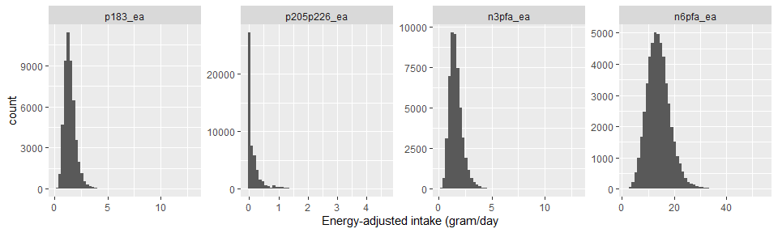
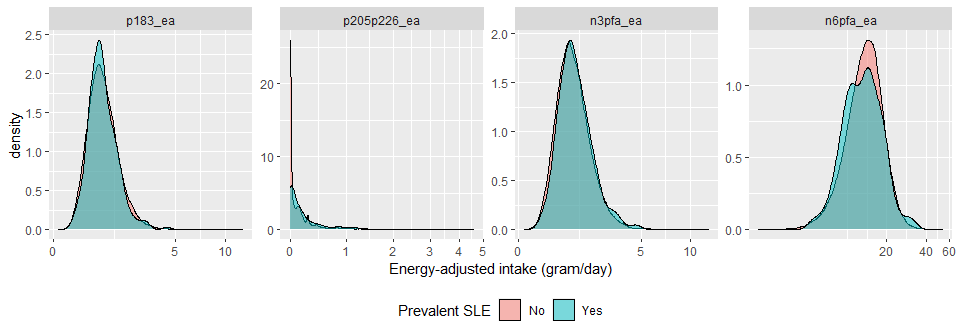
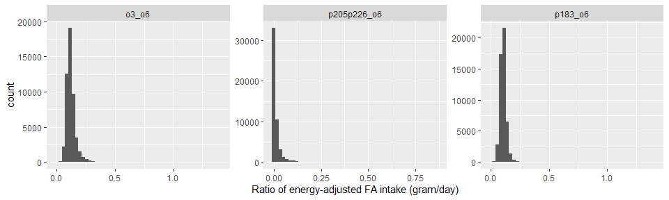

AHS-2 lupus study 2
================

## Dataset

-   Filename: `lupus-initial-dataset-v1-2022-04-25.csv`
    -   Data received on 4/25/2022
    -   Includes *n* = 93467 subjects and 118 variables
    -   No imputations
-   To create an analytic file:
    -   Included only non-Hispanic White or Black
    -   Excluded if age at baseline \< 30 years
    -   Excluded extreme energy intake of \<500 or \>4500 kcal
    -   Excluded any subjects with missing gender, education, smoking
        history, dietary pattern and BMI
    -   **Included only females in this analysis**
    -   This resulted in *n* = 50299 subjects (43168 subjects were
        excluded)

## Outcome

-   Prevalent cases of SLE were identified using the baseline
    questionnaire
    -   Includes only those who “have been treated for SLE in the last
        12 months” at baseline
    -   (“Years since the 1st diagnosis” was not used, following the
        case definition in the manuscript)
-   There were 220 prevalent cases (0.44%) of SLE

## Descriptive table

-   Descriptive table stratified by cases/non-cases
    -   Variables were categorized following the original manuscript
    -   Use of fish oil supplement (`take_fo`) now includes cod liver
        oil

<table>
<thead>
<tr>
<th style="text-align:left;">
</th>
<th style="text-align:left;">
level
</th>
<th style="text-align:left;">
No
</th>
<th style="text-align:left;">
Yes
</th>
<th style="text-align:left;">
p
</th>
<th style="text-align:left;">
test
</th>
</tr>
</thead>
<tbody>
<tr>
<td style="text-align:left;">
n
</td>
<td style="text-align:left;">
</td>
<td style="text-align:left;">
50079
</td>
<td style="text-align:left;">
220
</td>
<td style="text-align:left;">
</td>
<td style="text-align:left;">
</td>
</tr>
<tr>
<td style="text-align:left;">
age (mean (SD))
</td>
<td style="text-align:left;">
</td>
<td style="text-align:left;">
58.34 (14.31)
</td>
<td style="text-align:left;">
56.63 (11.90)
</td>
<td style="text-align:left;">
0.0759
</td>
<td style="text-align:left;">
</td>
</tr>
<tr>
<td style="text-align:left;">
agecat (%)
</td>
<td style="text-align:left;">
30-39
</td>
<td style="text-align:left;">
5148 (10.3)
</td>
<td style="text-align:left;">
14 ( 6.4)
</td>
<td style="text-align:left;">
0.0045
</td>
<td style="text-align:left;">
</td>
</tr>
<tr>
<td style="text-align:left;">
</td>
<td style="text-align:left;">
40-59
</td>
<td style="text-align:left;">
22942 (45.8)
</td>
<td style="text-align:left;">
124 (56.4)
</td>
<td style="text-align:left;">
</td>
<td style="text-align:left;">
</td>
</tr>
<tr>
<td style="text-align:left;">
</td>
<td style="text-align:left;">
\>=60
</td>
<td style="text-align:left;">
21989 (43.9)
</td>
<td style="text-align:left;">
82 (37.3)
</td>
<td style="text-align:left;">
</td>
<td style="text-align:left;">
</td>
</tr>
<tr>
<td style="text-align:left;">
black (%)
</td>
<td style="text-align:left;">
White
</td>
<td style="text-align:left;">
35590 (71.1)
</td>
<td style="text-align:left;">
125 (56.8)
</td>
<td style="text-align:left;">
\<0.0001
</td>
<td style="text-align:left;">
</td>
</tr>
<tr>
<td style="text-align:left;">
</td>
<td style="text-align:left;">
Black
</td>
<td style="text-align:left;">
14489 (28.9)
</td>
<td style="text-align:left;">
95 (43.2)
</td>
<td style="text-align:left;">
</td>
<td style="text-align:left;">
</td>
</tr>
<tr>
<td style="text-align:left;">
smkever (%)
</td>
<td style="text-align:left;">
Never
</td>
<td style="text-align:left;">
41690 (83.2)
</td>
<td style="text-align:left;">
159 (72.3)
</td>
<td style="text-align:left;">
\<0.0001
</td>
<td style="text-align:left;">
</td>
</tr>
<tr>
<td style="text-align:left;">
</td>
<td style="text-align:left;">
Ever
</td>
<td style="text-align:left;">
8389 (16.8)
</td>
<td style="text-align:left;">
61 (27.7)
</td>
<td style="text-align:left;">
</td>
<td style="text-align:left;">
</td>
</tr>
<tr>
<td style="text-align:left;">
alcever (%)
</td>
<td style="text-align:left;">
Never
</td>
<td style="text-align:left;">
30861 (61.6)
</td>
<td style="text-align:left;">
110 (50.0)
</td>
<td style="text-align:left;">
0.0005
</td>
<td style="text-align:left;">
</td>
</tr>
<tr>
<td style="text-align:left;">
</td>
<td style="text-align:left;">
Ever
</td>
<td style="text-align:left;">
19218 (38.4)
</td>
<td style="text-align:left;">
110 (50.0)
</td>
<td style="text-align:left;">
</td>
<td style="text-align:left;">
</td>
</tr>
<tr>
<td style="text-align:left;">
educat3 (%)
</td>
<td style="text-align:left;">
HS or less
</td>
<td style="text-align:left;">
11341 (22.6)
</td>
<td style="text-align:left;">
44 (20.0)
</td>
<td style="text-align:left;">
0.6379
</td>
<td style="text-align:left;">
</td>
</tr>
<tr>
<td style="text-align:left;">
</td>
<td style="text-align:left;">
Some college
</td>
<td style="text-align:left;">
22007 (43.9)
</td>
<td style="text-align:left;">
99 (45.0)
</td>
<td style="text-align:left;">
</td>
<td style="text-align:left;">
</td>
</tr>
<tr>
<td style="text-align:left;">
</td>
<td style="text-align:left;">
Col grad
</td>
<td style="text-align:left;">
16731 (33.4)
</td>
<td style="text-align:left;">
77 (35.0)
</td>
<td style="text-align:left;">
</td>
<td style="text-align:left;">
</td>
</tr>
<tr>
<td style="text-align:left;">
vegstat3 (%)
</td>
<td style="text-align:left;">
Vegetarians
</td>
<td style="text-align:left;">
18879 (37.7)
</td>
<td style="text-align:left;">
63 (28.6)
</td>
<td style="text-align:left;">
0.0197
</td>
<td style="text-align:left;">
</td>
</tr>
<tr>
<td style="text-align:left;">
</td>
<td style="text-align:left;">
Pesco
</td>
<td style="text-align:left;">
4945 ( 9.9)
</td>
<td style="text-align:left;">
23 (10.5)
</td>
<td style="text-align:left;">
</td>
<td style="text-align:left;">
</td>
</tr>
<tr>
<td style="text-align:left;">
</td>
<td style="text-align:left;">
Non-veg
</td>
<td style="text-align:left;">
26255 (52.4)
</td>
<td style="text-align:left;">
134 (60.9)
</td>
<td style="text-align:left;">
</td>
<td style="text-align:left;">
</td>
</tr>
<tr>
<td style="text-align:left;">
take_fo (%)
</td>
<td style="text-align:left;">
No
</td>
<td style="text-align:left;">
43805 (87.5)
</td>
<td style="text-align:left;">
168 (76.4)
</td>
<td style="text-align:left;">
\<0.0001
</td>
<td style="text-align:left;">
</td>
</tr>
<tr>
<td style="text-align:left;">
</td>
<td style="text-align:left;">
Yes
</td>
<td style="text-align:left;">
6274 (12.5)
</td>
<td style="text-align:left;">
52 (23.6)
</td>
<td style="text-align:left;">
</td>
<td style="text-align:left;">
</td>
</tr>
<tr>
<td style="text-align:left;">
bmi (mean (SD))
</td>
<td style="text-align:left;">
</td>
<td style="text-align:left;">
27.49 (6.56)
</td>
<td style="text-align:left;">
29.89 (9.41)
</td>
<td style="text-align:left;">
\<0.0001
</td>
<td style="text-align:left;">
</td>
</tr>
<tr>
<td style="text-align:left;">
bmicat (%)
</td>
<td style="text-align:left;">
Normal
</td>
<td style="text-align:left;">
20760 (41.5)
</td>
<td style="text-align:left;">
70 (31.8)
</td>
<td style="text-align:left;">
0.0149
</td>
<td style="text-align:left;">
</td>
</tr>
<tr>
<td style="text-align:left;">
</td>
<td style="text-align:left;">
Overweight
</td>
<td style="text-align:left;">
15239 (30.4)
</td>
<td style="text-align:left;">
77 (35.0)
</td>
<td style="text-align:left;">
</td>
<td style="text-align:left;">
</td>
</tr>
<tr>
<td style="text-align:left;">
</td>
<td style="text-align:left;">
Obese
</td>
<td style="text-align:left;">
14080 (28.1)
</td>
<td style="text-align:left;">
73 (33.2)
</td>
<td style="text-align:left;">
</td>
<td style="text-align:left;">
</td>
</tr>
<tr>
<td style="text-align:left;">
kcal (mean (SD))
</td>
<td style="text-align:left;">
</td>
<td style="text-align:left;">
1760.24 (710.79)
</td>
<td style="text-align:left;">
1788.80 (744.77)
</td>
<td style="text-align:left;">
0.5521
</td>
<td style="text-align:left;">
</td>
</tr>
</tbody>
</table>

## Diagnosis of SLE and use of fish oil supplement

-   Among those who were diagnosed with SLE and takes fish oil
    supplement, a crosstab was created between years since diagnosis and
    the duration of fish oil supplement use:

<table>
<thead>
<tr>
<th style="text-align:left;">
</th>
<th style="text-align:center;">
0-1 year
</th>
<th style="text-align:center;">
2-4 years
</th>
<th style="text-align:center;">
5-9 years
</th>
<th style="text-align:center;">
10+ years
</th>
<th style="text-align:center;">
Total
</th>
</tr>
</thead>
<tbody>
<tr>
<td style="text-align:left;">
Diagnosed with SLE
</td>
<td style="text-align:center;">
</td>
<td style="text-align:center;">
</td>
<td style="text-align:center;">
</td>
<td style="text-align:center;">
</td>
<td style="text-align:center;">
</td>
</tr>
<tr>
<td style="text-align:left;">
\<5 years ago
</td>
<td style="text-align:center;">
7
</td>
<td style="text-align:center;">
7
</td>
<td style="text-align:center;">
2
</td>
<td style="text-align:center;">
3
</td>
<td style="text-align:center;">
19
</td>
</tr>
<tr>
<td style="text-align:left;">
5-9 years ago
</td>
<td style="text-align:center;">
1
</td>
<td style="text-align:center;">
1
</td>
<td style="text-align:center;">
0
</td>
<td style="text-align:center;">
1
</td>
<td style="text-align:center;">
3
</td>
</tr>
<tr>
<td style="text-align:left;">
10-14 years ago
</td>
<td style="text-align:center;">
3
</td>
<td style="text-align:center;">
4
</td>
<td style="text-align:center;">
0
</td>
<td style="text-align:center;">
1
</td>
<td style="text-align:center;">
8
</td>
</tr>
<tr>
<td style="text-align:left;">
15-19 years ago
</td>
<td style="text-align:center;">
2
</td>
<td style="text-align:center;">
1
</td>
<td style="text-align:center;">
0
</td>
<td style="text-align:center;">
0
</td>
<td style="text-align:center;">
3
</td>
</tr>
<tr>
<td style="text-align:left;">
20+ years ago
</td>
<td style="text-align:center;">
2
</td>
<td style="text-align:center;">
1
</td>
<td style="text-align:center;">
2
</td>
<td style="text-align:center;">
1
</td>
<td style="text-align:center;">
6
</td>
</tr>
<tr>
<td style="text-align:left;">
Total
</td>
<td style="text-align:center;">
15
</td>
<td style="text-align:center;">
14
</td>
<td style="text-align:center;">
4
</td>
<td style="text-align:center;">
6
</td>
<td style="text-align:center;">
39
</td>
</tr>
</tbody>
</table>

## Energy-adjusted fatty acid intake

-   The nutrient intake data include the following fatty acids
    -   Each FA has both dietary and supplement intake

<table>
<thead>
<tr>
<th style="text-align:left;">
fa_name
</th>
<th style="text-align:left;">
lipid
</th>
<th style="text-align:left;">
note
</th>
</tr>
</thead>
<tbody>
<tr>
<td style="text-align:left;">
ALA
</td>
<td style="text-align:left;">
p183
</td>
<td style="text-align:left;">
Omega-3
</td>
</tr>
<tr>
<td style="text-align:left;">
SDA
</td>
<td style="text-align:left;">
p184
</td>
<td style="text-align:left;">
Omega-3
</td>
</tr>
<tr>
<td style="text-align:left;">
EPA
</td>
<td style="text-align:left;">
p205
</td>
<td style="text-align:left;">
Omega-3
</td>
</tr>
<tr>
<td style="text-align:left;">
DPA
</td>
<td style="text-align:left;">
p225
</td>
<td style="text-align:left;">
Omega-3
</td>
</tr>
<tr>
<td style="text-align:left;">
DHA
</td>
<td style="text-align:left;">
p226
</td>
<td style="text-align:left;">
Omega-3
</td>
</tr>
<tr>
<td style="text-align:left;">
LA
</td>
<td style="text-align:left;">
p182
</td>
<td style="text-align:left;">
Omega-6
</td>
</tr>
<tr>
<td style="text-align:left;">
AA
</td>
<td style="text-align:left;">
p204
</td>
<td style="text-align:left;">
Omega-6
</td>
</tr>
</tbody>
</table>

-   For each FA, its dietary intake was energy-adjusted by the residual
    method, while partitioning zero intake ([Jaceldo-Siegl et al.,
    2011](https://www.ncbi.nlm.nih.gov/pmc/articles/PMC3433053/)). Due
    to its highly right-skewed distribution, non-zero intake was
    log-transformed before being regressed on the total energy intake.
    Residuals were added by the mean of log and then back-transformed to
    obtain energy-adjusted dietary intake. Energy-adjusted dietary
    intake was added with (unadjusted) supplement intake to form
    energy-adjuste total intake.
    -   Energy-adjusted total omega-3 fatty acid intake was calculated
        as the sum of the following energy-adjusted FAs: ALA, SDA, EPA,
        DPA and DHA.
    -   Energy-adjusted total omega-6 fatty acid intake was calculated
        as the sum of the following energy-adjusted FAs: LA, AA
-   Distributions of energy-adjusted ALA, EPA + DHA, total omega-3, and
    total omega-6 are highly right-skewed:

<!-- -->

-   Density plots by prevalent SLE status are shown below. Note that the
    x-axis is in a pseudo-log scale:

<!-- -->

-   A Spearman correlation matrix among energy-adjusted ALA, EPA + DHA,
    total omega-3, and total omega-6 is shown below
    -   ALA is moderately positively correlated with omega-3 and omega-6
        fatty acids.

<table>
<thead>
<tr>
<th style="text-align:left;">
</th>
<th style="text-align:right;">
p183_ea
</th>
<th style="text-align:right;">
p205p226_ea
</th>
<th style="text-align:right;">
n3pfa_ea
</th>
<th style="text-align:right;">
n6pfa_ea
</th>
</tr>
</thead>
<tbody>
<tr>
<td style="text-align:left;">
p183_ea
</td>
<td style="text-align:right;">
1.000
</td>
<td style="text-align:right;">
0.004
</td>
<td style="text-align:right;">
0.882
</td>
<td style="text-align:right;">
0.742
</td>
</tr>
<tr>
<td style="text-align:left;">
p205p226_ea
</td>
<td style="text-align:right;">
0.004
</td>
<td style="text-align:right;">
1.000
</td>
<td style="text-align:right;">
0.350
</td>
<td style="text-align:right;">
-0.100
</td>
</tr>
<tr>
<td style="text-align:left;">
n3pfa_ea
</td>
<td style="text-align:right;">
0.882
</td>
<td style="text-align:right;">
0.350
</td>
<td style="text-align:right;">
1.000
</td>
<td style="text-align:right;">
0.609
</td>
</tr>
<tr>
<td style="text-align:left;">
n6pfa_ea
</td>
<td style="text-align:right;">
0.742
</td>
<td style="text-align:right;">
-0.100
</td>
<td style="text-align:right;">
0.609
</td>
<td style="text-align:right;">
1.000
</td>
</tr>
</tbody>
</table>

-   Median (IQR) intake (gram/day) of energy-adjusted ALA, EPA + DHA,
    total omega-3, and total omega-6 by cases/non-cases:
    -   For EPA + DHA, those with SLE had significantly higher intake
        than those without SLE.

<table class="gmisc_table" style="border-collapse: collapse; margin-top: 1em; margin-bottom: 1em;">
<thead>
<tr>
<td colspan="4" style="text-align: left;">
Median (IQR) energy-adjusted intake of fatty acids (gram/day)
</td>
</tr>
<tr>
<th style="border-bottom: 1px solid grey; border-top: 2px solid grey;">
</th>
<th style="font-weight: 900; border-bottom: 1px solid grey; border-top: 2px solid grey; text-align: center;">
No  (n = 50,079)
</th>
<th style="font-weight: 900; border-bottom: 1px solid grey; border-top: 2px solid grey; text-align: center;">
Yes  (n = 220)
</th>
<th style="font-weight: 900; border-bottom: 1px solid grey; border-top: 2px solid grey; text-align: center;">
P-value
</th>
</tr>
</thead>
<tbody>
<tr>
<td style="text-align: left;">
ALA
</td>
<td style="text-align: center;">
1.40 (1.11 - 1.76)
</td>
<td style="text-align: center;">
1.36 (1.13 - 1.73)
</td>
<td style="text-align: center;">
0.79
</td>
</tr>
<tr>
<td style="text-align: left;">
DHA + EPA
</td>
<td style="text-align: center;">
0.03 (0.00 - 0.18)
</td>
<td style="text-align: center;">
0.09 (0.01 - 0.30)
</td>
<td style="text-align: center;">
\< 0.0001
</td>
</tr>
<tr>
<td style="text-align: left;">
DHA + EPA dietary
</td>
<td style="text-align: center;">
0.02 (0.00 - 0.14)
</td>
<td style="text-align: center;">
0.05 (0.00 - 0.17)
</td>
<td style="text-align: center;">
0.002
</td>
</tr>
<tr>
<td style="text-align: left;">
Omega-3
</td>
<td style="text-align: center;">
1.55 (1.22 - 1.97)
</td>
<td style="text-align: center;">
1.60 (1.29 - 2.02)
</td>
<td style="text-align: center;">
0.091
</td>
</tr>
<tr>
<td style="text-align: left;">
Omega-3 dietary
</td>
<td style="text-align: center;">
1.51 (1.19 - 1.89)
</td>
<td style="text-align: center;">
1.53 (1.22 - 1.85)
</td>
<td style="text-align: center;">
0.75
</td>
</tr>
<tr>
<td style="border-bottom: 2px solid grey; text-align: left;">
Omega-6
</td>
<td style="border-bottom: 2px solid grey; text-align: center;">
13.73 (10.97 - 16.70)
</td>
<td style="border-bottom: 2px solid grey; text-align: center;">
13.26 (10.27 - 16.33)
</td>
<td style="border-bottom: 2px solid grey; text-align: center;">
0.084
</td>
</tr>
</tbody>
<tfoot>
<tr>
<td colspan="4">
P-values were from Mann-Whitney tests
</td>
</tr>
</tfoot>
</table>

-   Proportions of (energy-adjusted) dietary intake out of the total
    intake (dietary + supplement) are shown below.
    -   Over 90% of the total intake were from dietary intake, not
        supplements.

<table>
<thead>
<tr>
<th style="text-align:left;">
var
</th>
<th style="text-align:right;">
mean
</th>
</tr>
</thead>
<tbody>
<tr>
<td style="text-align:left;">
p183_diet_ratio
</td>
<td style="text-align:right;">
0.9983
</td>
</tr>
<tr>
<td style="text-align:left;">
p205p226_diet_ratio
</td>
<td style="text-align:right;">
0.9143
</td>
</tr>
<tr>
<td style="text-align:left;">
n3pfa_diet_ratio
</td>
<td style="text-align:right;">
0.9724
</td>
</tr>
<tr>
<td style="text-align:left;">
n6pfa_diet_ratio
</td>
<td style="text-align:right;">
0.9995
</td>
</tr>
</tbody>
</table>

-   Intake of fatty acids (dietary and total) among those who use fish
    oil supplement:
    -   Total intake of EPA + DHA is much greater, and most of its
        intake is from supplementary sources

<table class="gmisc_table" style="border-collapse: collapse; margin-top: 1em; margin-bottom: 1em;">
<thead>
<tr>
<td colspan="4" style="text-align: left;">
Median (IQR) energy-adjusted intake of fatty acids (gram/day)
</td>
</tr>
<tr>
<th style="border-bottom: 1px solid grey; border-top: 2px solid grey;">
</th>
<th style="font-weight: 900; border-bottom: 1px solid grey; border-top: 2px solid grey; text-align: center;">
No  (n = 6,274)
</th>
<th style="font-weight: 900; border-bottom: 1px solid grey; border-top: 2px solid grey; text-align: center;">
Yes  (n = 52)
</th>
<th style="font-weight: 900; border-bottom: 1px solid grey; border-top: 2px solid grey; text-align: center;">
P-value
</th>
</tr>
</thead>
<tbody>
<tr>
<td style="text-align: left;">
DHA + EPA
</td>
<td style="text-align: center;">
0.45 (0.31 - 0.82)
</td>
<td style="text-align: center;">
0.53 (0.35 - 0.91)
</td>
<td style="text-align: center;">
0.086
</td>
</tr>
<tr>
<td style="text-align: left;">
DHA + EPA dietary
</td>
<td style="text-align: center;">
0.09 (0.01 - 0.20)
</td>
<td style="text-align: center;">
0.10 (0.03 - 0.23)
</td>
<td style="text-align: center;">
0.19
</td>
</tr>
<tr>
<td style="text-align: left;">
Omega-3
</td>
<td style="text-align: center;">
2.06 (1.64 - 2.55)
</td>
<td style="text-align: center;">
2.15 (1.64 - 2.56)
</td>
<td style="text-align: center;">
0.51
</td>
</tr>
<tr>
<td style="border-bottom: 2px solid grey; text-align: left;">
Omega-3 dietary
</td>
<td style="border-bottom: 2px solid grey; text-align: center;">
1.56 (1.23 - 1.96)
</td>
<td style="border-bottom: 2px solid grey; text-align: center;">
1.59 (1.21 - 1.93)
</td>
<td style="border-bottom: 2px solid grey; text-align: center;">
0.96
</td>
</tr>
</tbody>
<tfoot>
<tr>
<td colspan="4">
P-values were from Mann-Whitney tests
</td>
</tr>
</tfoot>
</table>

-   Three ratios of fatty acids, Omega-3/Omega-6, (DHA + EPA)/Omega-6,
    ALA/Omega-6, were calculated based on energy-adjusted intake, i.e.,
    both the numerator and denominator were energy-adjusted values.
    -   Distribution of the three ratios were highly right-skewed:

<!-- -->

-   A Spearman correlation matrix among three ratio variables is shown
    below.
    -   Omega-3/omema-6 ratio is highly correlated with ALA/omega-6
        ratio.

<table>
<thead>
<tr>
<th style="text-align:left;">
</th>
<th style="text-align:right;">
o3_o6
</th>
<th style="text-align:right;">
p205p226_o6
</th>
<th style="text-align:right;">
p183_o6
</th>
</tr>
</thead>
<tbody>
<tr>
<td style="text-align:left;">
o3_o6
</td>
<td style="text-align:right;">
1.000
</td>
<td style="text-align:right;">
0.553
</td>
<td style="text-align:right;">
0.850
</td>
</tr>
<tr>
<td style="text-align:left;">
p205p226_o6
</td>
<td style="text-align:right;">
0.553
</td>
<td style="text-align:right;">
1.000
</td>
<td style="text-align:right;">
0.166
</td>
</tr>
<tr>
<td style="text-align:left;">
p183_o6
</td>
<td style="text-align:right;">
0.850
</td>
<td style="text-align:right;">
0.166
</td>
<td style="text-align:right;">
1.000
</td>
</tr>
</tbody>
</table>

-   Median (IQR) ratio of energy-adjusted fatty acids by
    cases/non-cases:
    -   For all ratios, those with SLE had significantly higher intake
        than those without SLE.

<table class="gmisc_table" style="border-collapse: collapse; margin-top: 1em; margin-bottom: 1em;">
<thead>
<tr>
<td colspan="4" style="text-align: left;">
Median (IQR) ratio of energy-adjusted fatty acid intake
</td>
</tr>
<tr>
<th style="border-bottom: 1px solid grey; border-top: 2px solid grey;">
</th>
<th style="font-weight: 900; border-bottom: 1px solid grey; border-top: 2px solid grey; text-align: center;">
No  (n = 50,079)
</th>
<th style="font-weight: 900; border-bottom: 1px solid grey; border-top: 2px solid grey; text-align: center;">
Yes  (n = 220)
</th>
<th style="font-weight: 900; border-bottom: 1px solid grey; border-top: 2px solid grey; text-align: center;">
P-value
</th>
</tr>
</thead>
<tbody>
<tr>
<td style="text-align: left;">
Omega-3/Omega-6
</td>
<td style="text-align: center;">
0.1144 (0.0966 - 0.1368)
</td>
<td style="text-align: center;">
0.1198 (0.1001 - 0.1519)
</td>
<td style="text-align: center;">
0.002
</td>
</tr>
<tr>
<td style="text-align: left;">
(DHA + EPA)/Omega-6
</td>
<td style="text-align: center;">
0.0022 (0.0002 - 0.0141)
</td>
<td style="text-align: center;">
0.0069 (0.0005 - 0.0221)
</td>
<td style="text-align: center;">
\< 0.0001
</td>
</tr>
<tr>
<td style="border-bottom: 2px solid grey; text-align: left;">
ALA/Omega-6
</td>
<td style="border-bottom: 2px solid grey; text-align: center;">
0.1051 (0.0908 - 0.1209)
</td>
<td style="border-bottom: 2px solid grey; text-align: center;">
0.1071 (0.0906 - 0.1245)
</td>
<td style="border-bottom: 2px solid grey; text-align: center;">
0.20
</td>
</tr>
</tbody>
<tfoot>
<tr>
<td colspan="4">
P-values were from Mann-Whitney tests
</td>
</tr>
</tfoot>
</table>

## Quartiles of FA ratios

-   The three FA ratio variables were categorized into quartile groups.
    Frequency tables by SLE status were shown below
    -   For omega-3/omega-6 and (DHA + EPA)/omega-6, the SLE group had
        significantly more subjects in higher quartile groups, compared
        to the non-SLE group.

<table>
<thead>
<tr>
<th style="text-align:left;">
</th>
<th style="text-align:left;">
level
</th>
<th style="text-align:left;">
No
</th>
<th style="text-align:left;">
Yes
</th>
<th style="text-align:left;">
p
</th>
<th style="text-align:left;">
test
</th>
</tr>
</thead>
<tbody>
<tr>
<td style="text-align:left;">
n
</td>
<td style="text-align:left;">
</td>
<td style="text-align:left;">
50079
</td>
<td style="text-align:left;">
220
</td>
<td style="text-align:left;">
</td>
<td style="text-align:left;">
</td>
</tr>
<tr>
<td style="text-align:left;">
o3_o6_cat (%)
</td>
<td style="text-align:left;">
1
</td>
<td style="text-align:left;">
12532 (25.0)
</td>
<td style="text-align:left;">
43 (19.5)
</td>
<td style="text-align:left;">
0.0038
</td>
<td style="text-align:left;">
</td>
</tr>
<tr>
<td style="text-align:left;">
</td>
<td style="text-align:left;">
2
</td>
<td style="text-align:left;">
12526 (25.0)
</td>
<td style="text-align:left;">
49 (22.3)
</td>
<td style="text-align:left;">
</td>
<td style="text-align:left;">
</td>
</tr>
<tr>
<td style="text-align:left;">
</td>
<td style="text-align:left;">
3
</td>
<td style="text-align:left;">
12525 (25.0)
</td>
<td style="text-align:left;">
50 (22.7)
</td>
<td style="text-align:left;">
</td>
<td style="text-align:left;">
</td>
</tr>
<tr>
<td style="text-align:left;">
</td>
<td style="text-align:left;">
4
</td>
<td style="text-align:left;">
12496 (25.0)
</td>
<td style="text-align:left;">
78 (35.5)
</td>
<td style="text-align:left;">
</td>
<td style="text-align:left;">
</td>
</tr>
<tr>
<td style="text-align:left;">
p205p226_o6_cat (%)
</td>
<td style="text-align:left;">
1
</td>
<td style="text-align:left;">
12537 (25.0)
</td>
<td style="text-align:left;">
38 (17.3)
</td>
<td style="text-align:left;">
0.0026
</td>
<td style="text-align:left;">
</td>
</tr>
<tr>
<td style="text-align:left;">
</td>
<td style="text-align:left;">
2
</td>
<td style="text-align:left;">
12530 (25.0)
</td>
<td style="text-align:left;">
45 (20.5)
</td>
<td style="text-align:left;">
</td>
<td style="text-align:left;">
</td>
</tr>
<tr>
<td style="text-align:left;">
</td>
<td style="text-align:left;">
3
</td>
<td style="text-align:left;">
12510 (25.0)
</td>
<td style="text-align:left;">
65 (29.5)
</td>
<td style="text-align:left;">
</td>
<td style="text-align:left;">
</td>
</tr>
<tr>
<td style="text-align:left;">
</td>
<td style="text-align:left;">
4
</td>
<td style="text-align:left;">
12502 (25.0)
</td>
<td style="text-align:left;">
72 (32.7)
</td>
<td style="text-align:left;">
</td>
<td style="text-align:left;">
</td>
</tr>
<tr>
<td style="text-align:left;">
p183_o6_cat (%)
</td>
<td style="text-align:left;">
1
</td>
<td style="text-align:left;">
12519 (25.0)
</td>
<td style="text-align:left;">
56 (25.5)
</td>
<td style="text-align:left;">
0.1687
</td>
<td style="text-align:left;">
</td>
</tr>
<tr>
<td style="text-align:left;">
</td>
<td style="text-align:left;">
2
</td>
<td style="text-align:left;">
12525 (25.0)
</td>
<td style="text-align:left;">
50 (22.7)
</td>
<td style="text-align:left;">
</td>
<td style="text-align:left;">
</td>
</tr>
<tr>
<td style="text-align:left;">
</td>
<td style="text-align:left;">
3
</td>
<td style="text-align:left;">
12529 (25.0)
</td>
<td style="text-align:left;">
46 (20.9)
</td>
<td style="text-align:left;">
</td>
<td style="text-align:left;">
</td>
</tr>
<tr>
<td style="text-align:left;">
</td>
<td style="text-align:left;">
4
</td>
<td style="text-align:left;">
12506 (25.0)
</td>
<td style="text-align:left;">
68 (30.9)
</td>
<td style="text-align:left;">
</td>
<td style="text-align:left;">
</td>
</tr>
</tbody>
</table>

-   Cut-off values of quartiles were shown below:

<table>
<thead>
<tr>
<th style="text-align:left;">
o3_o6_cat
</th>
<th style="text-align:right;">
min
</th>
<th style="text-align:right;">
max
</th>
</tr>
</thead>
<tbody>
<tr>
<td style="text-align:left;">
1
</td>
<td style="text-align:right;">
0.0123507
</td>
<td style="text-align:right;">
0.0966138
</td>
</tr>
<tr>
<td style="text-align:left;">
2
</td>
<td style="text-align:right;">
0.0966150
</td>
<td style="text-align:right;">
0.1144434
</td>
</tr>
<tr>
<td style="text-align:left;">
3
</td>
<td style="text-align:right;">
0.1144455
</td>
<td style="text-align:right;">
0.1368626
</td>
</tr>
<tr>
<td style="text-align:left;">
4
</td>
<td style="text-align:right;">
0.1368635
</td>
<td style="text-align:right;">
1.4122644
</td>
</tr>
</tbody>
</table>
<table>
<thead>
<tr>
<th style="text-align:left;">
p205p226_o6_cat
</th>
<th style="text-align:right;">
min
</th>
<th style="text-align:right;">
max
</th>
</tr>
</thead>
<tbody>
<tr>
<td style="text-align:left;">
1
</td>
<td style="text-align:right;">
0.0000000
</td>
<td style="text-align:right;">
0.0002033
</td>
</tr>
<tr>
<td style="text-align:left;">
2
</td>
<td style="text-align:right;">
0.0002033
</td>
<td style="text-align:right;">
0.0022178
</td>
</tr>
<tr>
<td style="text-align:left;">
3
</td>
<td style="text-align:right;">
0.0022180
</td>
<td style="text-align:right;">
0.0141035
</td>
</tr>
<tr>
<td style="text-align:left;">
4
</td>
<td style="text-align:right;">
0.0141043
</td>
<td style="text-align:right;">
0.8619019
</td>
</tr>
</tbody>
</table>
<table>
<thead>
<tr>
<th style="text-align:left;">
p183_o6_cat
</th>
<th style="text-align:right;">
min
</th>
<th style="text-align:right;">
max
</th>
</tr>
</thead>
<tbody>
<tr>
<td style="text-align:left;">
1
</td>
<td style="text-align:right;">
0.0119525
</td>
<td style="text-align:right;">
0.0907972
</td>
</tr>
<tr>
<td style="text-align:left;">
2
</td>
<td style="text-align:right;">
0.0907972
</td>
<td style="text-align:right;">
0.1050827
</td>
</tr>
<tr>
<td style="text-align:left;">
3
</td>
<td style="text-align:right;">
0.1050829
</td>
<td style="text-align:right;">
0.1208793
</td>
</tr>
<tr>
<td style="text-align:left;">
4
</td>
<td style="text-align:right;">
0.1208796
</td>
<td style="text-align:right;">
1.4115441
</td>
</tr>
</tbody>
</table>

## Logistic models with all three ratio variables

-   Four logistic models were fitted using prevalent SLE as the outcome.
    -   Model 1 includes: quartile groups of omega-3/omega-6, (DHA +
        EPA)/omega-6, ALA/omaga-6, and kcal (per 100 kcal)
    -   Model 2 adds age groups, race, education level, smoking status
        (never/ever), and alcohol (never/ever)
    -   Model 3 further adds dietary pattern
    -   Model 4 further adds BMI groups
-   The table below shows estimated odds ratios and 95% Wald confidence
    intervals from each logistic model:

<table style="text-align:center">
<tr>
<td colspan="5" style="border-bottom: 1px solid black">
</td>
</tr>
<tr>
<td style="text-align:left">
</td>
<td colspan="4">
Outcome: Prevalent SLE
</td>
</tr>
<tr>
<td style="text-align:left">
</td>
<td>
Model 1
</td>
<td>
Model 2
</td>
<td>
Model 3
</td>
<td>
Model 4
</td>
</tr>
<tr>
<td colspan="5" style="border-bottom: 1px solid black">
</td>
</tr>
<tr>
<td style="text-align:left">
O3/O6: Q2
</td>
<td>
1.60
</td>
<td>
1.59
</td>
<td>
1.59
</td>
<td>
1.59
</td>
</tr>
<tr>
<td style="text-align:left">
</td>
<td>
(0.93, 2.74)
</td>
<td>
(0.93, 2.72)
</td>
<td>
(0.93, 2.72)
</td>
<td>
(0.93, 2.72)
</td>
</tr>
<tr>
<td style="text-align:left">
</td>
<td>
</td>
<td>
</td>
<td>
</td>
<td>
</td>
</tr>
<tr>
<td style="text-align:left">
O3/O6: Q3
</td>
<td>
1.83
</td>
<td>
1.82
</td>
<td>
1.82
</td>
<td>
1.83
</td>
</tr>
<tr>
<td style="text-align:left">
</td>
<td>
(0.95, 3.54)
</td>
<td>
(0.94, 3.52)
</td>
<td>
(0.94, 3.52)
</td>
<td>
(0.94, 3.54)
</td>
</tr>
<tr>
<td style="text-align:left">
</td>
<td>
</td>
<td>
</td>
<td>
</td>
<td>
</td>
</tr>
<tr>
<td style="text-align:left">
O3/O6: Q4
</td>
<td>
2.81
</td>
<td>
2.69
</td>
<td>
2.70
</td>
<td>
2.72
</td>
</tr>
<tr>
<td style="text-align:left">
</td>
<td>
(1.28, 6.18)
</td>
<td>
(1.22, 5.94)
</td>
<td>
(1.23, 5.95)
</td>
<td>
(1.23, 5.99)
</td>
</tr>
<tr>
<td style="text-align:left">
</td>
<td>
</td>
<td>
</td>
<td>
</td>
<td>
</td>
</tr>
<tr>
<td style="text-align:left">
DHA+EPA/O6: Q2
</td>
<td>
1.20
</td>
<td>
1.18
</td>
<td>
1.24
</td>
<td>
1.21
</td>
</tr>
<tr>
<td style="text-align:left">
</td>
<td>
(0.78, 1.85)
</td>
<td>
(0.77, 1.83)
</td>
<td>
(0.77, 2.01)
</td>
<td>
(0.75, 1.96)
</td>
</tr>
<tr>
<td style="text-align:left">
</td>
<td>
</td>
<td>
</td>
<td>
</td>
<td>
</td>
</tr>
<tr>
<td style="text-align:left">
DHA+EPA/O6: Q3
</td>
<td>
1.54
</td>
<td>
1.30
</td>
<td>
1.43
</td>
<td>
1.40
</td>
</tr>
<tr>
<td style="text-align:left">
</td>
<td>
(1.02, 2.34)
</td>
<td>
(0.85, 1.99)
</td>
<td>
(0.79, 2.58)
</td>
<td>
(0.77, 2.53)
</td>
</tr>
<tr>
<td style="text-align:left">
</td>
<td>
</td>
<td>
</td>
<td>
</td>
<td>
</td>
</tr>
<tr>
<td style="text-align:left">
DHA+EPA/O6: Q4
</td>
<td>
1.28
</td>
<td>
1.02
</td>
<td>
1.11
</td>
<td>
1.08
</td>
</tr>
<tr>
<td style="text-align:left">
</td>
<td>
(0.77, 2.12)
</td>
<td>
(0.61, 1.71)
</td>
<td>
(0.58, 2.10)
</td>
<td>
(0.57, 2.05)
</td>
</tr>
<tr>
<td style="text-align:left">
</td>
<td>
</td>
<td>
</td>
<td>
</td>
<td>
</td>
</tr>
<tr>
<td style="text-align:left">
ALA/O6: Q2
</td>
<td>
0.62
</td>
<td>
0.61
</td>
<td>
0.61
</td>
<td>
0.61
</td>
</tr>
<tr>
<td style="text-align:left">
</td>
<td>
(0.38, 1.01)
</td>
<td>
(0.38, 1.00)
</td>
<td>
(0.38, 1.00)
</td>
<td>
(0.37, 0.99)
</td>
</tr>
<tr>
<td style="text-align:left">
</td>
<td>
</td>
<td>
</td>
<td>
</td>
<td>
</td>
</tr>
<tr>
<td style="text-align:left">
ALA/O6: Q3
</td>
<td>
0.47
</td>
<td>
0.46
</td>
<td>
0.46
</td>
<td>
0.46
</td>
</tr>
<tr>
<td style="text-align:left">
</td>
<td>
(0.27, 0.83)
</td>
<td>
(0.26, 0.82)
</td>
<td>
(0.26, 0.82)
</td>
<td>
(0.26, 0.82)
</td>
</tr>
<tr>
<td style="text-align:left">
</td>
<td>
</td>
<td>
</td>
<td>
</td>
<td>
</td>
</tr>
<tr>
<td style="text-align:left">
ALA/O6: Q4
</td>
<td>
0.55
</td>
<td>
0.55
</td>
<td>
0.55
</td>
<td>
0.55
</td>
</tr>
<tr>
<td style="text-align:left">
</td>
<td>
(0.29, 1.05)
</td>
<td>
(0.29, 1.05)
</td>
<td>
(0.29, 1.05)
</td>
<td>
(0.28, 1.05)
</td>
</tr>
<tr>
<td style="text-align:left">
</td>
<td>
</td>
<td>
</td>
<td>
</td>
<td>
</td>
</tr>
<tr>
<td style="text-align:left">
Kcal/100
</td>
<td>
1.00
</td>
<td>
1.00
</td>
<td>
1.00
</td>
<td>
1.00
</td>
</tr>
<tr>
<td style="text-align:left">
</td>
<td>
(0.99, 1.02)
</td>
<td>
(0.98, 1.02)
</td>
<td>
(0.98, 1.02)
</td>
<td>
(0.98, 1.02)
</td>
</tr>
<tr>
<td style="text-align:left">
</td>
<td>
</td>
<td>
</td>
<td>
</td>
<td>
</td>
</tr>
<tr>
<td style="text-align:left">
Age.: 30-39
</td>
<td>
</td>
<td>
0.58
</td>
<td>
0.58
</td>
<td>
0.60
</td>
</tr>
<tr>
<td style="text-align:left">
</td>
<td>
</td>
<td>
(0.32, 1.04)
</td>
<td>
(0.32, 1.04)
</td>
<td>
(0.33, 1.07)
</td>
</tr>
<tr>
<td style="text-align:left">
</td>
<td>
</td>
<td>
</td>
<td>
</td>
<td>
</td>
</tr>
<tr>
<td style="text-align:left">
Age.: 40-59
</td>
<td>
</td>
<td>
1.20
</td>
<td>
1.20
</td>
<td>
1.21
</td>
</tr>
<tr>
<td style="text-align:left">
</td>
<td>
</td>
<td>
(0.90, 1.61)
</td>
<td>
(0.89, 1.61)
</td>
<td>
(0.90, 1.62)
</td>
</tr>
<tr>
<td style="text-align:left">
</td>
<td>
</td>
<td>
</td>
<td>
</td>
<td>
</td>
</tr>
<tr>
<td style="text-align:left">
Race: Black
</td>
<td>
</td>
<td>
1.71
</td>
<td>
1.72
</td>
<td>
1.66
</td>
</tr>
<tr>
<td style="text-align:left">
</td>
<td>
</td>
<td>
(1.28, 2.27)
</td>
<td>
(1.29, 2.29)
</td>
<td>
(1.24, 2.22)
</td>
</tr>
<tr>
<td style="text-align:left">
</td>
<td>
</td>
<td>
</td>
<td>
</td>
<td>
</td>
</tr>
<tr>
<td style="text-align:left">
Educ: HS or less
</td>
<td>
</td>
<td>
0.72
</td>
<td>
0.72
</td>
<td>
0.71
</td>
</tr>
<tr>
<td style="text-align:left">
</td>
<td>
</td>
<td>
(0.49, 1.05)
</td>
<td>
(0.49, 1.06)
</td>
<td>
(0.48, 1.05)
</td>
</tr>
<tr>
<td style="text-align:left">
</td>
<td>
</td>
<td>
</td>
<td>
</td>
<td>
</td>
</tr>
<tr>
<td style="text-align:left">
Educ: Some college
</td>
<td>
</td>
<td>
0.87
</td>
<td>
0.87
</td>
<td>
0.86
</td>
</tr>
<tr>
<td style="text-align:left">
</td>
<td>
</td>
<td>
(0.64, 1.18)
</td>
<td>
(0.64, 1.18)
</td>
<td>
(0.63, 1.17)
</td>
</tr>
<tr>
<td style="text-align:left">
</td>
<td>
</td>
<td>
</td>
<td>
</td>
<td>
</td>
</tr>
<tr>
<td style="text-align:left">
Smkg: Ever
</td>
<td>
</td>
<td>
1.66
</td>
<td>
1.66
</td>
<td>
1.64
</td>
</tr>
<tr>
<td style="text-align:left">
</td>
<td>
</td>
<td>
(1.18, 2.35)
</td>
<td>
(1.18, 2.35)
</td>
<td>
(1.16, 2.32)
</td>
</tr>
<tr>
<td style="text-align:left">
</td>
<td>
</td>
<td>
</td>
<td>
</td>
<td>
</td>
</tr>
<tr>
<td style="text-align:left">
Alc.: Ever
</td>
<td>
</td>
<td>
1.23
</td>
<td>
1.24
</td>
<td>
1.24
</td>
</tr>
<tr>
<td style="text-align:left">
</td>
<td>
</td>
<td>
(0.90, 1.69)
</td>
<td>
(0.90, 1.69)
</td>
<td>
(0.91, 1.70)
</td>
</tr>
<tr>
<td style="text-align:left">
</td>
<td>
</td>
<td>
</td>
<td>
</td>
<td>
</td>
</tr>
<tr>
<td style="text-align:left">
Diet: Vegetarians
</td>
<td>
</td>
<td>
</td>
<td>
1.09
</td>
<td>
1.13
</td>
</tr>
<tr>
<td style="text-align:left">
</td>
<td>
</td>
<td>
</td>
<td>
(0.69, 1.74)
</td>
<td>
(0.71, 1.80)
</td>
</tr>
<tr>
<td style="text-align:left">
</td>
<td>
</td>
<td>
</td>
<td>
</td>
<td>
</td>
</tr>
<tr>
<td style="text-align:left">
Diet: Pesco veg
</td>
<td>
</td>
<td>
</td>
<td>
0.92
</td>
<td>
0.95
</td>
</tr>
<tr>
<td style="text-align:left">
</td>
<td>
</td>
<td>
</td>
<td>
(0.59, 1.44)
</td>
<td>
(0.61, 1.49)
</td>
</tr>
<tr>
<td style="text-align:left">
</td>
<td>
</td>
<td>
</td>
<td>
</td>
<td>
</td>
</tr>
<tr>
<td style="text-align:left">
BMI.: Overweight
</td>
<td>
</td>
<td>
</td>
<td>
</td>
<td>
1.32
</td>
</tr>
<tr>
<td style="text-align:left">
</td>
<td>
</td>
<td>
</td>
<td>
</td>
<td>
(0.95, 1.84)
</td>
</tr>
<tr>
<td style="text-align:left">
</td>
<td>
</td>
<td>
</td>
<td>
</td>
<td>
</td>
</tr>
<tr>
<td style="text-align:left">
BMI.: Obese
</td>
<td>
</td>
<td>
</td>
<td>
</td>
<td>
1.23
</td>
</tr>
<tr>
<td style="text-align:left">
</td>
<td>
</td>
<td>
</td>
<td>
</td>
<td>
(0.87, 1.74)
</td>
</tr>
<tr>
<td style="text-align:left">
</td>
<td>
</td>
<td>
</td>
<td>
</td>
<td>
</td>
</tr>
<tr>
<td colspan="5" style="border-bottom: 1px solid black">
</td>
</tr>
<tr>
<td style="text-align:left">
Observations
</td>
<td>
50,299
</td>
<td>
50,299
</td>
<td>
50,299
</td>
<td>
50,299
</td>
</tr>
<tr>
<td colspan="5" style="border-bottom: 1px solid black">
</td>
</tr>
</table>

## Logistic models with omega-3/omega-6 ratio

-   Four logistic models were fitted using prevalent SLE as the outcome.
    -   Model 1 includes: quartile groups of omega-3/omega-6 and kcal
        (per 100 kcal)
    -   Model 2 adds age groups, race, education level, smoking status
        (never/ever), and alcohol (never/ever)
    -   Model 3 further adds dietary pattern
    -   Model 4 further adds BMI groups
-   The table below shows estimated odds ratios and 95% Wald confidence
    intervals from each logistic model:

<table style="text-align:center">
<tr>
<td colspan="5" style="border-bottom: 1px solid black">
</td>
</tr>
<tr>
<td style="text-align:left">
</td>
<td colspan="4">
Outcome: Prevalent SLE
</td>
</tr>
<tr>
<td style="text-align:left">
</td>
<td>
Model 1
</td>
<td>
Model 2
</td>
<td>
Model 3
</td>
<td>
Model 4
</td>
</tr>
<tr>
<td colspan="5" style="border-bottom: 1px solid black">
</td>
</tr>
<tr>
<td style="text-align:left">
O3/O6: Q2
</td>
<td>
1.14
</td>
<td>
1.08
</td>
<td>
1.06
</td>
<td>
1.06
</td>
</tr>
<tr>
<td style="text-align:left">
</td>
<td>
(0.75, 1.71)
</td>
<td>
(0.72, 1.63)
</td>
<td>
(0.70, 1.61)
</td>
<td>
(0.70, 1.60)
</td>
</tr>
<tr>
<td style="text-align:left">
</td>
<td>
</td>
<td>
</td>
<td>
</td>
<td>
</td>
</tr>
<tr>
<td style="text-align:left">
O3/O6: Q3
</td>
<td>
1.16
</td>
<td>
1.06
</td>
<td>
1.03
</td>
<td>
1.02
</td>
</tr>
<tr>
<td style="text-align:left">
</td>
<td>
(0.77, 1.75)
</td>
<td>
(0.70, 1.59)
</td>
<td>
(0.68, 1.56)
</td>
<td>
(0.67, 1.55)
</td>
</tr>
<tr>
<td style="text-align:left">
</td>
<td>
</td>
<td>
</td>
<td>
</td>
<td>
</td>
</tr>
<tr>
<td style="text-align:left">
O3/O6: Q4
</td>
<td>
1.82
</td>
<td>
1.50
</td>
<td>
1.44
</td>
<td>
1.43
</td>
</tr>
<tr>
<td style="text-align:left">
</td>
<td>
(1.25, 2.64)
</td>
<td>
(1.02, 2.19)
</td>
<td>
(0.97, 2.14)
</td>
<td>
(0.97, 2.13)
</td>
</tr>
<tr>
<td style="text-align:left">
</td>
<td>
</td>
<td>
</td>
<td>
</td>
<td>
</td>
</tr>
<tr>
<td style="text-align:left">
Kcal/100
</td>
<td>
1.01
</td>
<td>
1.00
</td>
<td>
1.00
</td>
<td>
1.00
</td>
</tr>
<tr>
<td style="text-align:left">
</td>
<td>
(0.99, 1.02)
</td>
<td>
(0.99, 1.02)
</td>
<td>
(0.99, 1.02)
</td>
<td>
(0.98, 1.02)
</td>
</tr>
<tr>
<td style="text-align:left">
</td>
<td>
</td>
<td>
</td>
<td>
</td>
<td>
</td>
</tr>
<tr>
<td style="text-align:left">
Age.: 30-39
</td>
<td>
</td>
<td>
0.57
</td>
<td>
0.57
</td>
<td>
0.59
</td>
</tr>
<tr>
<td style="text-align:left">
</td>
<td>
</td>
<td>
(0.32, 1.03)
</td>
<td>
(0.32, 1.02)
</td>
<td>
(0.33, 1.05)
</td>
</tr>
<tr>
<td style="text-align:left">
</td>
<td>
</td>
<td>
</td>
<td>
</td>
<td>
</td>
</tr>
<tr>
<td style="text-align:left">
Age.: 40-59
</td>
<td>
</td>
<td>
1.19
</td>
<td>
1.19
</td>
<td>
1.20
</td>
</tr>
<tr>
<td style="text-align:left">
</td>
<td>
</td>
<td>
(0.89, 1.60)
</td>
<td>
(0.89, 1.60)
</td>
<td>
(0.89, 1.60)
</td>
</tr>
<tr>
<td style="text-align:left">
</td>
<td>
</td>
<td>
</td>
<td>
</td>
<td>
</td>
</tr>
<tr>
<td style="text-align:left">
Race: Black
</td>
<td>
</td>
<td>
1.76
</td>
<td>
1.72
</td>
<td>
1.67
</td>
</tr>
<tr>
<td style="text-align:left">
</td>
<td>
</td>
<td>
(1.33, 2.32)
</td>
<td>
(1.30, 2.29)
</td>
<td>
(1.25, 2.22)
</td>
</tr>
<tr>
<td style="text-align:left">
</td>
<td>
</td>
<td>
</td>
<td>
</td>
<td>
</td>
</tr>
<tr>
<td style="text-align:left">
Educ: HS or less
</td>
<td>
</td>
<td>
0.73
</td>
<td>
0.72
</td>
<td>
0.71
</td>
</tr>
<tr>
<td style="text-align:left">
</td>
<td>
</td>
<td>
(0.50, 1.08)
</td>
<td>
(0.49, 1.06)
</td>
<td>
(0.48, 1.05)
</td>
</tr>
<tr>
<td style="text-align:left">
</td>
<td>
</td>
<td>
</td>
<td>
</td>
<td>
</td>
</tr>
<tr>
<td style="text-align:left">
Educ: Some college
</td>
<td>
</td>
<td>
0.87
</td>
<td>
0.87
</td>
<td>
0.86
</td>
</tr>
<tr>
<td style="text-align:left">
</td>
<td>
</td>
<td>
(0.64, 1.19)
</td>
<td>
(0.64, 1.18)
</td>
<td>
(0.63, 1.16)
</td>
</tr>
<tr>
<td style="text-align:left">
</td>
<td>
</td>
<td>
</td>
<td>
</td>
<td>
</td>
</tr>
<tr>
<td style="text-align:left">
Smkg: Ever
</td>
<td>
</td>
<td>
1.67
</td>
<td>
1.66
</td>
<td>
1.64
</td>
</tr>
<tr>
<td style="text-align:left">
</td>
<td>
</td>
<td>
(1.18, 2.36)
</td>
<td>
(1.17, 2.35)
</td>
<td>
(1.16, 2.32)
</td>
</tr>
<tr>
<td style="text-align:left">
</td>
<td>
</td>
<td>
</td>
<td>
</td>
<td>
</td>
</tr>
<tr>
<td style="text-align:left">
Alc.: Ever
</td>
<td>
</td>
<td>
1.26
</td>
<td>
1.24
</td>
<td>
1.25
</td>
</tr>
<tr>
<td style="text-align:left">
</td>
<td>
</td>
<td>
(0.93, 1.73)
</td>
<td>
(0.91, 1.70)
</td>
<td>
(0.91, 1.71)
</td>
</tr>
<tr>
<td style="text-align:left">
</td>
<td>
</td>
<td>
</td>
<td>
</td>
<td>
</td>
</tr>
<tr>
<td style="text-align:left">
Diet: Vegetarians
</td>
<td>
</td>
<td>
</td>
<td>
0.88
</td>
<td>
0.91
</td>
</tr>
<tr>
<td style="text-align:left">
</td>
<td>
</td>
<td>
</td>
<td>
(0.63, 1.22)
</td>
<td>
(0.65, 1.28)
</td>
</tr>
<tr>
<td style="text-align:left">
</td>
<td>
</td>
<td>
</td>
<td>
</td>
<td>
</td>
</tr>
<tr>
<td style="text-align:left">
Diet: Pesco veg
</td>
<td>
</td>
<td>
</td>
<td>
0.94
</td>
<td>
0.96
</td>
</tr>
<tr>
<td style="text-align:left">
</td>
<td>
</td>
<td>
</td>
<td>
(0.60, 1.46)
</td>
<td>
(0.61, 1.51)
</td>
</tr>
<tr>
<td style="text-align:left">
</td>
<td>
</td>
<td>
</td>
<td>
</td>
<td>
</td>
</tr>
<tr>
<td style="text-align:left">
BMI.: Overweight
</td>
<td>
</td>
<td>
</td>
<td>
</td>
<td>
1.32
</td>
</tr>
<tr>
<td style="text-align:left">
</td>
<td>
</td>
<td>
</td>
<td>
</td>
<td>
(0.95, 1.83)
</td>
</tr>
<tr>
<td style="text-align:left">
</td>
<td>
</td>
<td>
</td>
<td>
</td>
<td>
</td>
</tr>
<tr>
<td style="text-align:left">
BMI.: Obese
</td>
<td>
</td>
<td>
</td>
<td>
</td>
<td>
1.22
</td>
</tr>
<tr>
<td style="text-align:left">
</td>
<td>
</td>
<td>
</td>
<td>
</td>
<td>
(0.86, 1.73)
</td>
</tr>
<tr>
<td style="text-align:left">
</td>
<td>
</td>
<td>
</td>
<td>
</td>
<td>
</td>
</tr>
<tr>
<td colspan="5" style="border-bottom: 1px solid black">
</td>
</tr>
<tr>
<td style="text-align:left">
Observations
</td>
<td>
50,299
</td>
<td>
50,299
</td>
<td>
50,299
</td>
<td>
50,299
</td>
</tr>
<tr>
<td colspan="5" style="border-bottom: 1px solid black">
</td>
</tr>
</table>

-   P-values for trend are shown below:

<!-- -->

    ## $`Model 1`
    ##   o3_o6_cat
    ## 1    0.0015
    ## 
    ## $`Model 2`
    ##   o3_o6_cat agecat educat3
    ## 1    0.0364 0.4163  0.1149
    ## 
    ## $`Model 3`
    ##   o3_o6_cat agecat educat3 vegstat3
    ## 1    0.0691 0.4006   0.097   0.4304
    ## 
    ## $`Model 4`
    ##   o3_o6_cat agecat educat3 vegstat3 bmicat
    ## 1    0.0715 0.4618  0.0835   0.5957  0.255

## Logistic models with (DHA + EPA)/omega-6 ratio

-   Four logistic models were fitted using prevalent SLE as the outcome.
    -   Model 1 includes: quartile groups of (DHA + EPA)/omega-6 and
        kcal (per 100 kcal)
    -   Model 2 adds age groups, race, education level, smoking status
        (never/ever), and alcohol (never/ever)
    -   Model 3 further adds dietary pattern
    -   Model 4 further adds BMI groups
-   The table below shows estimated odds ratios and 95% Wald confidence
    intervals from each logistic model:

<table style="text-align:center">
<tr>
<td colspan="5" style="border-bottom: 1px solid black">
</td>
</tr>
<tr>
<td style="text-align:left">
</td>
<td colspan="4">
Outcome: Prevalent SLE
</td>
</tr>
<tr>
<td style="text-align:left">
</td>
<td>
Model 1
</td>
<td>
Model 2
</td>
<td>
Model 3
</td>
<td>
Model 4
</td>
</tr>
<tr>
<td colspan="5" style="border-bottom: 1px solid black">
</td>
</tr>
<tr>
<td style="text-align:left">
DHA+EPA/O6: Q2
</td>
<td>
1.18
</td>
<td>
1.17
</td>
<td>
1.22
</td>
<td>
1.19
</td>
</tr>
<tr>
<td style="text-align:left">
</td>
<td>
(0.77, 1.83)
</td>
<td>
(0.76, 1.80)
</td>
<td>
(0.76, 1.98)
</td>
<td>
(0.74, 1.94)
</td>
</tr>
<tr>
<td style="text-align:left">
</td>
<td>
</td>
<td>
</td>
<td>
</td>
<td>
</td>
</tr>
<tr>
<td style="text-align:left">
DHA+EPA/O6: Q3
</td>
<td>
1.71
</td>
<td>
1.43
</td>
<td>
1.56
</td>
<td>
1.53
</td>
</tr>
<tr>
<td style="text-align:left">
</td>
<td>
(1.14, 2.55)
</td>
<td>
(0.95, 2.15)
</td>
<td>
(0.87, 2.80)
</td>
<td>
(0.85, 2.75)
</td>
</tr>
<tr>
<td style="text-align:left">
</td>
<td>
</td>
<td>
</td>
<td>
</td>
<td>
</td>
</tr>
<tr>
<td style="text-align:left">
DHA+EPA/O6: Q4
</td>
<td>
1.90
</td>
<td>
1.47
</td>
<td>
1.60
</td>
<td>
1.57
</td>
</tr>
<tr>
<td style="text-align:left">
</td>
<td>
(1.28, 2.81)
</td>
<td>
(0.98, 2.22)
</td>
<td>
(0.91, 2.80)
</td>
<td>
(0.89, 2.74)
</td>
</tr>
<tr>
<td style="text-align:left">
</td>
<td>
</td>
<td>
</td>
<td>
</td>
<td>
</td>
</tr>
<tr>
<td style="text-align:left">
Kcal/100
</td>
<td>
1.00
</td>
<td>
1.00
</td>
<td>
1.00
</td>
<td>
1.00
</td>
</tr>
<tr>
<td style="text-align:left">
</td>
<td>
(0.99, 1.02)
</td>
<td>
(0.98, 1.02)
</td>
<td>
(0.98, 1.02)
</td>
<td>
(0.98, 1.02)
</td>
</tr>
<tr>
<td style="text-align:left">
</td>
<td>
</td>
<td>
</td>
<td>
</td>
<td>
</td>
</tr>
<tr>
<td style="text-align:left">
Age.: 30-39
</td>
<td>
</td>
<td>
0.56
</td>
<td>
0.56
</td>
<td>
0.58
</td>
</tr>
<tr>
<td style="text-align:left">
</td>
<td>
</td>
<td>
(0.31, 1.01)
</td>
<td>
(0.31, 1.00)
</td>
<td>
(0.32, 1.03)
</td>
</tr>
<tr>
<td style="text-align:left">
</td>
<td>
</td>
<td>
</td>
<td>
</td>
<td>
</td>
</tr>
<tr>
<td style="text-align:left">
Age.: 40-59
</td>
<td>
</td>
<td>
1.18
</td>
<td>
1.18
</td>
<td>
1.19
</td>
</tr>
<tr>
<td style="text-align:left">
</td>
<td>
</td>
<td>
(0.88, 1.59)
</td>
<td>
(0.88, 1.59)
</td>
<td>
(0.89, 1.60)
</td>
</tr>
<tr>
<td style="text-align:left">
</td>
<td>
</td>
<td>
</td>
<td>
</td>
<td>
</td>
</tr>
<tr>
<td style="text-align:left">
Race: Black
</td>
<td>
</td>
<td>
1.73
</td>
<td>
1.74
</td>
<td>
1.68
</td>
</tr>
<tr>
<td style="text-align:left">
</td>
<td>
</td>
<td>
(1.30, 2.29)
</td>
<td>
(1.31, 2.31)
</td>
<td>
(1.26, 2.25)
</td>
</tr>
<tr>
<td style="text-align:left">
</td>
<td>
</td>
<td>
</td>
<td>
</td>
<td>
</td>
</tr>
<tr>
<td style="text-align:left">
Educ: HS or less
</td>
<td>
</td>
<td>
0.72
</td>
<td>
0.72
</td>
<td>
0.71
</td>
</tr>
<tr>
<td style="text-align:left">
</td>
<td>
</td>
<td>
(0.49, 1.06)
</td>
<td>
(0.49, 1.06)
</td>
<td>
(0.48, 1.05)
</td>
</tr>
<tr>
<td style="text-align:left">
</td>
<td>
</td>
<td>
</td>
<td>
</td>
<td>
</td>
</tr>
<tr>
<td style="text-align:left">
Educ: Some college
</td>
<td>
</td>
<td>
0.86
</td>
<td>
0.86
</td>
<td>
0.85
</td>
</tr>
<tr>
<td style="text-align:left">
</td>
<td>
</td>
<td>
(0.63, 1.17)
</td>
<td>
(0.64, 1.17)
</td>
<td>
(0.63, 1.16)
</td>
</tr>
<tr>
<td style="text-align:left">
</td>
<td>
</td>
<td>
</td>
<td>
</td>
<td>
</td>
</tr>
<tr>
<td style="text-align:left">
Smkg: Ever
</td>
<td>
</td>
<td>
1.66
</td>
<td>
1.66
</td>
<td>
1.64
</td>
</tr>
<tr>
<td style="text-align:left">
</td>
<td>
</td>
<td>
(1.17, 2.35)
</td>
<td>
(1.17, 2.35)
</td>
<td>
(1.16, 2.32)
</td>
</tr>
<tr>
<td style="text-align:left">
</td>
<td>
</td>
<td>
</td>
<td>
</td>
<td>
</td>
</tr>
<tr>
<td style="text-align:left">
Alc.: Ever
</td>
<td>
</td>
<td>
1.24
</td>
<td>
1.24
</td>
<td>
1.25
</td>
</tr>
<tr>
<td style="text-align:left">
</td>
<td>
</td>
<td>
(0.91, 1.69)
</td>
<td>
(0.91, 1.70)
</td>
<td>
(0.91, 1.71)
</td>
</tr>
<tr>
<td style="text-align:left">
</td>
<td>
</td>
<td>
</td>
<td>
</td>
<td>
</td>
</tr>
<tr>
<td style="text-align:left">
Diet: Vegetarians
</td>
<td>
</td>
<td>
</td>
<td>
1.09
</td>
<td>
1.12
</td>
</tr>
<tr>
<td style="text-align:left">
</td>
<td>
</td>
<td>
</td>
<td>
(0.68, 1.74)
</td>
<td>
(0.70, 1.79)
</td>
</tr>
<tr>
<td style="text-align:left">
</td>
<td>
</td>
<td>
</td>
<td>
</td>
<td>
</td>
</tr>
<tr>
<td style="text-align:left">
Diet: Pesco veg
</td>
<td>
</td>
<td>
</td>
<td>
0.93
</td>
<td>
0.96
</td>
</tr>
<tr>
<td style="text-align:left">
</td>
<td>
</td>
<td>
</td>
<td>
(0.60, 1.46)
</td>
<td>
(0.61, 1.51)
</td>
</tr>
<tr>
<td style="text-align:left">
</td>
<td>
</td>
<td>
</td>
<td>
</td>
<td>
</td>
</tr>
<tr>
<td style="text-align:left">
BMI.: Overweight
</td>
<td>
</td>
<td>
</td>
<td>
</td>
<td>
1.31
</td>
</tr>
<tr>
<td style="text-align:left">
</td>
<td>
</td>
<td>
</td>
<td>
</td>
<td>
(0.94, 1.82)
</td>
</tr>
<tr>
<td style="text-align:left">
</td>
<td>
</td>
<td>
</td>
<td>
</td>
<td>
</td>
</tr>
<tr>
<td style="text-align:left">
BMI.: Obese
</td>
<td>
</td>
<td>
</td>
<td>
</td>
<td>
1.20
</td>
</tr>
<tr>
<td style="text-align:left">
</td>
<td>
</td>
<td>
</td>
<td>
</td>
<td>
(0.85, 1.70)
</td>
</tr>
<tr>
<td style="text-align:left">
</td>
<td>
</td>
<td>
</td>
<td>
</td>
<td>
</td>
</tr>
<tr>
<td colspan="5" style="border-bottom: 1px solid black">
</td>
</tr>
<tr>
<td style="text-align:left">
Observations
</td>
<td>
50,299
</td>
<td>
50,299
</td>
<td>
50,299
</td>
<td>
50,299
</td>
</tr>
<tr>
<td colspan="5" style="border-bottom: 1px solid black">
</td>
</tr>
</table>

-   P-values for trend are shown below:

<!-- -->

    ## $`Model 1`
    ##   p205p226_o6_cat
    ## 1           3e-04
    ## 
    ## $`Model 2`
    ##   p205p226_o6_cat agecat educat3
    ## 1           0.045 0.3685  0.0918
    ## 
    ## $`Model 3`
    ##   p205p226_o6_cat agecat educat3 vegstat3
    ## 1          0.1135 0.3649  0.0976   0.8356
    ## 
    ## $`Model 4`
    ##   p205p226_o6_cat agecat educat3 vegstat3 bmicat
    ## 1          0.1253 0.4226   0.085   0.7245 0.2942

## Logistic models with ALA/omega-6 ratio

-   Four logistic models were fitted using prevalent SLE as the outcome.
    -   Model 1 includes: quartile groups of ALA/omega-6 and kcal (per
        100 kcal)
    -   Model 2 adds age groups, race, education level, smoking status
        (never/ever), and alcohol (never/ever)
    -   Model 3 further adds dietary pattern
    -   Model 4 further adds BMI groups
-   The table below shows estimated odds ratios and 95% Wald confidence
    intervals from each logistic model:

<table style="text-align:center">
<tr>
<td colspan="5" style="border-bottom: 1px solid black">
</td>
</tr>
<tr>
<td style="text-align:left">
</td>
<td colspan="4">
Outcome: Prevalent SLE
</td>
</tr>
<tr>
<td style="text-align:left">
</td>
<td>
Model 1
</td>
<td>
Model 2
</td>
<td>
Model 3
</td>
<td>
Model 4
</td>
</tr>
<tr>
<td colspan="5" style="border-bottom: 1px solid black">
</td>
</tr>
<tr>
<td style="text-align:left">
ALA/O6: Q2
</td>
<td>
0.89
</td>
<td>
0.86
</td>
<td>
0.84
</td>
<td>
0.84
</td>
</tr>
<tr>
<td style="text-align:left">
</td>
<td>
(0.61, 1.31)
</td>
<td>
(0.58, 1.26)
</td>
<td>
(0.57, 1.24)
</td>
<td>
(0.57, 1.23)
</td>
</tr>
<tr>
<td style="text-align:left">
</td>
<td>
</td>
<td>
</td>
<td>
</td>
<td>
</td>
</tr>
<tr>
<td style="text-align:left">
ALA/O6: Q3
</td>
<td>
0.82
</td>
<td>
0.76
</td>
<td>
0.75
</td>
<td>
0.74
</td>
</tr>
<tr>
<td style="text-align:left">
</td>
<td>
(0.55, 1.21)
</td>
<td>
(0.52, 1.13)
</td>
<td>
(0.50, 1.11)
</td>
<td>
(0.50, 1.10)
</td>
</tr>
<tr>
<td style="text-align:left">
</td>
<td>
</td>
<td>
</td>
<td>
</td>
<td>
</td>
</tr>
<tr>
<td style="text-align:left">
ALA/O6: Q4
</td>
<td>
1.21
</td>
<td>
1.12
</td>
<td>
1.10
</td>
<td>
1.09
</td>
</tr>
<tr>
<td style="text-align:left">
</td>
<td>
(0.85, 1.73)
</td>
<td>
(0.79, 1.60)
</td>
<td>
(0.77, 1.57)
</td>
<td>
(0.76, 1.56)
</td>
</tr>
<tr>
<td style="text-align:left">
</td>
<td>
</td>
<td>
</td>
<td>
</td>
<td>
</td>
</tr>
<tr>
<td style="text-align:left">
Kcal/100
</td>
<td>
1.01
</td>
<td>
1.00
</td>
<td>
1.00
</td>
<td>
1.00
</td>
</tr>
<tr>
<td style="text-align:left">
</td>
<td>
(0.99, 1.02)
</td>
<td>
(0.99, 1.02)
</td>
<td>
(0.99, 1.02)
</td>
<td>
(0.99, 1.02)
</td>
</tr>
<tr>
<td style="text-align:left">
</td>
<td>
</td>
<td>
</td>
<td>
</td>
<td>
</td>
</tr>
<tr>
<td style="text-align:left">
Age.: 30-39
</td>
<td>
</td>
<td>
0.58
</td>
<td>
0.57
</td>
<td>
0.59
</td>
</tr>
<tr>
<td style="text-align:left">
</td>
<td>
</td>
<td>
(0.32, 1.03)
</td>
<td>
(0.32, 1.02)
</td>
<td>
(0.33, 1.05)
</td>
</tr>
<tr>
<td style="text-align:left">
</td>
<td>
</td>
<td>
</td>
<td>
</td>
<td>
</td>
</tr>
<tr>
<td style="text-align:left">
Age.: 40-59
</td>
<td>
</td>
<td>
1.20
</td>
<td>
1.20
</td>
<td>
1.20
</td>
</tr>
<tr>
<td style="text-align:left">
</td>
<td>
</td>
<td>
(0.89, 1.61)
</td>
<td>
(0.89, 1.60)
</td>
<td>
(0.90, 1.61)
</td>
</tr>
<tr>
<td style="text-align:left">
</td>
<td>
</td>
<td>
</td>
<td>
</td>
<td>
</td>
</tr>
<tr>
<td style="text-align:left">
Race: Black
</td>
<td>
</td>
<td>
1.86
</td>
<td>
1.79
</td>
<td>
1.73
</td>
</tr>
<tr>
<td style="text-align:left">
</td>
<td>
</td>
<td>
(1.42, 2.45)
</td>
<td>
(1.35, 2.37)
</td>
<td>
(1.30, 2.30)
</td>
</tr>
<tr>
<td style="text-align:left">
</td>
<td>
</td>
<td>
</td>
<td>
</td>
<td>
</td>
</tr>
<tr>
<td style="text-align:left">
Educ: HS or less
</td>
<td>
</td>
<td>
0.74
</td>
<td>
0.72
</td>
<td>
0.71
</td>
</tr>
<tr>
<td style="text-align:left">
</td>
<td>
</td>
<td>
(0.50, 1.09)
</td>
<td>
(0.49, 1.06)
</td>
<td>
(0.48, 1.04)
</td>
</tr>
<tr>
<td style="text-align:left">
</td>
<td>
</td>
<td>
</td>
<td>
</td>
<td>
</td>
</tr>
<tr>
<td style="text-align:left">
Educ: Some college
</td>
<td>
</td>
<td>
0.88
</td>
<td>
0.86
</td>
<td>
0.85
</td>
</tr>
<tr>
<td style="text-align:left">
</td>
<td>
</td>
<td>
(0.65, 1.19)
</td>
<td>
(0.64, 1.17)
</td>
<td>
(0.63, 1.16)
</td>
</tr>
<tr>
<td style="text-align:left">
</td>
<td>
</td>
<td>
</td>
<td>
</td>
<td>
</td>
</tr>
<tr>
<td style="text-align:left">
Smkg: Ever
</td>
<td>
</td>
<td>
1.67
</td>
<td>
1.66
</td>
<td>
1.63
</td>
</tr>
<tr>
<td style="text-align:left">
</td>
<td>
</td>
<td>
(1.18, 2.36)
</td>
<td>
(1.17, 2.34)
</td>
<td>
(1.15, 2.31)
</td>
</tr>
<tr>
<td style="text-align:left">
</td>
<td>
</td>
<td>
</td>
<td>
</td>
<td>
</td>
</tr>
<tr>
<td style="text-align:left">
Alc.: Ever
</td>
<td>
</td>
<td>
1.30
</td>
<td>
1.26
</td>
<td>
1.26
</td>
</tr>
<tr>
<td style="text-align:left">
</td>
<td>
</td>
<td>
(0.95, 1.77)
</td>
<td>
(0.92, 1.72)
</td>
<td>
(0.92, 1.73)
</td>
</tr>
<tr>
<td style="text-align:left">
</td>
<td>
</td>
<td>
</td>
<td>
</td>
<td>
</td>
</tr>
<tr>
<td style="text-align:left">
Diet: Vegetarians
</td>
<td>
</td>
<td>
</td>
<td>
0.81
</td>
<td>
0.84
</td>
</tr>
<tr>
<td style="text-align:left">
</td>
<td>
</td>
<td>
</td>
<td>
(0.59, 1.11)
</td>
<td>
(0.61, 1.16)
</td>
</tr>
<tr>
<td style="text-align:left">
</td>
<td>
</td>
<td>
</td>
<td>
</td>
<td>
</td>
</tr>
<tr>
<td style="text-align:left">
Diet: Pesco veg
</td>
<td>
</td>
<td>
</td>
<td>
0.93
</td>
<td>
0.96
</td>
</tr>
<tr>
<td style="text-align:left">
</td>
<td>
</td>
<td>
</td>
<td>
(0.60, 1.45)
</td>
<td>
(0.61, 1.50)
</td>
</tr>
<tr>
<td style="text-align:left">
</td>
<td>
</td>
<td>
</td>
<td>
</td>
<td>
</td>
</tr>
<tr>
<td style="text-align:left">
BMI.: Overweight
</td>
<td>
</td>
<td>
</td>
<td>
</td>
<td>
1.33
</td>
</tr>
<tr>
<td style="text-align:left">
</td>
<td>
</td>
<td>
</td>
<td>
</td>
<td>
(0.95, 1.85)
</td>
</tr>
<tr>
<td style="text-align:left">
</td>
<td>
</td>
<td>
</td>
<td>
</td>
<td>
</td>
</tr>
<tr>
<td style="text-align:left">
BMI.: Obese
</td>
<td>
</td>
<td>
</td>
<td>
</td>
<td>
1.23
</td>
</tr>
<tr>
<td style="text-align:left">
</td>
<td>
</td>
<td>
</td>
<td>
</td>
<td>
(0.87, 1.74)
</td>
</tr>
<tr>
<td style="text-align:left">
</td>
<td>
</td>
<td>
</td>
<td>
</td>
<td>
</td>
</tr>
<tr>
<td colspan="5" style="border-bottom: 1px solid black">
</td>
</tr>
<tr>
<td style="text-align:left">
Observations
</td>
<td>
50,299
</td>
<td>
50,299
</td>
<td>
50,299
</td>
<td>
50,299
</td>
</tr>
<tr>
<td colspan="5" style="border-bottom: 1px solid black">
</td>
</tr>
</table>

-   P-values for trend are shown below:

<!-- -->

    ## $`Model 1`
    ##   p183_o6_cat
    ## 1      0.3367
    ## 
    ## $`Model 2`
    ##   p183_o6_cat agecat educat3
    ## 1      0.6004 0.4326  0.1267
    ## 
    ## $`Model 3`
    ##   p183_o6_cat agecat educat3 vegstat3
    ## 1      0.6828 0.4114  0.0936   0.1882
    ## 
    ## $`Model 4`
    ##   p183_o6_cat agecat educat3 vegstat3 bmicat
    ## 1       0.697  0.477  0.0798   0.2991 0.2447

## Incident cases of SLE

-   Incident cases of SLE were identified using [HHF3 Question
    10](https://wiki.ahs2.org/_media/hhf3:hhf3-page-03.jpg).
    -   There were *n* = 35144 subjects who returned HHF3 questionnaire.
        This included 137 prevalent cases at baseline.
    -   The question asked when they were first diagnosed with SLE after
        2001 in three time periods: 2002-2004, 2005-2006, and 2007-2008.
    -   There were 98 participants who indicated their first diagnosis
        after 2001. However, after excluding prevalent cases, there were
        64 incident cases of SLE. Among them, 25 cases indicated that
        they were treated for SLE for the past 12 months.
-   A frequency table of diagnosis periods:

<table>
<thead>
<tr>
<th style="text-align:left;">
sle_dx
</th>
<th style="text-align:right;">
n
</th>
<th style="text-align:right;">
Percent
</th>
</tr>
</thead>
<tbody>
<tr>
<td style="text-align:left;">
2002-2004
</td>
<td style="text-align:right;">
30
</td>
<td style="text-align:right;">
46.9
</td>
</tr>
<tr>
<td style="text-align:left;">
2005-2006
</td>
<td style="text-align:right;">
13
</td>
<td style="text-align:right;">
20.3
</td>
</tr>
<tr>
<td style="text-align:left;">
2007-2008
</td>
<td style="text-align:right;">
21
</td>
<td style="text-align:right;">
32.8
</td>
</tr>
</tbody>
</table>

-   Energy-adjusted FA intake was compared between cases and non-cases.

<table class="gmisc_table" style="border-collapse: collapse; margin-top: 1em; margin-bottom: 1em;">
<thead>
<tr>
<td colspan="4" style="text-align: left;">
Median (IQR) energy-adjusted intake of fatty acids (gram/day)
</td>
</tr>
<tr>
<th style="border-bottom: 1px solid grey; border-top: 2px solid grey;">
</th>
<th style="font-weight: 900; border-bottom: 1px solid grey; border-top: 2px solid grey; text-align: center;">
No  (n = 34,943)
</th>
<th style="font-weight: 900; border-bottom: 1px solid grey; border-top: 2px solid grey; text-align: center;">
Yes  (n = 64)
</th>
<th style="font-weight: 900; border-bottom: 1px solid grey; border-top: 2px solid grey; text-align: center;">
P-value
</th>
</tr>
</thead>
<tbody>
<tr>
<td style="text-align: left;">
ALA
</td>
<td style="text-align: center;">
1.42 (1.13 - 1.77)
</td>
<td style="text-align: center;">
1.34 (1.12 - 1.56)
</td>
<td style="text-align: center;">
0.11
</td>
</tr>
<tr>
<td style="text-align: left;">
DHA + EPA
</td>
<td style="text-align: center;">
0.02 (0.00 - 0.17)
</td>
<td style="text-align: center;">
0.03 (0.00 - 0.22)
</td>
<td style="text-align: center;">
0.68
</td>
</tr>
<tr>
<td style="text-align: left;">
Omega-3
</td>
<td style="text-align: center;">
1.56 (1.23 - 1.97)
</td>
<td style="text-align: center;">
1.55 (1.21 - 1.83)
</td>
<td style="text-align: center;">
0.55
</td>
</tr>
<tr>
<td style="border-bottom: 2px solid grey; text-align: left;">
Omega-6
</td>
<td style="border-bottom: 2px solid grey; text-align: center;">
13.96 (11.25 - 16.85)
</td>
<td style="border-bottom: 2px solid grey; text-align: center;">
13.13 (10.73 - 15.56)
</td>
<td style="border-bottom: 2px solid grey; text-align: center;">
0.070
</td>
</tr>
</tbody>
<tfoot>
<tr>
<td colspan="4">
P-values were from Mann-Whitney tests
</td>
</tr>
</tfoot>
</table>

-   Ratios of energy-adjusted FA intake were compared between cases and
    non-cases.

<table class="gmisc_table" style="border-collapse: collapse; margin-top: 1em; margin-bottom: 1em;">
<thead>
<tr>
<td colspan="4" style="text-align: left;">
Median (IQR) ratio of fatty acids
</td>
</tr>
<tr>
<th style="border-bottom: 1px solid grey; border-top: 2px solid grey;">
</th>
<th style="font-weight: 900; border-bottom: 1px solid grey; border-top: 2px solid grey; text-align: center;">
No  (n = 34,943)
</th>
<th style="font-weight: 900; border-bottom: 1px solid grey; border-top: 2px solid grey; text-align: center;">
Yes  (n = 64)
</th>
<th style="font-weight: 900; border-bottom: 1px solid grey; border-top: 2px solid grey; text-align: center;">
P-value
</th>
</tr>
</thead>
<tbody>
<tr>
<td style="text-align: left;">
Omega-3/Omega-6
</td>
<td style="text-align: center;">
0.1130 (0.0957 - 0.1348)
</td>
<td style="text-align: center;">
0.1143 (0.0971 - 0.1419)
</td>
<td style="text-align: center;">
0.68
</td>
</tr>
<tr>
<td style="text-align: left;">
(DHA + EPA)/Omega-6
</td>
<td style="text-align: center;">
0.0014 (0.0002 - 0.0124)
</td>
<td style="text-align: center;">
0.0023 (0.0002 - 0.0168)
</td>
<td style="text-align: center;">
0.54
</td>
</tr>
<tr>
<td style="border-bottom: 2px solid grey; text-align: left;">
ALA/Omega-6
</td>
<td style="border-bottom: 2px solid grey; text-align: center;">
0.1048 (0.0905 - 0.1205)
</td>
<td style="border-bottom: 2px solid grey; text-align: center;">
0.1024 (0.0914 - 0.1221)
</td>
<td style="border-bottom: 2px solid grey; text-align: center;">
0.83
</td>
</tr>
</tbody>
<tfoot>
<tr>
<td colspan="4">
P-values were from Mann-Whitney tests
</td>
</tr>
</tfoot>
</table>
