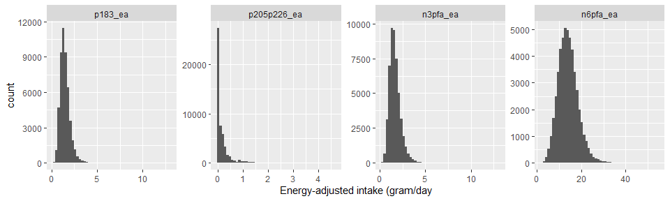
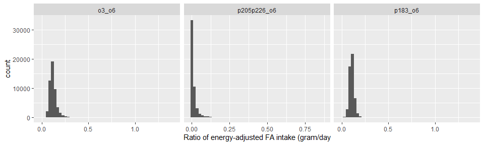

AHS-2 lupus study 2
================

## Dataset

-   Filename: `lupus-initial-dataset-v1-2022-04-25.csv`
    -   Data received on 4/25/2022
    -   Includes *n* = 93467 subjects and 115 variables
    -   No imputations
-   To create an analytic file:
    -   Included only non-Hispanic White or Black
    -   Excluded if age at baseline \< 30 years
    -   Excluded extreme energy intake of \<500 or \>4500 kcal
    -   Excluded any subjects with missing gender, education, smoking
        history, dietary pattern and BMI
    -   **Included only females in this analysis**
    -   This resulted in *n* = 50542 subjects (42925 subjects were
        excluded)

## Outcome

-   Prevalent cases of SLE were identified using the baseline
    questionnaire
    -   Includes only those who “have been treated for SLE in the last
        12 months” at baseline
    -   (“Years since the 1st diagnosis” was not used, following the
        case definition in the manuscript)
-   There were 220 prevalent cases (0.44%) of SLE

## Descriptive table

-   Descriptive table stratified by cases/non-cases
    -   Variables were categorized following the original manuscript

<table>
<thead>
<tr>
<th style="text-align:left;">
</th>
<th style="text-align:left;">
level
</th>
<th style="text-align:left;">
No
</th>
<th style="text-align:left;">
Yes
</th>
<th style="text-align:left;">
p
</th>
<th style="text-align:left;">
test
</th>
</tr>
</thead>
<tbody>
<tr>
<td style="text-align:left;">
n
</td>
<td style="text-align:left;">
</td>
<td style="text-align:left;">
50322
</td>
<td style="text-align:left;">
220
</td>
<td style="text-align:left;">
</td>
<td style="text-align:left;">
</td>
</tr>
<tr>
<td style="text-align:left;">
age (mean (SD))
</td>
<td style="text-align:left;">
</td>
<td style="text-align:left;">
58.38 (14.31)
</td>
<td style="text-align:left;">
56.63 (11.90)
</td>
<td style="text-align:left;">
0.0692
</td>
<td style="text-align:left;">
</td>
</tr>
<tr>
<td style="text-align:left;">
agecat (%)
</td>
<td style="text-align:left;">
30-39
</td>
<td style="text-align:left;">
5154 (10.2)
</td>
<td style="text-align:left;">
14 ( 6.4)
</td>
<td style="text-align:left;">
0.0042
</td>
<td style="text-align:left;">
</td>
</tr>
<tr>
<td style="text-align:left;">
</td>
<td style="text-align:left;">
40-59
</td>
<td style="text-align:left;">
23002 (45.7)
</td>
<td style="text-align:left;">
124 (56.4)
</td>
<td style="text-align:left;">
</td>
<td style="text-align:left;">
</td>
</tr>
<tr>
<td style="text-align:left;">
</td>
<td style="text-align:left;">
\>=60
</td>
<td style="text-align:left;">
22166 (44.0)
</td>
<td style="text-align:left;">
82 (37.3)
</td>
<td style="text-align:left;">
</td>
<td style="text-align:left;">
</td>
</tr>
<tr>
<td style="text-align:left;">
black (%)
</td>
<td style="text-align:left;">
White
</td>
<td style="text-align:left;">
35728 (71.0)
</td>
<td style="text-align:left;">
125 (56.8)
</td>
<td style="text-align:left;">
\<0.0001
</td>
<td style="text-align:left;">
</td>
</tr>
<tr>
<td style="text-align:left;">
</td>
<td style="text-align:left;">
Black
</td>
<td style="text-align:left;">
14594 (29.0)
</td>
<td style="text-align:left;">
95 (43.2)
</td>
<td style="text-align:left;">
</td>
<td style="text-align:left;">
</td>
</tr>
<tr>
<td style="text-align:left;">
smkever (%)
</td>
<td style="text-align:left;">
Never
</td>
<td style="text-align:left;">
41899 (83.3)
</td>
<td style="text-align:left;">
159 (72.3)
</td>
<td style="text-align:left;">
\<0.0001
</td>
<td style="text-align:left;">
</td>
</tr>
<tr>
<td style="text-align:left;">
</td>
<td style="text-align:left;">
Ever
</td>
<td style="text-align:left;">
8423 (16.7)
</td>
<td style="text-align:left;">
61 (27.7)
</td>
<td style="text-align:left;">
</td>
<td style="text-align:left;">
</td>
</tr>
<tr>
<td style="text-align:left;">
educat3 (%)
</td>
<td style="text-align:left;">
HS or less
</td>
<td style="text-align:left;">
11450 (22.8)
</td>
<td style="text-align:left;">
44 (20.0)
</td>
<td style="text-align:left;">
0.6150
</td>
<td style="text-align:left;">
</td>
</tr>
<tr>
<td style="text-align:left;">
</td>
<td style="text-align:left;">
Some college
</td>
<td style="text-align:left;">
22101 (43.9)
</td>
<td style="text-align:left;">
99 (45.0)
</td>
<td style="text-align:left;">
</td>
<td style="text-align:left;">
</td>
</tr>
<tr>
<td style="text-align:left;">
</td>
<td style="text-align:left;">
Col grad
</td>
<td style="text-align:left;">
16771 (33.3)
</td>
<td style="text-align:left;">
77 (35.0)
</td>
<td style="text-align:left;">
</td>
<td style="text-align:left;">
</td>
</tr>
<tr>
<td style="text-align:left;">
vegstat3 (%)
</td>
<td style="text-align:left;">
Vegetarians
</td>
<td style="text-align:left;">
18956 (37.7)
</td>
<td style="text-align:left;">
63 (28.6)
</td>
<td style="text-align:left;">
0.0201
</td>
<td style="text-align:left;">
</td>
</tr>
<tr>
<td style="text-align:left;">
</td>
<td style="text-align:left;">
Pesco
</td>
<td style="text-align:left;">
4978 ( 9.9)
</td>
<td style="text-align:left;">
23 (10.5)
</td>
<td style="text-align:left;">
</td>
<td style="text-align:left;">
</td>
</tr>
<tr>
<td style="text-align:left;">
</td>
<td style="text-align:left;">
Non-veg
</td>
<td style="text-align:left;">
26388 (52.4)
</td>
<td style="text-align:left;">
134 (60.9)
</td>
<td style="text-align:left;">
</td>
<td style="text-align:left;">
</td>
</tr>
<tr>
<td style="text-align:left;">
take_fo (%)
</td>
<td style="text-align:left;">
No
</td>
<td style="text-align:left;">
44775 (89.0)
</td>
<td style="text-align:left;">
177 (80.5)
</td>
<td style="text-align:left;">
0.0001
</td>
<td style="text-align:left;">
</td>
</tr>
<tr>
<td style="text-align:left;">
</td>
<td style="text-align:left;">
Yes
</td>
<td style="text-align:left;">
5547 (11.0)
</td>
<td style="text-align:left;">
43 (19.5)
</td>
<td style="text-align:left;">
</td>
<td style="text-align:left;">
</td>
</tr>
<tr>
<td style="text-align:left;">
bmi (mean (SD))
</td>
<td style="text-align:left;">
</td>
<td style="text-align:left;">
27.49 (6.56)
</td>
<td style="text-align:left;">
29.89 (9.41)
</td>
<td style="text-align:left;">
\<0.0001
</td>
<td style="text-align:left;">
</td>
</tr>
<tr>
<td style="text-align:left;">
bmicat (%)
</td>
<td style="text-align:left;">
Normal
</td>
<td style="text-align:left;">
20858 (41.4)
</td>
<td style="text-align:left;">
70 (31.8)
</td>
<td style="text-align:left;">
0.0150
</td>
<td style="text-align:left;">
</td>
</tr>
<tr>
<td style="text-align:left;">
</td>
<td style="text-align:left;">
Overweight
</td>
<td style="text-align:left;">
15313 (30.4)
</td>
<td style="text-align:left;">
77 (35.0)
</td>
<td style="text-align:left;">
</td>
<td style="text-align:left;">
</td>
</tr>
<tr>
<td style="text-align:left;">
</td>
<td style="text-align:left;">
Obese
</td>
<td style="text-align:left;">
14151 (28.1)
</td>
<td style="text-align:left;">
73 (33.2)
</td>
<td style="text-align:left;">
</td>
<td style="text-align:left;">
</td>
</tr>
<tr>
<td style="text-align:left;">
kcal (mean (SD))
</td>
<td style="text-align:left;">
</td>
<td style="text-align:left;">
1759.85 (710.88)
</td>
<td style="text-align:left;">
1788.80 (744.77)
</td>
<td style="text-align:left;">
0.5469
</td>
<td style="text-align:left;">
</td>
</tr>
</tbody>
</table>

## Energy-adjusted fatty acid intake

-   The nutrient intake data include the following fatty acids
    -   Each FA has both dietary and supplement intake

<table>
<thead>
<tr>
<th style="text-align:left;">
fa_name
</th>
<th style="text-align:left;">
lipid
</th>
<th style="text-align:left;">
note
</th>
</tr>
</thead>
<tbody>
<tr>
<td style="text-align:left;">
ALA
</td>
<td style="text-align:left;">
p183
</td>
<td style="text-align:left;">
Omega-3
</td>
</tr>
<tr>
<td style="text-align:left;">
SDA
</td>
<td style="text-align:left;">
p184
</td>
<td style="text-align:left;">
Omega-3
</td>
</tr>
<tr>
<td style="text-align:left;">
EPA
</td>
<td style="text-align:left;">
p205
</td>
<td style="text-align:left;">
Omega-3
</td>
</tr>
<tr>
<td style="text-align:left;">
DPA
</td>
<td style="text-align:left;">
p225
</td>
<td style="text-align:left;">
Omega-3
</td>
</tr>
<tr>
<td style="text-align:left;">
DHA
</td>
<td style="text-align:left;">
p226
</td>
<td style="text-align:left;">
Omega-3
</td>
</tr>
<tr>
<td style="text-align:left;">
LA
</td>
<td style="text-align:left;">
p182
</td>
<td style="text-align:left;">
Omega-6
</td>
</tr>
<tr>
<td style="text-align:left;">
AA
</td>
<td style="text-align:left;">
p204
</td>
<td style="text-align:left;">
Omega-6
</td>
</tr>
</tbody>
</table>

-   For each FA, its dietary intake was energy-adjusted by the residual
    method, while partitioning zero intake ([Jaceldo-Siegl et al.,
    2011](https://www.ncbi.nlm.nih.gov/pmc/articles/PMC3433053/)). Due
    to its highly right-skewed distribution, non-zero intake was
    log-transformed before being regressed on the total energy intake.
    Residuals were added by the mean of log and then back-transformed to
    obtain energy-adjusted dietary intake. Energy-adjusted dietary
    intake was added with (unadjusted) supplement intake to form
    energy-adjuste total intake.
    -   Energy-adjusted total omega-3 fatty acid intake was calculated
        as the sum of the following energy-adjusted FAs: ALA, SDA, EPA,
        DPA and DHA.
    -   Energy-adjusted total omega-6 fatty acid intake was calculated
        as the sum of the following energy-adjusted FAs: LA, AA
-   Distributions of energy-adjusted ALA, EPA + DHA, total omega-3, and
    total omega-6 are highly right-skewed:

<!-- -->

-   Density plots by prevalent SLE status are shown below. Note that the
    x-axis is in a pseudo-log scale:

<!-- -->

-   A Spearman correlation matrix among energy-adjusted ALA, EPA + DHA,
    total omega-3, and total omega-6 is shown below
    -   ALA is moderately positively correlated with omega-3 and omega-6
        fatty acids.

<table>
<thead>
<tr>
<th style="text-align:left;">
</th>
<th style="text-align:right;">
p183_ea
</th>
<th style="text-align:right;">
p205p226_ea
</th>
<th style="text-align:right;">
n3pfa_ea
</th>
<th style="text-align:right;">
n6pfa_ea
</th>
</tr>
</thead>
<tbody>
<tr>
<td style="text-align:left;">
p183_ea
</td>
<td style="text-align:right;">
1.000
</td>
<td style="text-align:right;">
0.004
</td>
<td style="text-align:right;">
0.881
</td>
<td style="text-align:right;">
0.742
</td>
</tr>
<tr>
<td style="text-align:left;">
p205p226_ea
</td>
<td style="text-align:right;">
0.004
</td>
<td style="text-align:right;">
1.000
</td>
<td style="text-align:right;">
0.351
</td>
<td style="text-align:right;">
-0.100
</td>
</tr>
<tr>
<td style="text-align:left;">
n3pfa_ea
</td>
<td style="text-align:right;">
0.881
</td>
<td style="text-align:right;">
0.351
</td>
<td style="text-align:right;">
1.000
</td>
<td style="text-align:right;">
0.609
</td>
</tr>
<tr>
<td style="text-align:left;">
n6pfa_ea
</td>
<td style="text-align:right;">
0.742
</td>
<td style="text-align:right;">
-0.100
</td>
<td style="text-align:right;">
0.609
</td>
<td style="text-align:right;">
1.000
</td>
</tr>
</tbody>
</table>

-   Median (IQR) intake (gram/day) of energy-adjusted ALA, EPA + DHA,
    total omega-3, and total omega-6 by cases/non-cases:
    -   For EPA + DHA, those with SLE had significantly higher intake
        than those without SLE.

<table class="gmisc_table" style="border-collapse: collapse; margin-top: 1em; margin-bottom: 1em;">
<thead>
<tr>
<td colspan="4" style="text-align: left;">
Median (IQR) energy-adjusted intake of fatty acids (gram/day)
</td>
</tr>
<tr>
<th style="border-bottom: 1px solid grey; border-top: 2px solid grey;">
</th>
<th style="font-weight: 900; border-bottom: 1px solid grey; border-top: 2px solid grey; text-align: center;">
No
</th>
<th style="font-weight: 900; border-bottom: 1px solid grey; border-top: 2px solid grey; text-align: center;">
Yes
</th>
<th style="font-weight: 900; border-bottom: 1px solid grey; border-top: 2px solid grey; text-align: center;">
P-value
</th>
</tr>
</thead>
<tbody>
<tr>
<td style="text-align: left;">
ALA
</td>
<td style="text-align: center;">
1.40 (1.11 - 1.76)
</td>
<td style="text-align: center;">
1.36 (1.13 - 1.73)
</td>
<td style="text-align: center;">
0.81
</td>
</tr>
<tr>
<td style="text-align: left;">
DHA + EPA
</td>
<td style="text-align: center;">
0.03 (0.00 - 0.18)
</td>
<td style="text-align: center;">
0.09 (0.01 - 0.30)
</td>
<td style="text-align: center;">
\< 0.0001
</td>
</tr>
<tr>
<td style="text-align: left;">
DHA + EPA dietary
</td>
<td style="text-align: center;">
0.02 (0.00 - 0.14)
</td>
<td style="text-align: center;">
0.05 (0.00 - 0.17)
</td>
<td style="text-align: center;">
0.002
</td>
</tr>
<tr>
<td style="text-align: left;">
Omega-3
</td>
<td style="text-align: center;">
1.55 (1.22 - 1.97)
</td>
<td style="text-align: center;">
1.60 (1.29 - 2.02)
</td>
<td style="text-align: center;">
0.090
</td>
</tr>
<tr>
<td style="text-align: left;">
Omega-3 dietary
</td>
<td style="text-align: center;">
1.51 (1.19 - 1.89)
</td>
<td style="text-align: center;">
1.53 (1.22 - 1.85)
</td>
<td style="text-align: center;">
0.74
</td>
</tr>
<tr>
<td style="border-bottom: 2px solid grey; text-align: left;">
Omega-6
</td>
<td style="border-bottom: 2px solid grey; text-align: center;">
13.73 (10.96 - 16.70)
</td>
<td style="border-bottom: 2px solid grey; text-align: center;">
13.25 (10.27 - 16.33)
</td>
<td style="border-bottom: 2px solid grey; text-align: center;">
0.088
</td>
</tr>
</tbody>
<tfoot>
<tr>
<td colspan="4">
P-values were from Mann-Whitney tests
</td>
</tr>
</tfoot>
</table>

-   Proportions of (energy-adjusted) dietary intake out of the total
    intake (dietary + supplement) are shown below. Over 90% of the total
    intake were from dietary intake, not supplements.

<table>
<thead>
<tr>
<th style="text-align:left;">
var
</th>
<th style="text-align:right;">
mean
</th>
</tr>
</thead>
<tbody>
<tr>
<td style="text-align:left;">
p183_diet_ratio
</td>
<td style="text-align:right;">
0.9983
</td>
</tr>
<tr>
<td style="text-align:left;">
p205p226_diet_ratio
</td>
<td style="text-align:right;">
0.9143
</td>
</tr>
<tr>
<td style="text-align:left;">
n3pfa_diet_ratio
</td>
<td style="text-align:right;">
0.9723
</td>
</tr>
<tr>
<td style="text-align:left;">
n6pfa_diet_ratio
</td>
<td style="text-align:right;">
0.9995
</td>
</tr>
</tbody>
</table>

-   Three ratios of fatty acids, Omega-3/Omega-6, (DHA + EPA)/Omega-6,
    ALA/Omega-6, were calculated based on energy-adjusted intake, i.e.,
    both the numerator and denominator were energy-adjusted values.
    -   Distribution of the three ratios were highly right-skewed:

<!-- -->

-   A Spearman correlation matrix among three ratio variables is shown
    below.
    -   Omega-3/omema-6 ratio is highly correlated with ALA/omega-6
        ratio.

<table>
<thead>
<tr>
<th style="text-align:left;">
</th>
<th style="text-align:right;">
o3_o6
</th>
<th style="text-align:right;">
p205p226_o6
</th>
<th style="text-align:right;">
p183_o6
</th>
</tr>
</thead>
<tbody>
<tr>
<td style="text-align:left;">
o3_o6
</td>
<td style="text-align:right;">
1.000
</td>
<td style="text-align:right;">
0.553
</td>
<td style="text-align:right;">
0.850
</td>
</tr>
<tr>
<td style="text-align:left;">
p205p226_o6
</td>
<td style="text-align:right;">
0.553
</td>
<td style="text-align:right;">
1.000
</td>
<td style="text-align:right;">
0.165
</td>
</tr>
<tr>
<td style="text-align:left;">
p183_o6
</td>
<td style="text-align:right;">
0.850
</td>
<td style="text-align:right;">
0.165
</td>
<td style="text-align:right;">
1.000
</td>
</tr>
</tbody>
</table>

-   Median (IQR) ratio of energy-adjusted fatty acids by
    cases/non-cases:
    -   For all ratios, those with SLE had significantly higher intake
        than those without SLE.

<table class="gmisc_table" style="border-collapse: collapse; margin-top: 1em; margin-bottom: 1em;">
<thead>
<tr>
<td colspan="4" style="text-align: left;">
Median (IQR) ratio of energy-adjusted fatty acid intake
</td>
</tr>
<tr>
<th style="border-bottom: 1px solid grey; border-top: 2px solid grey;">
</th>
<th style="font-weight: 900; border-bottom: 1px solid grey; border-top: 2px solid grey; text-align: center;">
No
</th>
<th style="font-weight: 900; border-bottom: 1px solid grey; border-top: 2px solid grey; text-align: center;">
Yes
</th>
<th style="font-weight: 900; border-bottom: 1px solid grey; border-top: 2px solid grey; text-align: center;">
P-value
</th>
</tr>
</thead>
<tbody>
<tr>
<td style="text-align: left;">
Omega-3/Omega-6
</td>
<td style="text-align: center;">
0.1144 (0.0966 - 0.1368)
</td>
<td style="text-align: center;">
0.1198 (0.1001 - 0.1519)
</td>
<td style="text-align: center;">
0.002
</td>
</tr>
<tr>
<td style="text-align: left;">
(DHA + EPA)/Omega-6
</td>
<td style="text-align: center;">
0.0022 (0.0002 - 0.0141)
</td>
<td style="text-align: center;">
0.0069 (0.0005 - 0.0221)
</td>
<td style="text-align: center;">
\< 0.0001
</td>
</tr>
<tr>
<td style="border-bottom: 2px solid grey; text-align: left;">
ALA/Omega-6
</td>
<td style="border-bottom: 2px solid grey; text-align: center;">
0.1051 (0.0908 - 0.1209)
</td>
<td style="border-bottom: 2px solid grey; text-align: center;">
0.1071 (0.0906 - 0.1245)
</td>
<td style="border-bottom: 2px solid grey; text-align: center;">
0.20
</td>
</tr>
</tbody>
<tfoot>
<tr>
<td colspan="4">
P-values were from Mann-Whitney tests
</td>
</tr>
</tfoot>
</table>

## Quartiles of FA ratios

-   The three FA ratio variables were categorized into quartile groups.
    Frequency tables by SLE status were shown below
    -   For omega-3/omega-6 and (DHA + EPA)/omega-6, the SLE group had
        significantly more subjects in higher quartile groups, compared
        to the non-SLE group.

<table>
<thead>
<tr>
<th style="text-align:left;">
</th>
<th style="text-align:left;">
level
</th>
<th style="text-align:left;">
No
</th>
<th style="text-align:left;">
Yes
</th>
<th style="text-align:left;">
p
</th>
<th style="text-align:left;">
test
</th>
</tr>
</thead>
<tbody>
<tr>
<td style="text-align:left;">
n
</td>
<td style="text-align:left;">
</td>
<td style="text-align:left;">
50322
</td>
<td style="text-align:left;">
220
</td>
<td style="text-align:left;">
</td>
<td style="text-align:left;">
</td>
</tr>
<tr>
<td style="text-align:left;">
o3_o6_cat (%)
</td>
<td style="text-align:left;">
1
</td>
<td style="text-align:left;">
12593 (25.0)
</td>
<td style="text-align:left;">
43 (19.5)
</td>
<td style="text-align:left;">
0.0038
</td>
<td style="text-align:left;">
</td>
</tr>
<tr>
<td style="text-align:left;">
</td>
<td style="text-align:left;">
2
</td>
<td style="text-align:left;">
12587 (25.0)
</td>
<td style="text-align:left;">
49 (22.3)
</td>
<td style="text-align:left;">
</td>
<td style="text-align:left;">
</td>
</tr>
<tr>
<td style="text-align:left;">
</td>
<td style="text-align:left;">
3
</td>
<td style="text-align:left;">
12585 (25.0)
</td>
<td style="text-align:left;">
50 (22.7)
</td>
<td style="text-align:left;">
</td>
<td style="text-align:left;">
</td>
</tr>
<tr>
<td style="text-align:left;">
</td>
<td style="text-align:left;">
4
</td>
<td style="text-align:left;">
12557 (25.0)
</td>
<td style="text-align:left;">
78 (35.5)
</td>
<td style="text-align:left;">
</td>
<td style="text-align:left;">
</td>
</tr>
<tr>
<td style="text-align:left;">
p205p226_o6_cat (%)
</td>
<td style="text-align:left;">
1
</td>
<td style="text-align:left;">
12598 (25.0)
</td>
<td style="text-align:left;">
38 (17.3)
</td>
<td style="text-align:left;">
0.0026
</td>
<td style="text-align:left;">
</td>
</tr>
<tr>
<td style="text-align:left;">
</td>
<td style="text-align:left;">
2
</td>
<td style="text-align:left;">
12591 (25.0)
</td>
<td style="text-align:left;">
45 (20.5)
</td>
<td style="text-align:left;">
</td>
<td style="text-align:left;">
</td>
</tr>
<tr>
<td style="text-align:left;">
</td>
<td style="text-align:left;">
3
</td>
<td style="text-align:left;">
12570 (25.0)
</td>
<td style="text-align:left;">
65 (29.5)
</td>
<td style="text-align:left;">
</td>
<td style="text-align:left;">
</td>
</tr>
<tr>
<td style="text-align:left;">
</td>
<td style="text-align:left;">
4
</td>
<td style="text-align:left;">
12563 (25.0)
</td>
<td style="text-align:left;">
72 (32.7)
</td>
<td style="text-align:left;">
</td>
<td style="text-align:left;">
</td>
</tr>
<tr>
<td style="text-align:left;">
p183_o6_cat (%)
</td>
<td style="text-align:left;">
1
</td>
<td style="text-align:left;">
12580 (25.0)
</td>
<td style="text-align:left;">
56 (25.5)
</td>
<td style="text-align:left;">
0.1688
</td>
<td style="text-align:left;">
</td>
</tr>
<tr>
<td style="text-align:left;">
</td>
<td style="text-align:left;">
2
</td>
<td style="text-align:left;">
12586 (25.0)
</td>
<td style="text-align:left;">
50 (22.7)
</td>
<td style="text-align:left;">
</td>
<td style="text-align:left;">
</td>
</tr>
<tr>
<td style="text-align:left;">
</td>
<td style="text-align:left;">
3
</td>
<td style="text-align:left;">
12589 (25.0)
</td>
<td style="text-align:left;">
46 (20.9)
</td>
<td style="text-align:left;">
</td>
<td style="text-align:left;">
</td>
</tr>
<tr>
<td style="text-align:left;">
</td>
<td style="text-align:left;">
4
</td>
<td style="text-align:left;">
12567 (25.0)
</td>
<td style="text-align:left;">
68 (30.9)
</td>
<td style="text-align:left;">
</td>
<td style="text-align:left;">
</td>
</tr>
</tbody>
</table>

-   Cut-off values of quartiles were shown below:

<table>
<thead>
<tr>
<th style="text-align:left;">
o3_o6_cat
</th>
<th style="text-align:right;">
min
</th>
<th style="text-align:right;">
max
</th>
</tr>
</thead>
<tbody>
<tr>
<td style="text-align:left;">
1
</td>
<td style="text-align:right;">
0.0123506
</td>
<td style="text-align:right;">
0.0966521
</td>
</tr>
<tr>
<td style="text-align:left;">
2
</td>
<td style="text-align:right;">
0.0966532
</td>
<td style="text-align:right;">
0.1144649
</td>
</tr>
<tr>
<td style="text-align:left;">
3
</td>
<td style="text-align:right;">
0.1144651
</td>
<td style="text-align:right;">
0.1368897
</td>
</tr>
<tr>
<td style="text-align:left;">
4
</td>
<td style="text-align:right;">
0.1368947
</td>
<td style="text-align:right;">
1.4121172
</td>
</tr>
</tbody>
</table>
<table>
<thead>
<tr>
<th style="text-align:left;">
p205p226_o6_cat
</th>
<th style="text-align:right;">
min
</th>
<th style="text-align:right;">
max
</th>
</tr>
</thead>
<tbody>
<tr>
<td style="text-align:left;">
1
</td>
<td style="text-align:right;">
0.0000000
</td>
<td style="text-align:right;">
0.0002034
</td>
</tr>
<tr>
<td style="text-align:left;">
2
</td>
<td style="text-align:right;">
0.0002034
</td>
<td style="text-align:right;">
0.0022238
</td>
</tr>
<tr>
<td style="text-align:left;">
3
</td>
<td style="text-align:right;">
0.0022239
</td>
<td style="text-align:right;">
0.0141175
</td>
</tr>
<tr>
<td style="text-align:left;">
4
</td>
<td style="text-align:right;">
0.0141215
</td>
<td style="text-align:right;">
0.8621944
</td>
</tr>
</tbody>
</table>
<table>
<thead>
<tr>
<th style="text-align:left;">
p183_o6_cat
</th>
<th style="text-align:right;">
min
</th>
<th style="text-align:right;">
max
</th>
</tr>
</thead>
<tbody>
<tr>
<td style="text-align:left;">
1
</td>
<td style="text-align:right;">
0.0119524
</td>
<td style="text-align:right;">
0.0908085
</td>
</tr>
<tr>
<td style="text-align:left;">
2
</td>
<td style="text-align:right;">
0.0908095
</td>
<td style="text-align:right;">
0.1051179
</td>
</tr>
<tr>
<td style="text-align:left;">
3
</td>
<td style="text-align:right;">
0.1051185
</td>
<td style="text-align:right;">
0.1208971
</td>
</tr>
<tr>
<td style="text-align:left;">
4
</td>
<td style="text-align:right;">
0.1208993
</td>
<td style="text-align:right;">
1.4113972
</td>
</tr>
</tbody>
</table>

## Logistic models with all three ratio variables

-   Four logistic models were fitted using prevalent SLE as the outcome.
    -   Model 1 includes: quartile groups of omega-3/omega-6, (DHA +
        EPA)/omega-6, ALA/omaga-6, and kcal (per 100 kcal)
    -   Model 2 adds age groups, race, education level, and smoking
        status (never/ever)
    -   Model 3 further adds dietary pattern
    -   Model 4 further adds BMI groups
-   The table below shows estimated odds ratios and 95% Wald confidence
    intervals from each logistic model:

<table style="text-align:center">
<tr>
<td colspan="5" style="border-bottom: 1px solid black">
</td>
</tr>
<tr>
<td style="text-align:left">
</td>
<td colspan="4">
Outcome: Prevalent SLE
</td>
</tr>
<tr>
<td style="text-align:left">
</td>
<td>
Model 1
</td>
<td>
Model 2
</td>
<td>
Model 3
</td>
<td>
Model 4
</td>
</tr>
<tr>
<td colspan="5" style="border-bottom: 1px solid black">
</td>
</tr>
<tr>
<td style="text-align:left">
O3/O6: Q2
</td>
<td>
1.60
</td>
<td>
1.59
</td>
<td>
1.59
</td>
<td>
1.59
</td>
</tr>
<tr>
<td style="text-align:left">
</td>
<td>
(0.93, 2.74)
</td>
<td>
(0.93, 2.73)
</td>
<td>
(0.93, 2.73)
</td>
<td>
(0.93, 2.73)
</td>
</tr>
<tr>
<td style="text-align:left">
</td>
<td>
</td>
<td>
</td>
<td>
</td>
<td>
</td>
</tr>
<tr>
<td style="text-align:left">
O3/O6: Q3
</td>
<td>
1.83
</td>
<td>
1.82
</td>
<td>
1.82
</td>
<td>
1.83
</td>
</tr>
<tr>
<td style="text-align:left">
</td>
<td>
(0.95, 3.54)
</td>
<td>
(0.94, 3.52)
</td>
<td>
(0.94, 3.53)
</td>
<td>
(0.95, 3.54)
</td>
</tr>
<tr>
<td style="text-align:left">
</td>
<td>
</td>
<td>
</td>
<td>
</td>
<td>
</td>
</tr>
<tr>
<td style="text-align:left">
O3/O6: Q4
</td>
<td>
2.81
</td>
<td>
2.71
</td>
<td>
2.71
</td>
<td>
2.73
</td>
</tr>
<tr>
<td style="text-align:left">
</td>
<td>
(1.28, 6.17)
</td>
<td>
(1.23, 5.96)
</td>
<td>
(1.23, 5.98)
</td>
<td>
(1.24, 6.02)
</td>
</tr>
<tr>
<td style="text-align:left">
</td>
<td>
</td>
<td>
</td>
<td>
</td>
<td>
</td>
</tr>
<tr>
<td style="text-align:left">
DHA+EPA/O6: Q2
</td>
<td>
1.20
</td>
<td>
1.19
</td>
<td>
1.24
</td>
<td>
1.21
</td>
</tr>
<tr>
<td style="text-align:left">
</td>
<td>
(0.78, 1.85)
</td>
<td>
(0.77, 1.84)
</td>
<td>
(0.76, 2.00)
</td>
<td>
(0.75, 1.96)
</td>
</tr>
<tr>
<td style="text-align:left">
</td>
<td>
</td>
<td>
</td>
<td>
</td>
<td>
</td>
</tr>
<tr>
<td style="text-align:left">
DHA+EPA/O6: Q3
</td>
<td>
1.54
</td>
<td>
1.34
</td>
<td>
1.44
</td>
<td>
1.41
</td>
</tr>
<tr>
<td style="text-align:left">
</td>
<td>
(1.02, 2.34)
</td>
<td>
(0.88, 2.04)
</td>
<td>
(0.80, 2.60)
</td>
<td>
(0.78, 2.55)
</td>
</tr>
<tr>
<td style="text-align:left">
</td>
<td>
</td>
<td>
</td>
<td>
</td>
<td>
</td>
</tr>
<tr>
<td style="text-align:left">
DHA+EPA/O6: Q4
</td>
<td>
1.28
</td>
<td>
1.05
</td>
<td>
1.12
</td>
<td>
1.09
</td>
</tr>
<tr>
<td style="text-align:left">
</td>
<td>
(0.77, 2.12)
</td>
<td>
(0.62, 1.76)
</td>
<td>
(0.59, 2.13)
</td>
<td>
(0.58, 2.08)
</td>
</tr>
<tr>
<td style="text-align:left">
</td>
<td>
</td>
<td>
</td>
<td>
</td>
<td>
</td>
</tr>
<tr>
<td style="text-align:left">
ALA/O6: Q2
</td>
<td>
0.62
</td>
<td>
0.61
</td>
<td>
0.61
</td>
<td>
0.61
</td>
</tr>
<tr>
<td style="text-align:left">
</td>
<td>
(0.38, 1.01)
</td>
<td>
(0.38, 1.00)
</td>
<td>
(0.38, 1.00)
</td>
<td>
(0.37, 0.99)
</td>
</tr>
<tr>
<td style="text-align:left">
</td>
<td>
</td>
<td>
</td>
<td>
</td>
<td>
</td>
</tr>
<tr>
<td style="text-align:left">
ALA/O6: Q3
</td>
<td>
0.47
</td>
<td>
0.47
</td>
<td>
0.47
</td>
<td>
0.46
</td>
</tr>
<tr>
<td style="text-align:left">
</td>
<td>
(0.27, 0.84)
</td>
<td>
(0.26, 0.82)
</td>
<td>
(0.26, 0.82)
</td>
<td>
(0.26, 0.82)
</td>
</tr>
<tr>
<td style="text-align:left">
</td>
<td>
</td>
<td>
</td>
<td>
</td>
<td>
</td>
</tr>
<tr>
<td style="text-align:left">
ALA/O6: Q4
</td>
<td>
0.55
</td>
<td>
0.55
</td>
<td>
0.55
</td>
<td>
0.55
</td>
</tr>
<tr>
<td style="text-align:left">
</td>
<td>
(0.29, 1.05)
</td>
<td>
(0.29, 1.05)
</td>
<td>
(0.29, 1.05)
</td>
<td>
(0.28, 1.04)
</td>
</tr>
<tr>
<td style="text-align:left">
</td>
<td>
</td>
<td>
</td>
<td>
</td>
<td>
</td>
</tr>
<tr>
<td style="text-align:left">
Kcal/100
</td>
<td>
1.00
</td>
<td>
1.00
</td>
<td>
1.00
</td>
<td>
1.00
</td>
</tr>
<tr>
<td style="text-align:left">
</td>
<td>
(0.99, 1.02)
</td>
<td>
(0.98, 1.02)
</td>
<td>
(0.98, 1.02)
</td>
<td>
(0.98, 1.02)
</td>
</tr>
<tr>
<td style="text-align:left">
</td>
<td>
</td>
<td>
</td>
<td>
</td>
<td>
</td>
</tr>
<tr>
<td style="text-align:left">
Age.: 30-39
</td>
<td>
</td>
<td>
0.61
</td>
<td>
0.61
</td>
<td>
0.63
</td>
</tr>
<tr>
<td style="text-align:left">
</td>
<td>
</td>
<td>
(0.34, 1.09)
</td>
<td>
(0.34, 1.09)
</td>
<td>
(0.35, 1.12)
</td>
</tr>
<tr>
<td style="text-align:left">
</td>
<td>
</td>
<td>
</td>
<td>
</td>
<td>
</td>
</tr>
<tr>
<td style="text-align:left">
Age.: 40-59
</td>
<td>
</td>
<td>
1.25
</td>
<td>
1.25
</td>
<td>
1.26
</td>
</tr>
<tr>
<td style="text-align:left">
</td>
<td>
</td>
<td>
(0.94, 1.67)
</td>
<td>
(0.93, 1.67)
</td>
<td>
(0.94, 1.68)
</td>
</tr>
<tr>
<td style="text-align:left">
</td>
<td>
</td>
<td>
</td>
<td>
</td>
<td>
</td>
</tr>
<tr>
<td style="text-align:left">
Race: Black
</td>
<td>
</td>
<td>
1.68
</td>
<td>
1.69
</td>
<td>
1.63
</td>
</tr>
<tr>
<td style="text-align:left">
</td>
<td>
</td>
<td>
(1.26, 2.23)
</td>
<td>
(1.27, 2.25)
</td>
<td>
(1.22, 2.19)
</td>
</tr>
<tr>
<td style="text-align:left">
</td>
<td>
</td>
<td>
</td>
<td>
</td>
<td>
</td>
</tr>
<tr>
<td style="text-align:left">
Educ: HS or less
</td>
<td>
</td>
<td>
0.71
</td>
<td>
0.72
</td>
<td>
0.71
</td>
</tr>
<tr>
<td style="text-align:left">
</td>
<td>
</td>
<td>
(0.48, 1.05)
</td>
<td>
(0.48, 1.06)
</td>
<td>
(0.48, 1.04)
</td>
</tr>
<tr>
<td style="text-align:left">
</td>
<td>
</td>
<td>
</td>
<td>
</td>
<td>
</td>
</tr>
<tr>
<td style="text-align:left">
Educ: Some college
</td>
<td>
</td>
<td>
0.87
</td>
<td>
0.87
</td>
<td>
0.86
</td>
</tr>
<tr>
<td style="text-align:left">
</td>
<td>
</td>
<td>
(0.64, 1.18)
</td>
<td>
(0.64, 1.19)
</td>
<td>
(0.64, 1.17)
</td>
</tr>
<tr>
<td style="text-align:left">
</td>
<td>
</td>
<td>
</td>
<td>
</td>
<td>
</td>
</tr>
<tr>
<td style="text-align:left">
Smkg: Ever
</td>
<td>
</td>
<td>
1.87
</td>
<td>
1.86
</td>
<td>
1.84
</td>
</tr>
<tr>
<td style="text-align:left">
</td>
<td>
</td>
<td>
(1.37, 2.53)
</td>
<td>
(1.37, 2.53)
</td>
<td>
(1.36, 2.51)
</td>
</tr>
<tr>
<td style="text-align:left">
</td>
<td>
</td>
<td>
</td>
<td>
</td>
<td>
</td>
</tr>
<tr>
<td style="text-align:left">
Diet: Vegetarians
</td>
<td>
</td>
<td>
</td>
<td>
1.07
</td>
<td>
1.10
</td>
</tr>
<tr>
<td style="text-align:left">
</td>
<td>
</td>
<td>
</td>
<td>
(0.67, 1.70)
</td>
<td>
(0.69, 1.75)
</td>
</tr>
<tr>
<td style="text-align:left">
</td>
<td>
</td>
<td>
</td>
<td>
</td>
<td>
</td>
</tr>
<tr>
<td style="text-align:left">
Diet: Pesco veg
</td>
<td>
</td>
<td>
</td>
<td>
0.91
</td>
<td>
0.93
</td>
</tr>
<tr>
<td style="text-align:left">
</td>
<td>
</td>
<td>
</td>
<td>
(0.58, 1.42)
</td>
<td>
(0.60, 1.46)
</td>
</tr>
<tr>
<td style="text-align:left">
</td>
<td>
</td>
<td>
</td>
<td>
</td>
<td>
</td>
</tr>
<tr>
<td style="text-align:left">
BMI.: Overweight
</td>
<td>
</td>
<td>
</td>
<td>
</td>
<td>
1.32
</td>
</tr>
<tr>
<td style="text-align:left">
</td>
<td>
</td>
<td>
</td>
<td>
</td>
<td>
(0.94, 1.83)
</td>
</tr>
<tr>
<td style="text-align:left">
</td>
<td>
</td>
<td>
</td>
<td>
</td>
<td>
</td>
</tr>
<tr>
<td style="text-align:left">
BMI.: Obese
</td>
<td>
</td>
<td>
</td>
<td>
</td>
<td>
1.22
</td>
</tr>
<tr>
<td style="text-align:left">
</td>
<td>
</td>
<td>
</td>
<td>
</td>
<td>
(0.86, 1.73)
</td>
</tr>
<tr>
<td style="text-align:left">
</td>
<td>
</td>
<td>
</td>
<td>
</td>
<td>
</td>
</tr>
<tr>
<td colspan="5" style="border-bottom: 1px solid black">
</td>
</tr>
<tr>
<td style="text-align:left">
Observations
</td>
<td>
50,542
</td>
<td>
50,542
</td>
<td>
50,542
</td>
<td>
50,542
</td>
</tr>
<tr>
<td colspan="5" style="border-bottom: 1px solid black">
</td>
</tr>
</table>

## Logistic models with omega-3/omega-6 ratio

-   Four logistic models were fitted using prevalent SLE as the outcome.
    -   Model 1 includes: quartile groups of omega-3/omega-6 and kcal
        (per 100 kcal)
    -   Model 2 adds age groups, race, education level, and smoking
        status (never/ever)
    -   Model 3 further adds dietary pattern
    -   Model 4 further adds BMI groups
-   The table below shows estimated odds ratios and 95% Wald confidence
    intervals from each logistic model:

<table style="text-align:center">
<tr>
<td colspan="5" style="border-bottom: 1px solid black">
</td>
</tr>
<tr>
<td style="text-align:left">
</td>
<td colspan="4">
Outcome: Prevalent SLE
</td>
</tr>
<tr>
<td style="text-align:left">
</td>
<td>
Model 1
</td>
<td>
Model 2
</td>
<td>
Model 3
</td>
<td>
Model 4
</td>
</tr>
<tr>
<td colspan="5" style="border-bottom: 1px solid black">
</td>
</tr>
<tr>
<td style="text-align:left">
O3/O6: Q2
</td>
<td>
1.14
</td>
<td>
1.09
</td>
<td>
1.07
</td>
<td>
1.06
</td>
</tr>
<tr>
<td style="text-align:left">
</td>
<td>
(0.75, 1.71)
</td>
<td>
(0.72, 1.64)
</td>
<td>
(0.71, 1.61)
</td>
<td>
(0.70, 1.60)
</td>
</tr>
<tr>
<td style="text-align:left">
</td>
<td>
</td>
<td>
</td>
<td>
</td>
<td>
</td>
</tr>
<tr>
<td style="text-align:left">
O3/O6: Q3
</td>
<td>
1.16
</td>
<td>
1.07
</td>
<td>
1.03
</td>
<td>
1.02
</td>
</tr>
<tr>
<td style="text-align:left">
</td>
<td>
(0.77, 1.75)
</td>
<td>
(0.71, 1.61)
</td>
<td>
(0.68, 1.56)
</td>
<td>
(0.67, 1.55)
</td>
</tr>
<tr>
<td style="text-align:left">
</td>
<td>
</td>
<td>
</td>
<td>
</td>
<td>
</td>
</tr>
<tr>
<td style="text-align:left">
O3/O6: Q4
</td>
<td>
1.82
</td>
<td>
1.53
</td>
<td>
1.45
</td>
<td>
1.45
</td>
</tr>
<tr>
<td style="text-align:left">
</td>
<td>
(1.25, 2.64)
</td>
<td>
(1.05, 2.24)
</td>
<td>
(0.98, 2.16)
</td>
<td>
(0.98, 2.15)
</td>
</tr>
<tr>
<td style="text-align:left">
</td>
<td>
</td>
<td>
</td>
<td>
</td>
<td>
</td>
</tr>
<tr>
<td style="text-align:left">
Kcal/100
</td>
<td>
1.01
</td>
<td>
1.00
</td>
<td>
1.00
</td>
<td>
1.00
</td>
</tr>
<tr>
<td style="text-align:left">
</td>
<td>
(0.99, 1.02)
</td>
<td>
(0.99, 1.02)
</td>
<td>
(0.99, 1.02)
</td>
<td>
(0.98, 1.02)
</td>
</tr>
<tr>
<td style="text-align:left">
</td>
<td>
</td>
<td>
</td>
<td>
</td>
<td>
</td>
</tr>
<tr>
<td style="text-align:left">
Age.: 30-39
</td>
<td>
</td>
<td>
0.61
</td>
<td>
0.60
</td>
<td>
0.62
</td>
</tr>
<tr>
<td style="text-align:left">
</td>
<td>
</td>
<td>
(0.34, 1.09)
</td>
<td>
(0.34, 1.07)
</td>
<td>
(0.35, 1.10)
</td>
</tr>
<tr>
<td style="text-align:left">
</td>
<td>
</td>
<td>
</td>
<td>
</td>
<td>
</td>
</tr>
<tr>
<td style="text-align:left">
Age.: 40-59
</td>
<td>
</td>
<td>
1.25
</td>
<td>
1.24
</td>
<td>
1.25
</td>
</tr>
<tr>
<td style="text-align:left">
</td>
<td>
</td>
<td>
(0.93, 1.66)
</td>
<td>
(0.93, 1.65)
</td>
<td>
(0.93, 1.66)
</td>
</tr>
<tr>
<td style="text-align:left">
</td>
<td>
</td>
<td>
</td>
<td>
</td>
<td>
</td>
</tr>
<tr>
<td style="text-align:left">
Race: Black
</td>
<td>
</td>
<td>
1.74
</td>
<td>
1.70
</td>
<td>
1.64
</td>
</tr>
<tr>
<td style="text-align:left">
</td>
<td>
</td>
<td>
(1.32, 2.29)
</td>
<td>
(1.28, 2.25)
</td>
<td>
(1.24, 2.19)
</td>
</tr>
<tr>
<td style="text-align:left">
</td>
<td>
</td>
<td>
</td>
<td>
</td>
<td>
</td>
</tr>
<tr>
<td style="text-align:left">
Educ: HS or less
</td>
<td>
</td>
<td>
0.73
</td>
<td>
0.72
</td>
<td>
0.71
</td>
</tr>
<tr>
<td style="text-align:left">
</td>
<td>
</td>
<td>
(0.50, 1.08)
</td>
<td>
(0.49, 1.06)
</td>
<td>
(0.48, 1.05)
</td>
</tr>
<tr>
<td style="text-align:left">
</td>
<td>
</td>
<td>
</td>
<td>
</td>
<td>
</td>
</tr>
<tr>
<td style="text-align:left">
Educ: Some college
</td>
<td>
</td>
<td>
0.88
</td>
<td>
0.87
</td>
<td>
0.86
</td>
</tr>
<tr>
<td style="text-align:left">
</td>
<td>
</td>
<td>
(0.65, 1.20)
</td>
<td>
(0.64, 1.18)
</td>
<td>
(0.63, 1.17)
</td>
</tr>
<tr>
<td style="text-align:left">
</td>
<td>
</td>
<td>
</td>
<td>
</td>
<td>
</td>
</tr>
<tr>
<td style="text-align:left">
Smkg: Ever
</td>
<td>
</td>
<td>
1.91
</td>
<td>
1.87
</td>
<td>
1.85
</td>
</tr>
<tr>
<td style="text-align:left">
</td>
<td>
</td>
<td>
(1.41, 2.58)
</td>
<td>
(1.37, 2.54)
</td>
<td>
(1.36, 2.51)
</td>
</tr>
<tr>
<td style="text-align:left">
</td>
<td>
</td>
<td>
</td>
<td>
</td>
<td>
</td>
</tr>
<tr>
<td style="text-align:left">
Diet: Vegetarians
</td>
<td>
</td>
<td>
</td>
<td>
0.85
</td>
<td>
0.89
</td>
</tr>
<tr>
<td style="text-align:left">
</td>
<td>
</td>
<td>
</td>
<td>
(0.61, 1.18)
</td>
<td>
(0.63, 1.24)
</td>
</tr>
<tr>
<td style="text-align:left">
</td>
<td>
</td>
<td>
</td>
<td>
</td>
<td>
</td>
</tr>
<tr>
<td style="text-align:left">
Diet: Pesco veg
</td>
<td>
</td>
<td>
</td>
<td>
0.92
</td>
<td>
0.95
</td>
</tr>
<tr>
<td style="text-align:left">
</td>
<td>
</td>
<td>
</td>
<td>
(0.59, 1.43)
</td>
<td>
(0.60, 1.48)
</td>
</tr>
<tr>
<td style="text-align:left">
</td>
<td>
</td>
<td>
</td>
<td>
</td>
<td>
</td>
</tr>
<tr>
<td style="text-align:left">
BMI.: Overweight
</td>
<td>
</td>
<td>
</td>
<td>
</td>
<td>
1.31
</td>
</tr>
<tr>
<td style="text-align:left">
</td>
<td>
</td>
<td>
</td>
<td>
</td>
<td>
(0.94, 1.83)
</td>
</tr>
<tr>
<td style="text-align:left">
</td>
<td>
</td>
<td>
</td>
<td>
</td>
<td>
</td>
</tr>
<tr>
<td style="text-align:left">
BMI.: Obese
</td>
<td>
</td>
<td>
</td>
<td>
</td>
<td>
1.22
</td>
</tr>
<tr>
<td style="text-align:left">
</td>
<td>
</td>
<td>
</td>
<td>
</td>
<td>
(0.86, 1.73)
</td>
</tr>
<tr>
<td style="text-align:left">
</td>
<td>
</td>
<td>
</td>
<td>
</td>
<td>
</td>
</tr>
<tr>
<td colspan="5" style="border-bottom: 1px solid black">
</td>
</tr>
<tr>
<td style="text-align:left">
Observations
</td>
<td>
50,542
</td>
<td>
50,542
</td>
<td>
50,542
</td>
<td>
50,542
</td>
</tr>
<tr>
<td colspan="5" style="border-bottom: 1px solid black">
</td>
</tr>
</table>

## Logistic models with (DHA + EPA)/omega-6 ratio

-   Four logistic models were fitted using prevalent SLE as the outcome.
    -   Model 1 includes: quartile groups of (DHA + EPA)/omega-6 and
        kcal (per 100 kcal)
    -   Model 2 adds age groups, race, education level, and smoking
        status (never/ever)
    -   Model 3 further adds dietary pattern
    -   Model 4 further adds BMI groups
-   The table below shows estimated odds ratios and 95% Wald confidence
    intervals from each logistic model:

<table style="text-align:center">
<tr>
<td colspan="5" style="border-bottom: 1px solid black">
</td>
</tr>
<tr>
<td style="text-align:left">
</td>
<td colspan="4">
Outcome: Prevalent SLE
</td>
</tr>
<tr>
<td style="text-align:left">
</td>
<td>
Model 1
</td>
<td>
Model 2
</td>
<td>
Model 3
</td>
<td>
Model 4
</td>
</tr>
<tr>
<td colspan="5" style="border-bottom: 1px solid black">
</td>
</tr>
<tr>
<td style="text-align:left">
DHA+EPA/O6: Q2
</td>
<td>
1.18
</td>
<td>
1.18
</td>
<td>
1.22
</td>
<td>
1.19
</td>
</tr>
<tr>
<td style="text-align:left">
</td>
<td>
(0.77, 1.83)
</td>
<td>
(0.76, 1.82)
</td>
<td>
(0.75, 1.97)
</td>
<td>
(0.74, 1.93)
</td>
</tr>
<tr>
<td style="text-align:left">
</td>
<td>
</td>
<td>
</td>
<td>
</td>
<td>
</td>
</tr>
<tr>
<td style="text-align:left">
DHA+EPA/O6: Q3
</td>
<td>
1.71
</td>
<td>
1.47
</td>
<td>
1.58
</td>
<td>
1.55
</td>
</tr>
<tr>
<td style="text-align:left">
</td>
<td>
(1.14, 2.55)
</td>
<td>
(0.97, 2.21)
</td>
<td>
(0.88, 2.83)
</td>
<td>
(0.86, 2.78)
</td>
</tr>
<tr>
<td style="text-align:left">
</td>
<td>
</td>
<td>
</td>
<td>
</td>
<td>
</td>
</tr>
<tr>
<td style="text-align:left">
DHA+EPA/O6: Q4
</td>
<td>
1.90
</td>
<td>
1.52
</td>
<td>
1.62
</td>
<td>
1.59
</td>
</tr>
<tr>
<td style="text-align:left">
</td>
<td>
(1.28, 2.81)
</td>
<td>
(1.01, 2.29)
</td>
<td>
(0.93, 2.84)
</td>
<td>
(0.91, 2.79)
</td>
</tr>
<tr>
<td style="text-align:left">
</td>
<td>
</td>
<td>
</td>
<td>
</td>
<td>
</td>
</tr>
<tr>
<td style="text-align:left">
Kcal/100
</td>
<td>
1.00
</td>
<td>
1.00
</td>
<td>
1.00
</td>
<td>
1.00
</td>
</tr>
<tr>
<td style="text-align:left">
</td>
<td>
(0.99, 1.02)
</td>
<td>
(0.98, 1.02)
</td>
<td>
(0.98, 1.02)
</td>
<td>
(0.98, 1.02)
</td>
</tr>
<tr>
<td style="text-align:left">
</td>
<td>
</td>
<td>
</td>
<td>
</td>
<td>
</td>
</tr>
<tr>
<td style="text-align:left">
Age.: 30-39
</td>
<td>
</td>
<td>
0.59
</td>
<td>
0.59
</td>
<td>
0.61
</td>
</tr>
<tr>
<td style="text-align:left">
</td>
<td>
</td>
<td>
(0.33, 1.06)
</td>
<td>
(0.33, 1.05)
</td>
<td>
(0.34, 1.08)
</td>
</tr>
<tr>
<td style="text-align:left">
</td>
<td>
</td>
<td>
</td>
<td>
</td>
<td>
</td>
</tr>
<tr>
<td style="text-align:left">
Age.: 40-59
</td>
<td>
</td>
<td>
1.23
</td>
<td>
1.23
</td>
<td>
1.24
</td>
</tr>
<tr>
<td style="text-align:left">
</td>
<td>
</td>
<td>
(0.92, 1.65)
</td>
<td>
(0.92, 1.64)
</td>
<td>
(0.93, 1.65)
</td>
</tr>
<tr>
<td style="text-align:left">
</td>
<td>
</td>
<td>
</td>
<td>
</td>
<td>
</td>
</tr>
<tr>
<td style="text-align:left">
Race: Black
</td>
<td>
</td>
<td>
1.70
</td>
<td>
1.71
</td>
<td>
1.66
</td>
</tr>
<tr>
<td style="text-align:left">
</td>
<td>
</td>
<td>
(1.28, 2.26)
</td>
<td>
(1.28, 2.28)
</td>
<td>
(1.24, 2.22)
</td>
</tr>
<tr>
<td style="text-align:left">
</td>
<td>
</td>
<td>
</td>
<td>
</td>
<td>
</td>
</tr>
<tr>
<td style="text-align:left">
Educ: HS or less
</td>
<td>
</td>
<td>
0.72
</td>
<td>
0.72
</td>
<td>
0.71
</td>
</tr>
<tr>
<td style="text-align:left">
</td>
<td>
</td>
<td>
(0.49, 1.06)
</td>
<td>
(0.49, 1.06)
</td>
<td>
(0.48, 1.05)
</td>
</tr>
<tr>
<td style="text-align:left">
</td>
<td>
</td>
<td>
</td>
<td>
</td>
<td>
</td>
</tr>
<tr>
<td style="text-align:left">
Educ: Some college
</td>
<td>
</td>
<td>
0.87
</td>
<td>
0.87
</td>
<td>
0.86
</td>
</tr>
<tr>
<td style="text-align:left">
</td>
<td>
</td>
<td>
(0.64, 1.18)
</td>
<td>
(0.64, 1.18)
</td>
<td>
(0.63, 1.17)
</td>
</tr>
<tr>
<td style="text-align:left">
</td>
<td>
</td>
<td>
</td>
<td>
</td>
<td>
</td>
</tr>
<tr>
<td style="text-align:left">
Smkg: Ever
</td>
<td>
</td>
<td>
1.87
</td>
<td>
1.87
</td>
<td>
1.85
</td>
</tr>
<tr>
<td style="text-align:left">
</td>
<td>
</td>
<td>
(1.38, 2.53)
</td>
<td>
(1.37, 2.54)
</td>
<td>
(1.36, 2.51)
</td>
</tr>
<tr>
<td style="text-align:left">
</td>
<td>
</td>
<td>
</td>
<td>
</td>
<td>
</td>
</tr>
<tr>
<td style="text-align:left">
Diet: Vegetarians
</td>
<td>
</td>
<td>
</td>
<td>
1.07
</td>
<td>
1.09
</td>
</tr>
<tr>
<td style="text-align:left">
</td>
<td>
</td>
<td>
</td>
<td>
(0.67, 1.70)
</td>
<td>
(0.69, 1.75)
</td>
</tr>
<tr>
<td style="text-align:left">
</td>
<td>
</td>
<td>
</td>
<td>
</td>
<td>
</td>
</tr>
<tr>
<td style="text-align:left">
Diet: Pesco veg
</td>
<td>
</td>
<td>
</td>
<td>
0.92
</td>
<td>
0.94
</td>
</tr>
<tr>
<td style="text-align:left">
</td>
<td>
</td>
<td>
</td>
<td>
(0.59, 1.43)
</td>
<td>
(0.60, 1.48)
</td>
</tr>
<tr>
<td style="text-align:left">
</td>
<td>
</td>
<td>
</td>
<td>
</td>
<td>
</td>
</tr>
<tr>
<td style="text-align:left">
BMI.: Overweight
</td>
<td>
</td>
<td>
</td>
<td>
</td>
<td>
1.31
</td>
</tr>
<tr>
<td style="text-align:left">
</td>
<td>
</td>
<td>
</td>
<td>
</td>
<td>
(0.94, 1.82)
</td>
</tr>
<tr>
<td style="text-align:left">
</td>
<td>
</td>
<td>
</td>
<td>
</td>
<td>
</td>
</tr>
<tr>
<td style="text-align:left">
BMI.: Obese
</td>
<td>
</td>
<td>
</td>
<td>
</td>
<td>
1.20
</td>
</tr>
<tr>
<td style="text-align:left">
</td>
<td>
</td>
<td>
</td>
<td>
</td>
<td>
(0.85, 1.70)
</td>
</tr>
<tr>
<td style="text-align:left">
</td>
<td>
</td>
<td>
</td>
<td>
</td>
<td>
</td>
</tr>
<tr>
<td colspan="5" style="border-bottom: 1px solid black">
</td>
</tr>
<tr>
<td style="text-align:left">
Observations
</td>
<td>
50,542
</td>
<td>
50,542
</td>
<td>
50,542
</td>
<td>
50,542
</td>
</tr>
<tr>
<td colspan="5" style="border-bottom: 1px solid black">
</td>
</tr>
</table>

## Logistic models with ALA/omega-6 ratio

-   Four logistic models were fitted using prevalent SLE as the outcome.
    -   Model 1 includes: quartile groups of ALA/omega-6 and kcal (per
        100 kcal)
    -   Model 2 adds age groups, race, education level, and smoking
        status (never/ever)
    -   Model 3 further adds dietary pattern
    -   Model 4 further adds BMI groups
-   The table below shows estimated odds ratios and 95% Wald confidence
    intervals from each logistic model:

<table style="text-align:center">
<tr>
<td colspan="5" style="border-bottom: 1px solid black">
</td>
</tr>
<tr>
<td style="text-align:left">
</td>
<td colspan="4">
Outcome: Prevalent SLE
</td>
</tr>
<tr>
<td style="text-align:left">
</td>
<td>
Model 1
</td>
<td>
Model 2
</td>
<td>
Model 3
</td>
<td>
Model 4
</td>
</tr>
<tr>
<td colspan="5" style="border-bottom: 1px solid black">
</td>
</tr>
<tr>
<td style="text-align:left">
ALA/O6: Q2
</td>
<td>
0.89
</td>
<td>
0.86
</td>
<td>
0.84
</td>
<td>
0.84
</td>
</tr>
<tr>
<td style="text-align:left">
</td>
<td>
(0.61, 1.31)
</td>
<td>
(0.59, 1.26)
</td>
<td>
(0.58, 1.24)
</td>
<td>
(0.57, 1.23)
</td>
</tr>
<tr>
<td style="text-align:left">
</td>
<td>
</td>
<td>
</td>
<td>
</td>
<td>
</td>
</tr>
<tr>
<td style="text-align:left">
ALA/O6: Q3
</td>
<td>
0.82
</td>
<td>
0.77
</td>
<td>
0.75
</td>
<td>
0.74
</td>
</tr>
<tr>
<td style="text-align:left">
</td>
<td>
(0.55, 1.21)
</td>
<td>
(0.52, 1.14)
</td>
<td>
(0.51, 1.11)
</td>
<td>
(0.50, 1.10)
</td>
</tr>
<tr>
<td style="text-align:left">
</td>
<td>
</td>
<td>
</td>
<td>
</td>
<td>
</td>
</tr>
<tr>
<td style="text-align:left">
ALA/O6: Q4
</td>
<td>
1.21
</td>
<td>
1.13
</td>
<td>
1.10
</td>
<td>
1.09
</td>
</tr>
<tr>
<td style="text-align:left">
</td>
<td>
(0.85, 1.73)
</td>
<td>
(0.79, 1.61)
</td>
<td>
(0.77, 1.57)
</td>
<td>
(0.77, 1.56)
</td>
</tr>
<tr>
<td style="text-align:left">
</td>
<td>
</td>
<td>
</td>
<td>
</td>
<td>
</td>
</tr>
<tr>
<td style="text-align:left">
Kcal/100
</td>
<td>
1.01
</td>
<td>
1.00
</td>
<td>
1.00
</td>
<td>
1.00
</td>
</tr>
<tr>
<td style="text-align:left">
</td>
<td>
(0.99, 1.02)
</td>
<td>
(0.99, 1.02)
</td>
<td>
(0.99, 1.02)
</td>
<td>
(0.98, 1.02)
</td>
</tr>
<tr>
<td style="text-align:left">
</td>
<td>
</td>
<td>
</td>
<td>
</td>
<td>
</td>
</tr>
<tr>
<td style="text-align:left">
Age.: 30-39
</td>
<td>
</td>
<td>
0.61
</td>
<td>
0.60
</td>
<td>
0.62
</td>
</tr>
<tr>
<td style="text-align:left">
</td>
<td>
</td>
<td>
(0.34, 1.10)
</td>
<td>
(0.34, 1.08)
</td>
<td>
(0.35, 1.11)
</td>
</tr>
<tr>
<td style="text-align:left">
</td>
<td>
</td>
<td>
</td>
<td>
</td>
<td>
</td>
</tr>
<tr>
<td style="text-align:left">
Age.: 40-59
</td>
<td>
</td>
<td>
1.26
</td>
<td>
1.25
</td>
<td>
1.25
</td>
</tr>
<tr>
<td style="text-align:left">
</td>
<td>
</td>
<td>
(0.94, 1.68)
</td>
<td>
(0.93, 1.67)
</td>
<td>
(0.94, 1.68)
</td>
</tr>
<tr>
<td style="text-align:left">
</td>
<td>
</td>
<td>
</td>
<td>
</td>
<td>
</td>
</tr>
<tr>
<td style="text-align:left">
Race: Black
</td>
<td>
</td>
<td>
1.85
</td>
<td>
1.77
</td>
<td>
1.71
</td>
</tr>
<tr>
<td style="text-align:left">
</td>
<td>
</td>
<td>
(1.41, 2.43)
</td>
<td>
(1.34, 2.34)
</td>
<td>
(1.29, 2.27)
</td>
</tr>
<tr>
<td style="text-align:left">
</td>
<td>
</td>
<td>
</td>
<td>
</td>
<td>
</td>
</tr>
<tr>
<td style="text-align:left">
Educ: HS or less
</td>
<td>
</td>
<td>
0.74
</td>
<td>
0.72
</td>
<td>
0.71
</td>
</tr>
<tr>
<td style="text-align:left">
</td>
<td>
</td>
<td>
(0.50, 1.10)
</td>
<td>
(0.48, 1.06)
</td>
<td>
(0.48, 1.04)
</td>
</tr>
<tr>
<td style="text-align:left">
</td>
<td>
</td>
<td>
</td>
<td>
</td>
<td>
</td>
</tr>
<tr>
<td style="text-align:left">
Educ: Some college
</td>
<td>
</td>
<td>
0.89
</td>
<td>
0.87
</td>
<td>
0.86
</td>
</tr>
<tr>
<td style="text-align:left">
</td>
<td>
</td>
<td>
(0.66, 1.21)
</td>
<td>
(0.64, 1.18)
</td>
<td>
(0.63, 1.17)
</td>
</tr>
<tr>
<td style="text-align:left">
</td>
<td>
</td>
<td>
</td>
<td>
</td>
<td>
</td>
</tr>
<tr>
<td style="text-align:left">
Smkg: Ever
</td>
<td>
</td>
<td>
1.94
</td>
<td>
1.87
</td>
<td>
1.85
</td>
</tr>
<tr>
<td style="text-align:left">
</td>
<td>
</td>
<td>
(1.43, 2.62)
</td>
<td>
(1.38, 2.55)
</td>
<td>
(1.36, 2.52)
</td>
</tr>
<tr>
<td style="text-align:left">
</td>
<td>
</td>
<td>
</td>
<td>
</td>
<td>
</td>
</tr>
<tr>
<td style="text-align:left">
Diet: Vegetarians
</td>
<td>
</td>
<td>
</td>
<td>
0.78
</td>
<td>
0.81
</td>
</tr>
<tr>
<td style="text-align:left">
</td>
<td>
</td>
<td>
</td>
<td>
(0.57, 1.07)
</td>
<td>
(0.59, 1.12)
</td>
</tr>
<tr>
<td style="text-align:left">
</td>
<td>
</td>
<td>
</td>
<td>
</td>
<td>
</td>
</tr>
<tr>
<td style="text-align:left">
Diet: Pesco veg
</td>
<td>
</td>
<td>
</td>
<td>
0.91
</td>
<td>
0.94
</td>
</tr>
<tr>
<td style="text-align:left">
</td>
<td>
</td>
<td>
</td>
<td>
(0.58, 1.43)
</td>
<td>
(0.60, 1.47)
</td>
</tr>
<tr>
<td style="text-align:left">
</td>
<td>
</td>
<td>
</td>
<td>
</td>
<td>
</td>
</tr>
<tr>
<td style="text-align:left">
BMI.: Overweight
</td>
<td>
</td>
<td>
</td>
<td>
</td>
<td>
1.32
</td>
</tr>
<tr>
<td style="text-align:left">
</td>
<td>
</td>
<td>
</td>
<td>
</td>
<td>
(0.95, 1.84)
</td>
</tr>
<tr>
<td style="text-align:left">
</td>
<td>
</td>
<td>
</td>
<td>
</td>
<td>
</td>
</tr>
<tr>
<td style="text-align:left">
BMI.: Obese
</td>
<td>
</td>
<td>
</td>
<td>
</td>
<td>
1.23
</td>
</tr>
<tr>
<td style="text-align:left">
</td>
<td>
</td>
<td>
</td>
<td>
</td>
<td>
(0.87, 1.73)
</td>
</tr>
<tr>
<td style="text-align:left">
</td>
<td>
</td>
<td>
</td>
<td>
</td>
<td>
</td>
</tr>
<tr>
<td colspan="5" style="border-bottom: 1px solid black">
</td>
</tr>
<tr>
<td style="text-align:left">
Observations
</td>
<td>
50,542
</td>
<td>
50,542
</td>
<td>
50,542
</td>
<td>
50,542
</td>
</tr>
<tr>
<td colspan="5" style="border-bottom: 1px solid black">
</td>
</tr>
</table>
