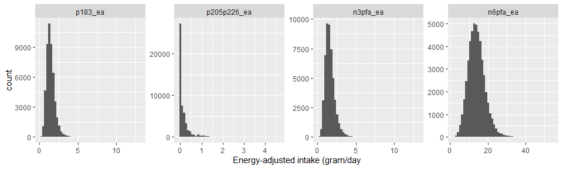
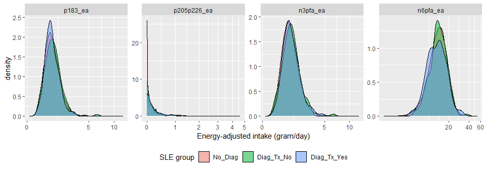
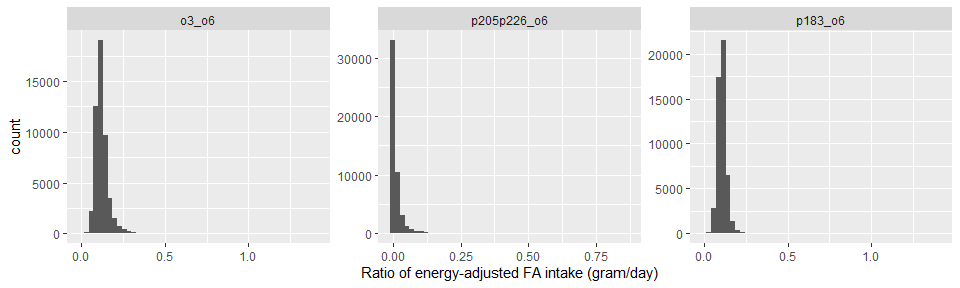

AHS-2 lupus study 2
================

## Dataset

- Filename: `lupus-initial-dataset-v1-2022-04-25.csv`
  - Data received on 4/25/2022
  - Includes *n* = 93467 subjects and 118 variables
  - No imputations
- To create an analytic file:
  - Included only non-Hispanic White or Black
  - Excluded if age at baseline \< 30 years
  - Excluded extreme energy intake of \<500 or \>4500 kcal
  - Excluded any subjects with missing gender, education, smoking
    history, dietary pattern and BMI
  - **Excluded those subjects who were diagnosed with SLE, but did not
    indicated whether they have been treated within 12 months or not (n
    = 76, see “Outcome” section below)**
  - **Included only females in this analysis**
  - This resulted in *n* = 50223 subjects (43244 subjects were excluded)

## Outcome

- Subjects were classified into 3 groups of SLE diagnosis
  - Those who indicated “treated within the last 12 months” were
    classified into “Diagnosed & treated” regardless of whether
    diagnosis year is missing or not (n = 220).
  - Those who have ever diagnosed and indicated “not treated within the
    last 12 months” were classified into “Diagnosed but no treated” (n =
    138).
  - Those who have never diagnosed were classified into “Not diagnosed”
    group.
  - Those who have ever diagnosed but have missing on “treated within
    the last 12 months” were excluded (n = 76).

## Descriptive table

- Descriptive table stratified by SLE status (3 groups)
  - Use of fish oil supplement (`take_fo`) includes cod liver oil

<table>
<thead>
<tr>
<th style="text-align:left;">
</th>
<th style="text-align:left;">
level
</th>
<th style="text-align:left;">
Overall
</th>
<th style="text-align:left;">
No_Diag
</th>
<th style="text-align:left;">
Diag_Tx_No
</th>
<th style="text-align:left;">
Diag_Tx_Yes
</th>
<th style="text-align:left;">
p
</th>
<th style="text-align:left;">
test
</th>
</tr>
</thead>
<tbody>
<tr>
<td style="text-align:left;">
n
</td>
<td style="text-align:left;">
</td>
<td style="text-align:left;">
50223
</td>
<td style="text-align:left;">
49865
</td>
<td style="text-align:left;">
138
</td>
<td style="text-align:left;">
220
</td>
<td style="text-align:left;">
</td>
<td style="text-align:left;">
</td>
</tr>
<tr>
<td style="text-align:left;">
age (mean (SD))
</td>
<td style="text-align:left;">
</td>
<td style="text-align:left;">
58.34 (14.30)
</td>
<td style="text-align:left;">
58.34 (14.31)
</td>
<td style="text-align:left;">
60.31 (12.97)
</td>
<td style="text-align:left;">
56.63 (11.90)
</td>
<td style="text-align:left;">
0.0556
</td>
<td style="text-align:left;">
</td>
</tr>
<tr>
<td style="text-align:left;">
agecat (%)
</td>
<td style="text-align:left;">
30-49
</td>
<td style="text-align:left;">
15995 (31.8)
</td>
<td style="text-align:left;">
15892 (31.9)
</td>
<td style="text-align:left;">
33 (23.9)
</td>
<td style="text-align:left;">
70 (31.8)
</td>
<td style="text-align:left;">
0.0345
</td>
<td style="text-align:left;">
</td>
</tr>
<tr>
<td style="text-align:left;">
</td>
<td style="text-align:left;">
50-59
</td>
<td style="text-align:left;">
12183 (24.3)
</td>
<td style="text-align:left;">
12076 (24.2)
</td>
<td style="text-align:left;">
39 (28.3)
</td>
<td style="text-align:left;">
68 (30.9)
</td>
<td style="text-align:left;">
</td>
<td style="text-align:left;">
</td>
</tr>
<tr>
<td style="text-align:left;">
</td>
<td style="text-align:left;">
\>=60
</td>
<td style="text-align:left;">
22045 (43.9)
</td>
<td style="text-align:left;">
21897 (43.9)
</td>
<td style="text-align:left;">
66 (47.8)
</td>
<td style="text-align:left;">
82 (37.3)
</td>
<td style="text-align:left;">
</td>
<td style="text-align:left;">
</td>
</tr>
<tr>
<td style="text-align:left;">
black (%)
</td>
<td style="text-align:left;">
White
</td>
<td style="text-align:left;">
35666 (71.0)
</td>
<td style="text-align:left;">
35441 (71.1)
</td>
<td style="text-align:left;">
100 (72.5)
</td>
<td style="text-align:left;">
125 (56.8)
</td>
<td style="text-align:left;">
\<0.0001
</td>
<td style="text-align:left;">
</td>
</tr>
<tr>
<td style="text-align:left;">
</td>
<td style="text-align:left;">
Black
</td>
<td style="text-align:left;">
14557 (29.0)
</td>
<td style="text-align:left;">
14424 (28.9)
</td>
<td style="text-align:left;">
38 (27.5)
</td>
<td style="text-align:left;">
95 (43.2)
</td>
<td style="text-align:left;">
</td>
<td style="text-align:left;">
</td>
</tr>
<tr>
<td style="text-align:left;">
smkever (%)
</td>
<td style="text-align:left;">
Never
</td>
<td style="text-align:left;">
41786 (83.2)
</td>
<td style="text-align:left;">
41512 (83.2)
</td>
<td style="text-align:left;">
115 (83.3)
</td>
<td style="text-align:left;">
159 (72.3)
</td>
<td style="text-align:left;">
0.0001
</td>
<td style="text-align:left;">
</td>
</tr>
<tr>
<td style="text-align:left;">
</td>
<td style="text-align:left;">
Ever
</td>
<td style="text-align:left;">
8437 (16.8)
</td>
<td style="text-align:left;">
8353 (16.8)
</td>
<td style="text-align:left;">
23 (16.7)
</td>
<td style="text-align:left;">
61 (27.7)
</td>
<td style="text-align:left;">
</td>
<td style="text-align:left;">
</td>
</tr>
<tr>
<td style="text-align:left;">
alcever (%)
</td>
<td style="text-align:left;">
Never
</td>
<td style="text-align:left;">
30929 (61.6)
</td>
<td style="text-align:left;">
30736 (61.6)
</td>
<td style="text-align:left;">
83 (60.1)
</td>
<td style="text-align:left;">
110 (50.0)
</td>
<td style="text-align:left;">
0.0018
</td>
<td style="text-align:left;">
</td>
</tr>
<tr>
<td style="text-align:left;">
</td>
<td style="text-align:left;">
Ever
</td>
<td style="text-align:left;">
19294 (38.4)
</td>
<td style="text-align:left;">
19129 (38.4)
</td>
<td style="text-align:left;">
55 (39.9)
</td>
<td style="text-align:left;">
110 (50.0)
</td>
<td style="text-align:left;">
</td>
<td style="text-align:left;">
</td>
</tr>
<tr>
<td style="text-align:left;">
educat3 (%)
</td>
<td style="text-align:left;">
HS or less
</td>
<td style="text-align:left;">
11371 (22.6)
</td>
<td style="text-align:left;">
11302 (22.7)
</td>
<td style="text-align:left;">
25 (18.1)
</td>
<td style="text-align:left;">
44 (20.0)
</td>
<td style="text-align:left;">
0.0661
</td>
<td style="text-align:left;">
</td>
</tr>
<tr>
<td style="text-align:left;">
</td>
<td style="text-align:left;">
Some college
</td>
<td style="text-align:left;">
22071 (43.9)
</td>
<td style="text-align:left;">
21895 (43.9)
</td>
<td style="text-align:left;">
77 (55.8)
</td>
<td style="text-align:left;">
99 (45.0)
</td>
<td style="text-align:left;">
</td>
<td style="text-align:left;">
</td>
</tr>
<tr>
<td style="text-align:left;">
</td>
<td style="text-align:left;">
Col grad
</td>
<td style="text-align:left;">
16781 (33.4)
</td>
<td style="text-align:left;">
16668 (33.4)
</td>
<td style="text-align:left;">
36 (26.1)
</td>
<td style="text-align:left;">
77 (35.0)
</td>
<td style="text-align:left;">
</td>
<td style="text-align:left;">
</td>
</tr>
<tr>
<td style="text-align:left;">
vegstat3 (%)
</td>
<td style="text-align:left;">
Vegetarians
</td>
<td style="text-align:left;">
18917 (37.7)
</td>
<td style="text-align:left;">
18793 (37.7)
</td>
<td style="text-align:left;">
61 (44.2)
</td>
<td style="text-align:left;">
63 (28.6)
</td>
<td style="text-align:left;">
0.0290
</td>
<td style="text-align:left;">
</td>
</tr>
<tr>
<td style="text-align:left;">
</td>
<td style="text-align:left;">
Pesco
</td>
<td style="text-align:left;">
4966 ( 9.9)
</td>
<td style="text-align:left;">
4933 ( 9.9)
</td>
<td style="text-align:left;">
10 ( 7.2)
</td>
<td style="text-align:left;">
23 (10.5)
</td>
<td style="text-align:left;">
</td>
<td style="text-align:left;">
</td>
</tr>
<tr>
<td style="text-align:left;">
</td>
<td style="text-align:left;">
Non-veg
</td>
<td style="text-align:left;">
26340 (52.4)
</td>
<td style="text-align:left;">
26139 (52.4)
</td>
<td style="text-align:left;">
67 (48.6)
</td>
<td style="text-align:left;">
134 (60.9)
</td>
<td style="text-align:left;">
</td>
<td style="text-align:left;">
</td>
</tr>
<tr>
<td style="text-align:left;">
take_fo (%)
</td>
<td style="text-align:left;">
No
</td>
<td style="text-align:left;">
43910 (87.4)
</td>
<td style="text-align:left;">
43618 (87.5)
</td>
<td style="text-align:left;">
124 (89.9)
</td>
<td style="text-align:left;">
168 (76.4)
</td>
<td style="text-align:left;">
\<0.0001
</td>
<td style="text-align:left;">
</td>
</tr>
<tr>
<td style="text-align:left;">
</td>
<td style="text-align:left;">
Yes
</td>
<td style="text-align:left;">
6313 (12.6)
</td>
<td style="text-align:left;">
6247 (12.5)
</td>
<td style="text-align:left;">
14 (10.1)
</td>
<td style="text-align:left;">
52 (23.6)
</td>
<td style="text-align:left;">
</td>
<td style="text-align:left;">
</td>
</tr>
<tr>
<td style="text-align:left;">
bmi (mean (SD))
</td>
<td style="text-align:left;">
</td>
<td style="text-align:left;">
27.49 (6.58)
</td>
<td style="text-align:left;">
27.49 (6.56)
</td>
<td style="text-align:left;">
26.98 (6.85)
</td>
<td style="text-align:left;">
29.89 (9.41)
</td>
<td style="text-align:left;">
\<0.0001
</td>
<td style="text-align:left;">
</td>
</tr>
<tr>
<td style="text-align:left;">
bmicat (%)
</td>
<td style="text-align:left;">
Normal
</td>
<td style="text-align:left;">
20812 (41.4)
</td>
<td style="text-align:left;">
20676 (41.5)
</td>
<td style="text-align:left;">
66 (47.8)
</td>
<td style="text-align:left;">
70 (31.8)
</td>
<td style="text-align:left;">
0.0261
</td>
<td style="text-align:left;">
</td>
</tr>
<tr>
<td style="text-align:left;">
</td>
<td style="text-align:left;">
Overweight
</td>
<td style="text-align:left;">
15285 (30.4)
</td>
<td style="text-align:left;">
15173 (30.4)
</td>
<td style="text-align:left;">
35 (25.4)
</td>
<td style="text-align:left;">
77 (35.0)
</td>
<td style="text-align:left;">
</td>
<td style="text-align:left;">
</td>
</tr>
<tr>
<td style="text-align:left;">
</td>
<td style="text-align:left;">
Obese
</td>
<td style="text-align:left;">
14126 (28.1)
</td>
<td style="text-align:left;">
14016 (28.1)
</td>
<td style="text-align:left;">
37 (26.8)
</td>
<td style="text-align:left;">
73 (33.2)
</td>
<td style="text-align:left;">
</td>
<td style="text-align:left;">
</td>
</tr>
<tr>
<td style="text-align:left;">
kcal (mean (SD))
</td>
<td style="text-align:left;">
</td>
<td style="text-align:left;">
1760.40 (710.96)
</td>
<td style="text-align:left;">
1760.39 (710.81)
</td>
<td style="text-align:left;">
1720.46 (713.19)
</td>
<td style="text-align:left;">
1788.80 (744.77)
</td>
<td style="text-align:left;">
0.6748
</td>
<td style="text-align:left;">
</td>
</tr>
</tbody>
</table>

- Descriptive table stratified by SLE diagnosis (not diagnosed vs
  treated + not treated together)

<table>
<thead>
<tr>
<th style="text-align:left;">
</th>
<th style="text-align:left;">
level
</th>
<th style="text-align:left;">
Overall
</th>
<th style="text-align:left;">
0
</th>
<th style="text-align:left;">
1
</th>
<th style="text-align:left;">
p
</th>
<th style="text-align:left;">
test
</th>
</tr>
</thead>
<tbody>
<tr>
<td style="text-align:left;">
n
</td>
<td style="text-align:left;">
</td>
<td style="text-align:left;">
50223
</td>
<td style="text-align:left;">
49865
</td>
<td style="text-align:left;">
358
</td>
<td style="text-align:left;">
</td>
<td style="text-align:left;">
</td>
</tr>
<tr>
<td style="text-align:left;">
age (mean (SD))
</td>
<td style="text-align:left;">
</td>
<td style="text-align:left;">
58.34 (14.30)
</td>
<td style="text-align:left;">
58.34 (14.31)
</td>
<td style="text-align:left;">
58.05 (12.43)
</td>
<td style="text-align:left;">
0.7009
</td>
<td style="text-align:left;">
</td>
</tr>
<tr>
<td style="text-align:left;">
agecat (%)
</td>
<td style="text-align:left;">
30-49
</td>
<td style="text-align:left;">
15995 (31.8)
</td>
<td style="text-align:left;">
15892 (31.9)
</td>
<td style="text-align:left;">
103 (28.8)
</td>
<td style="text-align:left;">
0.0424
</td>
<td style="text-align:left;">
</td>
</tr>
<tr>
<td style="text-align:left;">
</td>
<td style="text-align:left;">
50-59
</td>
<td style="text-align:left;">
12183 (24.3)
</td>
<td style="text-align:left;">
12076 (24.2)
</td>
<td style="text-align:left;">
107 (29.9)
</td>
<td style="text-align:left;">
</td>
<td style="text-align:left;">
</td>
</tr>
<tr>
<td style="text-align:left;">
</td>
<td style="text-align:left;">
\>=60
</td>
<td style="text-align:left;">
22045 (43.9)
</td>
<td style="text-align:left;">
21897 (43.9)
</td>
<td style="text-align:left;">
148 (41.3)
</td>
<td style="text-align:left;">
</td>
<td style="text-align:left;">
</td>
</tr>
<tr>
<td style="text-align:left;">
black (%)
</td>
<td style="text-align:left;">
White
</td>
<td style="text-align:left;">
35666 (71.0)
</td>
<td style="text-align:left;">
35441 (71.1)
</td>
<td style="text-align:left;">
225 (62.8)
</td>
<td style="text-align:left;">
0.0008
</td>
<td style="text-align:left;">
</td>
</tr>
<tr>
<td style="text-align:left;">
</td>
<td style="text-align:left;">
Black
</td>
<td style="text-align:left;">
14557 (29.0)
</td>
<td style="text-align:left;">
14424 (28.9)
</td>
<td style="text-align:left;">
133 (37.2)
</td>
<td style="text-align:left;">
</td>
<td style="text-align:left;">
</td>
</tr>
<tr>
<td style="text-align:left;">
smkever (%)
</td>
<td style="text-align:left;">
Never
</td>
<td style="text-align:left;">
41786 (83.2)
</td>
<td style="text-align:left;">
41512 (83.2)
</td>
<td style="text-align:left;">
274 (76.5)
</td>
<td style="text-align:left;">
0.0009
</td>
<td style="text-align:left;">
</td>
</tr>
<tr>
<td style="text-align:left;">
</td>
<td style="text-align:left;">
Ever
</td>
<td style="text-align:left;">
8437 (16.8)
</td>
<td style="text-align:left;">
8353 (16.8)
</td>
<td style="text-align:left;">
84 (23.5)
</td>
<td style="text-align:left;">
</td>
<td style="text-align:left;">
</td>
</tr>
<tr>
<td style="text-align:left;">
alcever (%)
</td>
<td style="text-align:left;">
Never
</td>
<td style="text-align:left;">
30929 (61.6)
</td>
<td style="text-align:left;">
30736 (61.6)
</td>
<td style="text-align:left;">
193 (53.9)
</td>
<td style="text-align:left;">
0.0033
</td>
<td style="text-align:left;">
</td>
</tr>
<tr>
<td style="text-align:left;">
</td>
<td style="text-align:left;">
Ever
</td>
<td style="text-align:left;">
19294 (38.4)
</td>
<td style="text-align:left;">
19129 (38.4)
</td>
<td style="text-align:left;">
165 (46.1)
</td>
<td style="text-align:left;">
</td>
<td style="text-align:left;">
</td>
</tr>
<tr>
<td style="text-align:left;">
educat3 (%)
</td>
<td style="text-align:left;">
HS or less
</td>
<td style="text-align:left;">
11371 (22.6)
</td>
<td style="text-align:left;">
11302 (22.7)
</td>
<td style="text-align:left;">
69 (19.3)
</td>
<td style="text-align:left;">
0.1104
</td>
<td style="text-align:left;">
</td>
</tr>
<tr>
<td style="text-align:left;">
</td>
<td style="text-align:left;">
Some college
</td>
<td style="text-align:left;">
22071 (43.9)
</td>
<td style="text-align:left;">
21895 (43.9)
</td>
<td style="text-align:left;">
176 (49.2)
</td>
<td style="text-align:left;">
</td>
<td style="text-align:left;">
</td>
</tr>
<tr>
<td style="text-align:left;">
</td>
<td style="text-align:left;">
Col grad
</td>
<td style="text-align:left;">
16781 (33.4)
</td>
<td style="text-align:left;">
16668 (33.4)
</td>
<td style="text-align:left;">
113 (31.6)
</td>
<td style="text-align:left;">
</td>
<td style="text-align:left;">
</td>
</tr>
<tr>
<td style="text-align:left;">
vegstat3 (%)
</td>
<td style="text-align:left;">
Vegetarians
</td>
<td style="text-align:left;">
18917 (37.7)
</td>
<td style="text-align:left;">
18793 (37.7)
</td>
<td style="text-align:left;">
124 (34.6)
</td>
<td style="text-align:left;">
0.3710
</td>
<td style="text-align:left;">
</td>
</tr>
<tr>
<td style="text-align:left;">
</td>
<td style="text-align:left;">
Pesco
</td>
<td style="text-align:left;">
4966 ( 9.9)
</td>
<td style="text-align:left;">
4933 ( 9.9)
</td>
<td style="text-align:left;">
33 ( 9.2)
</td>
<td style="text-align:left;">
</td>
<td style="text-align:left;">
</td>
</tr>
<tr>
<td style="text-align:left;">
</td>
<td style="text-align:left;">
Non-veg
</td>
<td style="text-align:left;">
26340 (52.4)
</td>
<td style="text-align:left;">
26139 (52.4)
</td>
<td style="text-align:left;">
201 (56.1)
</td>
<td style="text-align:left;">
</td>
<td style="text-align:left;">
</td>
</tr>
<tr>
<td style="text-align:left;">
take_fo (%)
</td>
<td style="text-align:left;">
No
</td>
<td style="text-align:left;">
43910 (87.4)
</td>
<td style="text-align:left;">
43618 (87.5)
</td>
<td style="text-align:left;">
292 (81.6)
</td>
<td style="text-align:left;">
0.0010
</td>
<td style="text-align:left;">
</td>
</tr>
<tr>
<td style="text-align:left;">
</td>
<td style="text-align:left;">
Yes
</td>
<td style="text-align:left;">
6313 (12.6)
</td>
<td style="text-align:left;">
6247 (12.5)
</td>
<td style="text-align:left;">
66 (18.4)
</td>
<td style="text-align:left;">
</td>
<td style="text-align:left;">
</td>
</tr>
<tr>
<td style="text-align:left;">
bmi (mean (SD))
</td>
<td style="text-align:left;">
</td>
<td style="text-align:left;">
27.49 (6.58)
</td>
<td style="text-align:left;">
27.49 (6.56)
</td>
<td style="text-align:left;">
28.77 (8.62)
</td>
<td style="text-align:left;">
0.0002
</td>
<td style="text-align:left;">
</td>
</tr>
<tr>
<td style="text-align:left;">
bmicat (%)
</td>
<td style="text-align:left;">
Normal
</td>
<td style="text-align:left;">
20812 (41.4)
</td>
<td style="text-align:left;">
20676 (41.5)
</td>
<td style="text-align:left;">
136 (38.0)
</td>
<td style="text-align:left;">
0.3701
</td>
<td style="text-align:left;">
</td>
</tr>
<tr>
<td style="text-align:left;">
</td>
<td style="text-align:left;">
Overweight
</td>
<td style="text-align:left;">
15285 (30.4)
</td>
<td style="text-align:left;">
15173 (30.4)
</td>
<td style="text-align:left;">
112 (31.3)
</td>
<td style="text-align:left;">
</td>
<td style="text-align:left;">
</td>
</tr>
<tr>
<td style="text-align:left;">
</td>
<td style="text-align:left;">
Obese
</td>
<td style="text-align:left;">
14126 (28.1)
</td>
<td style="text-align:left;">
14016 (28.1)
</td>
<td style="text-align:left;">
110 (30.7)
</td>
<td style="text-align:left;">
</td>
<td style="text-align:left;">
</td>
</tr>
<tr>
<td style="text-align:left;">
kcal (mean (SD))
</td>
<td style="text-align:left;">
</td>
<td style="text-align:left;">
1760.40 (710.96)
</td>
<td style="text-align:left;">
1760.39 (710.81)
</td>
<td style="text-align:left;">
1762.45 (732.51)
</td>
<td style="text-align:left;">
0.9563
</td>
<td style="text-align:left;">
</td>
</tr>
</tbody>
</table>

## Energy-adjusted fatty acid intake

- The nutrient intake data include the following fatty acids
  - Each FA has both dietary and supplement intake

<table>
<thead>
<tr>
<th style="text-align:left;">
fa_name
</th>
<th style="text-align:left;">
lipid
</th>
<th style="text-align:left;">
note
</th>
</tr>
</thead>
<tbody>
<tr>
<td style="text-align:left;">
ALA
</td>
<td style="text-align:left;">
p183
</td>
<td style="text-align:left;">
Omega-3
</td>
</tr>
<tr>
<td style="text-align:left;">
SDA
</td>
<td style="text-align:left;">
p184
</td>
<td style="text-align:left;">
Omega-3
</td>
</tr>
<tr>
<td style="text-align:left;">
EPA
</td>
<td style="text-align:left;">
p205
</td>
<td style="text-align:left;">
Omega-3
</td>
</tr>
<tr>
<td style="text-align:left;">
DPA
</td>
<td style="text-align:left;">
p225
</td>
<td style="text-align:left;">
Omega-3
</td>
</tr>
<tr>
<td style="text-align:left;">
DHA
</td>
<td style="text-align:left;">
p226
</td>
<td style="text-align:left;">
Omega-3
</td>
</tr>
<tr>
<td style="text-align:left;">
LA
</td>
<td style="text-align:left;">
p182
</td>
<td style="text-align:left;">
Omega-6
</td>
</tr>
<tr>
<td style="text-align:left;">
AA
</td>
<td style="text-align:left;">
p204
</td>
<td style="text-align:left;">
Omega-6
</td>
</tr>
</tbody>
</table>

- For each FA, its dietary intake was energy-adjusted by the residual
  method, while partitioning zero intake ([Jaceldo-Siegl et al.,
  2011](https://www.ncbi.nlm.nih.gov/pmc/articles/PMC3433053/)). Due to
  its highly right-skewed distribution, non-zero intake was
  log-transformed before being regressed on the total energy intake.
  Residuals were added by the mean of log and then back-transformed to
  obtain energy-adjusted dietary intake. Energy-adjusted dietary intake
  was added with (unadjusted) supplement intake to form energy-adjuste
  total intake.
  - Energy-adjusted total omega-3 fatty acid intake was calculated as
    the sum of the following energy-adjusted FAs: ALA, SDA, EPA, DPA and
    DHA.
  - Energy-adjusted total omega-6 fatty acid intake was calculated as
    the sum of the following energy-adjusted FAs: LA, AA
- Distributions of energy-adjusted ALA, EPA + DHA, total omega-3, and
  total omega-6 are highly right-skewed:

<!-- -->

- Density plots by prevalent SLE status are shown below. Note that the
  x-axis is in a pseudo-log scale:

<!-- -->

- A Spearman correlation matrix among energy-adjusted ALA, EPA + DHA,
  total omega-3, and total omega-6 is shown below
  - ALA is moderately positively correlated with omega-3 and omega-6
    fatty acids.

<table>
<thead>
<tr>
<th style="text-align:left;">
</th>
<th style="text-align:right;">
p183_ea
</th>
<th style="text-align:right;">
p205p226_ea
</th>
<th style="text-align:right;">
n3pfa_ea
</th>
<th style="text-align:right;">
n6pfa_ea
</th>
</tr>
</thead>
<tbody>
<tr>
<td style="text-align:left;">
p183_ea
</td>
<td style="text-align:right;">
1.000
</td>
<td style="text-align:right;">
0.003
</td>
<td style="text-align:right;">
0.882
</td>
<td style="text-align:right;">
0.742
</td>
</tr>
<tr>
<td style="text-align:left;">
p205p226_ea
</td>
<td style="text-align:right;">
0.003
</td>
<td style="text-align:right;">
1.000
</td>
<td style="text-align:right;">
0.350
</td>
<td style="text-align:right;">
-0.101
</td>
</tr>
<tr>
<td style="text-align:left;">
n3pfa_ea
</td>
<td style="text-align:right;">
0.882
</td>
<td style="text-align:right;">
0.350
</td>
<td style="text-align:right;">
1.000
</td>
<td style="text-align:right;">
0.609
</td>
</tr>
<tr>
<td style="text-align:left;">
n6pfa_ea
</td>
<td style="text-align:right;">
0.742
</td>
<td style="text-align:right;">
-0.101
</td>
<td style="text-align:right;">
0.609
</td>
<td style="text-align:right;">
1.000
</td>
</tr>
</tbody>
</table>

- Median (IQR) intake (gram/day) of energy-adjusted ALA, EPA + DHA,
  total omega-3, and total omega-6 by SLE group:

<table class="gmisc_table" style="border-collapse: collapse; margin-top: 1em; margin-bottom: 1em;">
<thead>
<tr>
<td colspan="6" style="text-align: left;">
Median (IQR) energy-adjusted intake of fatty acids (gram/day)
</td>
</tr>
<tr>
<th style="border-bottom: 1px solid grey; border-top: 2px solid grey;">
</th>
<th style="font-weight: 900; border-bottom: 1px solid grey; border-top: 2px solid grey; text-align: center;">
Total  (n = 50,223)
</th>
<th style="font-weight: 900; border-bottom: 1px solid grey; border-top: 2px solid grey; text-align: center;">
No_Diag  (n = 49,865)
</th>
<th style="font-weight: 900; border-bottom: 1px solid grey; border-top: 2px solid grey; text-align: center;">
Diag_Tx_No  (n = 138)
</th>
<th style="font-weight: 900; border-bottom: 1px solid grey; border-top: 2px solid grey; text-align: center;">
Diag_Tx_Yes  (n = 220)
</th>
<th style="font-weight: 900; border-bottom: 1px solid grey; border-top: 2px solid grey; text-align: center;">
P-value
</th>
</tr>
</thead>
<tbody>
<tr>
<td style="text-align: left;">
ALA
</td>
<td style="text-align: center;">
1.40 (1.11 - 1.76)
</td>
<td style="text-align: center;">
1.40 (1.11 - 1.76)
</td>
<td style="text-align: center;">
1.47 (1.16 - 1.81)
</td>
<td style="text-align: center;">
1.36 (1.13 - 1.73)
</td>
<td style="text-align: center;">
0.46
</td>
</tr>
<tr>
<td style="text-align: left;">
DHA + EPA
</td>
<td style="text-align: center;">
0.03 (0.00 - 0.18)
</td>
<td style="text-align: center;">
0.03 (0.00 - 0.18)
</td>
<td style="text-align: center;">
0.04 (0.00 - 0.18)
</td>
<td style="text-align: center;">
0.09 (0.01 - 0.30)
</td>
<td style="text-align: center;">
0.0002
</td>
</tr>
<tr>
<td style="text-align: left;">
DHA + EPA dietary
</td>
<td style="text-align: center;">
0.02 (0.00 - 0.14)
</td>
<td style="text-align: center;">
0.02 (0.00 - 0.14)
</td>
<td style="text-align: center;">
0.02 (0.00 - 0.16)
</td>
<td style="text-align: center;">
0.05 (0.00 - 0.17)
</td>
<td style="text-align: center;">
0.006
</td>
</tr>
<tr>
<td style="text-align: left;">
Omega-3
</td>
<td style="text-align: center;">
1.55 (1.22 - 1.97)
</td>
<td style="text-align: center;">
1.55 (1.22 - 1.97)
</td>
<td style="text-align: center;">
1.65 (1.30 - 2.02)
</td>
<td style="text-align: center;">
1.60 (1.30 - 2.02)
</td>
<td style="text-align: center;">
0.10
</td>
</tr>
<tr>
<td style="text-align: left;">
Omega-3 dietary
</td>
<td style="text-align: center;">
1.51 (1.19 - 1.89)
</td>
<td style="text-align: center;">
1.51 (1.19 - 1.89)
</td>
<td style="text-align: center;">
1.60 (1.29 - 1.95)
</td>
<td style="text-align: center;">
1.53 (1.22 - 1.85)
</td>
<td style="text-align: center;">
0.22
</td>
</tr>
<tr>
<td style="border-bottom: 2px solid grey; text-align: left;">
Omega-6
</td>
<td style="border-bottom: 2px solid grey; text-align: center;">
13.73 (10.96 - 16.71)
</td>
<td style="border-bottom: 2px solid grey; text-align: center;">
13.73 (10.97 - 16.71)
</td>
<td style="border-bottom: 2px solid grey; text-align: center;">
13.71 (11.67 - 16.92)
</td>
<td style="border-bottom: 2px solid grey; text-align: center;">
13.26 (10.27 - 16.33)
</td>
<td style="border-bottom: 2px solid grey; text-align: center;">
0.16
</td>
</tr>
</tbody>
<tfoot>
<tr>
<td colspan="6">
P-values were from Kruskcal-Wallis tests
</td>
</tr>
</tfoot>
</table>

- Similarly, mean (SD) intake (gram/day) of energy-adjusted ALA, EPA +
  DHA, total omega-3, and total omega-6 is shown below:

<table class="gmisc_table" style="border-collapse: collapse; margin-top: 1em; margin-bottom: 1em;">
<thead>
<tr>
<td colspan="6" style="text-align: left;">
Mean (SD) energy-adjusted intake of fatty acids (gram/day)
</td>
</tr>
<tr>
<th style="border-bottom: 1px solid grey; border-top: 2px solid grey;">
</th>
<th style="font-weight: 900; border-bottom: 1px solid grey; border-top: 2px solid grey; text-align: center;">
Total  (n = 50,223)
</th>
<th style="font-weight: 900; border-bottom: 1px solid grey; border-top: 2px solid grey; text-align: center;">
No_Diag  (n = 49,865)
</th>
<th style="font-weight: 900; border-bottom: 1px solid grey; border-top: 2px solid grey; text-align: center;">
Diag_Tx_No  (n = 138)
</th>
<th style="font-weight: 900; border-bottom: 1px solid grey; border-top: 2px solid grey; text-align: center;">
Diag_Tx_Yes  (n = 220)
</th>
<th style="font-weight: 900; border-bottom: 1px solid grey; border-top: 2px solid grey; text-align: center;">
P-value
</th>
</tr>
</thead>
<tbody>
<tr>
<td style="text-align: left;">
ALA
</td>
<td style="text-align: center;">
1.49 (±0.58)
</td>
<td style="text-align: center;">
1.49 (±0.58)
</td>
<td style="text-align: center;">
1.55 (±0.65)
</td>
<td style="text-align: center;">
1.47 (±0.51)
</td>
<td style="text-align: center;">
0.41
</td>
</tr>
<tr>
<td style="text-align: left;">
DHA + EPA
</td>
<td style="text-align: center;">
0.15 (±0.27)
</td>
<td style="text-align: center;">
0.15 (±0.27)
</td>
<td style="text-align: center;">
0.14 (±0.23)
</td>
<td style="text-align: center;">
0.22 (±0.33)
</td>
<td style="text-align: center;">
0.0002
</td>
</tr>
<tr>
<td style="text-align: left;">
DHA + EPA dietary
</td>
<td style="text-align: center;">
0.09 (±0.17)
</td>
<td style="text-align: center;">
0.09 (±0.17)
</td>
<td style="text-align: center;">
0.11 (±0.19)
</td>
<td style="text-align: center;">
0.11 (±0.13)
</td>
<td style="text-align: center;">
0.32
</td>
</tr>
<tr>
<td style="text-align: left;">
Omega-3
</td>
<td style="text-align: center;">
1.66 (±0.66)
</td>
<td style="text-align: center;">
1.66 (±0.66)
</td>
<td style="text-align: center;">
1.72 (±0.70)
</td>
<td style="text-align: center;">
1.73 (±0.65)
</td>
<td style="text-align: center;">
0.17
</td>
</tr>
<tr>
<td style="text-align: left;">
Omega-3 dietary
</td>
<td style="text-align: center;">
1.60 (±0.62)
</td>
<td style="text-align: center;">
1.60 (±0.62)
</td>
<td style="text-align: center;">
1.68 (±0.68)
</td>
<td style="text-align: center;">
1.59 (±0.55)
</td>
<td style="text-align: center;">
0.29
</td>
</tr>
<tr>
<td style="border-bottom: 2px solid grey; text-align: left;">
Omega-6
</td>
<td style="border-bottom: 2px solid grey; text-align: center;">
14.08 (±4.49)
</td>
<td style="border-bottom: 2px solid grey; text-align: center;">
14.08 (±4.48)
</td>
<td style="border-bottom: 2px solid grey; text-align: center;">
14.39 (±4.39)
</td>
<td style="border-bottom: 2px solid grey; text-align: center;">
13.72 (±4.70)
</td>
<td style="border-bottom: 2px solid grey; text-align: center;">
0.35
</td>
</tr>
</tbody>
<tfoot>
<tr>
<td colspan="6">
P-values were from one-way ANOVA
</td>
</tr>
</tfoot>
</table>

- Proportions of (energy-adjusted) dietary intake out of the total
  intake (dietary + supplement) are shown below.
  - Over 90% of the total intake were from dietary intake, not
    supplements.

<table>
<thead>
<tr>
<th style="text-align:left;">
var
</th>
<th style="text-align:right;">
mean
</th>
</tr>
</thead>
<tbody>
<tr>
<td style="text-align:left;">
p183_diet_ratio
</td>
<td style="text-align:right;">
0.9983
</td>
</tr>
<tr>
<td style="text-align:left;">
p205p226_diet_ratio
</td>
<td style="text-align:right;">
0.9144
</td>
</tr>
<tr>
<td style="text-align:left;">
n3pfa_diet_ratio
</td>
<td style="text-align:right;">
0.9724
</td>
</tr>
<tr>
<td style="text-align:left;">
n6pfa_diet_ratio
</td>
<td style="text-align:right;">
0.9995
</td>
</tr>
</tbody>
</table>

- Intake of fatty acids (dietary and total) among those who use fish oil
  supplement:
  - Total intake of EPA + DHA is much greater, and most of its intake is
    from supplementary sources

<table class="gmisc_table" style="border-collapse: collapse; margin-top: 1em; margin-bottom: 1em;">
<thead>
<tr>
<td colspan="5" style="text-align: left;">
Median (IQR) energy-adjusted intake of fatty acids (gram/day)
</td>
</tr>
<tr>
<th style="border-bottom: 1px solid grey; border-top: 2px solid grey;">
</th>
<th style="font-weight: 900; border-bottom: 1px solid grey; border-top: 2px solid grey; text-align: center;">
No_Diag  (n = 6,247)
</th>
<th style="font-weight: 900; border-bottom: 1px solid grey; border-top: 2px solid grey; text-align: center;">
Diag_Tx_No  (n = 14)
</th>
<th style="font-weight: 900; border-bottom: 1px solid grey; border-top: 2px solid grey; text-align: center;">
Diag_Tx_Yes  (n = 52)
</th>
<th style="font-weight: 900; border-bottom: 1px solid grey; border-top: 2px solid grey; text-align: center;">
P-value
</th>
</tr>
</thead>
<tbody>
<tr>
<td style="text-align: left;">
DHA + EPA
</td>
<td style="text-align: center;">
0.45 (0.31 - 0.82)
</td>
<td style="text-align: center;">
0.40 (0.30 - 0.69)
</td>
<td style="text-align: center;">
0.53 (0.35 - 0.91)
</td>
<td style="text-align: center;">
0.16
</td>
</tr>
<tr>
<td style="text-align: left;">
DHA + EPA dietary
</td>
<td style="text-align: center;">
0.09 (0.01 - 0.20)
</td>
<td style="text-align: center;">
0.12 (0.01 - 0.18)
</td>
<td style="text-align: center;">
0.10 (0.03 - 0.23)
</td>
<td style="text-align: center;">
0.42
</td>
</tr>
<tr>
<td style="text-align: left;">
Omega-3
</td>
<td style="text-align: center;">
2.06 (1.64 - 2.55)
</td>
<td style="text-align: center;">
2.09 (1.75 - 2.28)
</td>
<td style="text-align: center;">
2.15 (1.64 - 2.56)
</td>
<td style="text-align: center;">
0.80
</td>
</tr>
<tr>
<td style="border-bottom: 2px solid grey; text-align: left;">
Omega-3 dietary
</td>
<td style="border-bottom: 2px solid grey; text-align: center;">
1.56 (1.23 - 1.96)
</td>
<td style="border-bottom: 2px solid grey; text-align: center;">
1.78 (1.33 - 1.94)
</td>
<td style="border-bottom: 2px solid grey; text-align: center;">
1.59 (1.21 - 1.93)
</td>
<td style="border-bottom: 2px solid grey; text-align: center;">
0.67
</td>
</tr>
</tbody>
<tfoot>
<tr>
<td colspan="5">
P-values were from Kruskal-Wallis tests
</td>
</tr>
</tfoot>
</table>

- Three ratios of fatty acids, Omega-3/Omega-6, (DHA + EPA)/Omega-6,
  ALA/Omega-6, were calculated based on energy-adjusted intake, i.e.,
  both the numerator and denominator were energy-adjusted values.
  - Distribution of the three ratios were highly right-skewed:

<!-- -->

- A Spearman correlation matrix among three ratio variables is shown
  below.
  - Omega-3/omema-6 ratio is highly correlated with ALA/omega-6 ratio.

<table>
<thead>
<tr>
<th style="text-align:left;">
</th>
<th style="text-align:right;">
o3_o6
</th>
<th style="text-align:right;">
p205p226_o6
</th>
<th style="text-align:right;">
p183_o6
</th>
</tr>
</thead>
<tbody>
<tr>
<td style="text-align:left;">
o3_o6
</td>
<td style="text-align:right;">
1.000
</td>
<td style="text-align:right;">
0.553
</td>
<td style="text-align:right;">
0.850
</td>
</tr>
<tr>
<td style="text-align:left;">
p205p226_o6
</td>
<td style="text-align:right;">
0.553
</td>
<td style="text-align:right;">
1.000
</td>
<td style="text-align:right;">
0.165
</td>
</tr>
<tr>
<td style="text-align:left;">
p183_o6
</td>
<td style="text-align:right;">
0.850
</td>
<td style="text-align:right;">
0.165
</td>
<td style="text-align:right;">
1.000
</td>
</tr>
</tbody>
</table>

- Median (IQR) ratio of energy-adjusted fatty acids by SLE status:

<table class="gmisc_table" style="border-collapse: collapse; margin-top: 1em; margin-bottom: 1em;">
<thead>
<tr>
<td colspan="5" style="text-align: left;">
Median (IQR) ratio of energy-adjusted fatty acid intake
</td>
</tr>
<tr>
<th style="border-bottom: 1px solid grey; border-top: 2px solid grey;">
</th>
<th style="font-weight: 900; border-bottom: 1px solid grey; border-top: 2px solid grey; text-align: center;">
No_Diag  (n = 49,865)
</th>
<th style="font-weight: 900; border-bottom: 1px solid grey; border-top: 2px solid grey; text-align: center;">
Diag_Tx_No  (n = 138)
</th>
<th style="font-weight: 900; border-bottom: 1px solid grey; border-top: 2px solid grey; text-align: center;">
Diag_Tx_Yes  (n = 220)
</th>
<th style="font-weight: 900; border-bottom: 1px solid grey; border-top: 2px solid grey; text-align: center;">
P-value
</th>
</tr>
</thead>
<tbody>
<tr>
<td style="text-align: left;">
Omega-3/Omega-6
</td>
<td style="text-align: center;">
0.1144 (0.0966 - 0.1368)
</td>
<td style="text-align: center;">
0.1169 (0.0988 - 0.1387)
</td>
<td style="text-align: center;">
0.1198 (0.1001 - 0.1519)
</td>
<td style="text-align: center;">
0.006
</td>
</tr>
<tr>
<td style="text-align: left;">
(DHA + EPA)/Omega-6
</td>
<td style="text-align: center;">
0.0022 (0.0002 - 0.0141)
</td>
<td style="text-align: center;">
0.0020 (0.0001 - 0.0139)
</td>
<td style="text-align: center;">
0.0069 (0.0005 - 0.0221)
</td>
<td style="text-align: center;">
0.0002
</td>
</tr>
<tr>
<td style="border-bottom: 2px solid grey; text-align: left;">
ALA/Omega-6
</td>
<td style="border-bottom: 2px solid grey; text-align: center;">
0.1051 (0.0908 - 0.1209)
</td>
<td style="border-bottom: 2px solid grey; text-align: center;">
0.1048 (0.0931 - 0.1173)
</td>
<td style="border-bottom: 2px solid grey; text-align: center;">
0.1071 (0.0906 - 0.1245)
</td>
<td style="border-bottom: 2px solid grey; text-align: center;">
0.43
</td>
</tr>
</tbody>
<tfoot>
<tr>
<td colspan="5">
P-values were from Kruskal-Wallis tests
</td>
</tr>
</tfoot>
</table>

## Quartiles of FA ratios

- The three FA ratio variables were categorized into quartile groups.
  Frequency tables by SLE status were shown below
  - For omega-3/omega-6 and (DHA + EPA)/omega-6, the SLE group had
    significantly more subjects in higher quartile groups, compared to
    the non-SLE group.

<table>
<thead>
<tr>
<th style="text-align:left;">
</th>
<th style="text-align:left;">
level
</th>
<th style="text-align:left;">
No
</th>
<th style="text-align:left;">
Yes
</th>
<th style="text-align:left;">
p
</th>
<th style="text-align:left;">
test
</th>
</tr>
</thead>
<tbody>
<tr>
<td style="text-align:left;">
n
</td>
<td style="text-align:left;">
</td>
<td style="text-align:left;">
50003
</td>
<td style="text-align:left;">
220
</td>
<td style="text-align:left;">
</td>
<td style="text-align:left;">
</td>
</tr>
<tr>
<td style="text-align:left;">
o3_o6_cat (%)
</td>
<td style="text-align:left;">
1
</td>
<td style="text-align:left;">
12513 (25.0)
</td>
<td style="text-align:left;">
43 (19.5)
</td>
<td style="text-align:left;">
0.0038
</td>
<td style="text-align:left;">
</td>
</tr>
<tr>
<td style="text-align:left;">
</td>
<td style="text-align:left;">
2
</td>
<td style="text-align:left;">
12507 (25.0)
</td>
<td style="text-align:left;">
49 (22.3)
</td>
<td style="text-align:left;">
</td>
<td style="text-align:left;">
</td>
</tr>
<tr>
<td style="text-align:left;">
</td>
<td style="text-align:left;">
3
</td>
<td style="text-align:left;">
12506 (25.0)
</td>
<td style="text-align:left;">
50 (22.7)
</td>
<td style="text-align:left;">
</td>
<td style="text-align:left;">
</td>
</tr>
<tr>
<td style="text-align:left;">
</td>
<td style="text-align:left;">
4
</td>
<td style="text-align:left;">
12477 (25.0)
</td>
<td style="text-align:left;">
78 (35.5)
</td>
<td style="text-align:left;">
</td>
<td style="text-align:left;">
</td>
</tr>
<tr>
<td style="text-align:left;">
p205p226_o6_cat (%)
</td>
<td style="text-align:left;">
1
</td>
<td style="text-align:left;">
12518 (25.0)
</td>
<td style="text-align:left;">
38 (17.3)
</td>
<td style="text-align:left;">
0.0023
</td>
<td style="text-align:left;">
</td>
</tr>
<tr>
<td style="text-align:left;">
</td>
<td style="text-align:left;">
2
</td>
<td style="text-align:left;">
12511 (25.0)
</td>
<td style="text-align:left;">
45 (20.5)
</td>
<td style="text-align:left;">
</td>
<td style="text-align:left;">
</td>
</tr>
<tr>
<td style="text-align:left;">
</td>
<td style="text-align:left;">
3
</td>
<td style="text-align:left;">
12492 (25.0)
</td>
<td style="text-align:left;">
64 (29.1)
</td>
<td style="text-align:left;">
</td>
<td style="text-align:left;">
</td>
</tr>
<tr>
<td style="text-align:left;">
</td>
<td style="text-align:left;">
4
</td>
<td style="text-align:left;">
12482 (25.0)
</td>
<td style="text-align:left;">
73 (33.2)
</td>
<td style="text-align:left;">
</td>
<td style="text-align:left;">
</td>
</tr>
<tr>
<td style="text-align:left;">
p183_o6_cat (%)
</td>
<td style="text-align:left;">
1
</td>
<td style="text-align:left;">
12500 (25.0)
</td>
<td style="text-align:left;">
56 (25.5)
</td>
<td style="text-align:left;">
0.1687
</td>
<td style="text-align:left;">
</td>
</tr>
<tr>
<td style="text-align:left;">
</td>
<td style="text-align:left;">
2
</td>
<td style="text-align:left;">
12506 (25.0)
</td>
<td style="text-align:left;">
50 (22.7)
</td>
<td style="text-align:left;">
</td>
<td style="text-align:left;">
</td>
</tr>
<tr>
<td style="text-align:left;">
</td>
<td style="text-align:left;">
3
</td>
<td style="text-align:left;">
12510 (25.0)
</td>
<td style="text-align:left;">
46 (20.9)
</td>
<td style="text-align:left;">
</td>
<td style="text-align:left;">
</td>
</tr>
<tr>
<td style="text-align:left;">
</td>
<td style="text-align:left;">
4
</td>
<td style="text-align:left;">
12487 (25.0)
</td>
<td style="text-align:left;">
68 (30.9)
</td>
<td style="text-align:left;">
</td>
<td style="text-align:left;">
</td>
</tr>
</tbody>
</table>

- Cut-off values of quartiles were shown below:

<table>
<thead>
<tr>
<th style="text-align:left;">
o3_o6_cat
</th>
<th style="text-align:right;">
min
</th>
<th style="text-align:right;">
max
</th>
</tr>
</thead>
<tbody>
<tr>
<td style="text-align:left;">
1
</td>
<td style="text-align:right;">
0.0123506
</td>
<td style="text-align:right;">
0.0965957
</td>
</tr>
<tr>
<td style="text-align:left;">
2
</td>
<td style="text-align:right;">
0.0966004
</td>
<td style="text-align:right;">
0.1144273
</td>
</tr>
<tr>
<td style="text-align:left;">
3
</td>
<td style="text-align:right;">
0.1144275
</td>
<td style="text-align:right;">
0.1368443
</td>
</tr>
<tr>
<td style="text-align:left;">
4
</td>
<td style="text-align:right;">
0.1368446
</td>
<td style="text-align:right;">
1.4122044
</td>
</tr>
</tbody>
</table>
<table>
<thead>
<tr>
<th style="text-align:left;">
p205p226_o6_cat
</th>
<th style="text-align:right;">
min
</th>
<th style="text-align:right;">
max
</th>
</tr>
</thead>
<tbody>
<tr>
<td style="text-align:left;">
1
</td>
<td style="text-align:right;">
0.0000000
</td>
<td style="text-align:right;">
0.0002032
</td>
</tr>
<tr>
<td style="text-align:left;">
2
</td>
<td style="text-align:right;">
0.0002032
</td>
<td style="text-align:right;">
0.0022143
</td>
</tr>
<tr>
<td style="text-align:left;">
3
</td>
<td style="text-align:right;">
0.0022143
</td>
<td style="text-align:right;">
0.0140948
</td>
</tr>
<tr>
<td style="text-align:left;">
4
</td>
<td style="text-align:right;">
0.0140977
</td>
<td style="text-align:right;">
0.8620827
</td>
</tr>
</tbody>
</table>
<table>
<thead>
<tr>
<th style="text-align:left;">
p183_o6_cat
</th>
<th style="text-align:right;">
min
</th>
<th style="text-align:right;">
max
</th>
</tr>
</thead>
<tbody>
<tr>
<td style="text-align:left;">
1
</td>
<td style="text-align:right;">
0.0119524
</td>
<td style="text-align:right;">
0.0907824
</td>
</tr>
<tr>
<td style="text-align:left;">
2
</td>
<td style="text-align:right;">
0.0907826
</td>
<td style="text-align:right;">
0.1050813
</td>
</tr>
<tr>
<td style="text-align:left;">
3
</td>
<td style="text-align:right;">
0.1050815
</td>
<td style="text-align:right;">
0.1208763
</td>
</tr>
<tr>
<td style="text-align:left;">
4
</td>
<td style="text-align:right;">
0.1208782
</td>
<td style="text-align:right;">
1.4114844
</td>
</tr>
</tbody>
</table>

## Logistic models with all three ratio variables

- Four logistic models were fitted using SLE diagnosis (treated + not
  treated) as the outcome.
  - Model 1 includes: quartile groups of omega-3/omega-6, (DHA +
    EPA)/omega-6, ALA/omaga-6, and kcal (per 100 kcal)
  - Model 2 adds age groups, race, education level, and smoking status
    (never/ever)
  - Model 3 further adds dietary pattern
  - Model 4 further adds BMI groups
- The table below shows estimated odds ratios and 95% Wald confidence
  intervals from each logistic model:

<table style="text-align:center">
<tr>
<td colspan="5" style="border-bottom: 1px solid black">
</td>
</tr>
<tr>
<td style="text-align:left">
</td>
<td colspan="4">
Outcome: SLE diagnosis
</td>
</tr>
<tr>
<td style="text-align:left">
</td>
<td>
Model 1
</td>
<td>
Model 2
</td>
<td>
Model 3
</td>
<td>
Model 4
</td>
</tr>
<tr>
<td colspan="5" style="border-bottom: 1px solid black">
</td>
</tr>
<tr>
<td style="text-align:left">
O3/O6: Q2
</td>
<td>
1.58
</td>
<td>
1.58
</td>
<td>
1.58
</td>
<td>
1.58
</td>
</tr>
<tr>
<td style="text-align:left">
</td>
<td>
(1.03, 2.42)
</td>
<td>
(1.03, 2.41)
</td>
<td>
(1.03, 2.41)
</td>
<td>
(1.03, 2.41)
</td>
</tr>
<tr>
<td style="text-align:left">
</td>
<td>
</td>
<td>
</td>
<td>
</td>
<td>
</td>
</tr>
<tr>
<td style="text-align:left">
O3/O6: Q3
</td>
<td>
2.01
</td>
<td>
2.01
</td>
<td>
2.02
</td>
<td>
2.02
</td>
</tr>
<tr>
<td style="text-align:left">
</td>
<td>
(1.20, 3.38)
</td>
<td>
(1.20, 3.39)
</td>
<td>
(1.20, 3.39)
</td>
<td>
(1.20, 3.39)
</td>
</tr>
<tr>
<td style="text-align:left">
</td>
<td>
</td>
<td>
</td>
<td>
</td>
<td>
</td>
</tr>
<tr>
<td style="text-align:left">
O3/O6: Q4
</td>
<td>
2.90
</td>
<td>
2.85
</td>
<td>
2.86
</td>
<td>
2.87
</td>
</tr>
<tr>
<td style="text-align:left">
</td>
<td>
(1.54, 5.44)
</td>
<td>
(1.52, 5.36)
</td>
<td>
(1.52, 5.38)
</td>
<td>
(1.52, 5.39)
</td>
</tr>
<tr>
<td style="text-align:left">
</td>
<td>
</td>
<td>
</td>
<td>
</td>
<td>
</td>
</tr>
<tr>
<td style="text-align:left">
DHA+EPA/O6: Q2
</td>
<td>
0.75
</td>
<td>
0.75
</td>
<td>
0.79
</td>
<td>
0.79
</td>
</tr>
<tr>
<td style="text-align:left">
</td>
<td>
(0.55, 1.04)
</td>
<td>
(0.54, 1.04)
</td>
<td>
(0.55, 1.14)
</td>
<td>
(0.55, 1.13)
</td>
</tr>
<tr>
<td style="text-align:left">
</td>
<td>
</td>
<td>
</td>
<td>
</td>
<td>
</td>
</tr>
<tr>
<td style="text-align:left">
DHA+EPA/O6: Q3
</td>
<td>
0.99
</td>
<td>
0.91
</td>
<td>
1.01
</td>
<td>
1.01
</td>
</tr>
<tr>
<td style="text-align:left">
</td>
<td>
(0.73, 1.34)
</td>
<td>
(0.67, 1.24)
</td>
<td>
(0.64, 1.59)
</td>
<td>
(0.64, 1.59)
</td>
</tr>
<tr>
<td style="text-align:left">
</td>
<td>
</td>
<td>
</td>
<td>
</td>
<td>
</td>
</tr>
<tr>
<td style="text-align:left">
DHA+EPA/O6: Q4
</td>
<td>
0.81
</td>
<td>
0.71
</td>
<td>
0.78
</td>
<td>
0.78
</td>
</tr>
<tr>
<td style="text-align:left">
</td>
<td>
(0.55, 1.19)
</td>
<td>
(0.48, 1.05)
</td>
<td>
(0.48, 1.28)
</td>
<td>
(0.47, 1.28)
</td>
</tr>
<tr>
<td style="text-align:left">
</td>
<td>
</td>
<td>
</td>
<td>
</td>
<td>
</td>
</tr>
<tr>
<td style="text-align:left">
ALA/O6: Q2
</td>
<td>
0.76
</td>
<td>
0.77
</td>
<td>
0.77
</td>
<td>
0.76
</td>
</tr>
<tr>
<td style="text-align:left">
</td>
<td>
(0.52, 1.12)
</td>
<td>
(0.52, 1.13)
</td>
<td>
(0.52, 1.13)
</td>
<td>
(0.52, 1.12)
</td>
</tr>
<tr>
<td style="text-align:left">
</td>
<td>
</td>
<td>
</td>
<td>
</td>
<td>
</td>
</tr>
<tr>
<td style="text-align:left">
ALA/O6: Q3
</td>
<td>
0.56
</td>
<td>
0.56
</td>
<td>
0.56
</td>
<td>
0.56
</td>
</tr>
<tr>
<td style="text-align:left">
</td>
<td>
(0.36, 0.89)
</td>
<td>
(0.35, 0.88)
</td>
<td>
(0.35, 0.88)
</td>
<td>
(0.35, 0.88)
</td>
</tr>
<tr>
<td style="text-align:left">
</td>
<td>
</td>
<td>
</td>
<td>
</td>
<td>
</td>
</tr>
<tr>
<td style="text-align:left">
ALA/O6: Q4
</td>
<td>
0.53
</td>
<td>
0.53
</td>
<td>
0.53
</td>
<td>
0.52
</td>
</tr>
<tr>
<td style="text-align:left">
</td>
<td>
(0.31, 0.89)
</td>
<td>
(0.31, 0.89)
</td>
<td>
(0.31, 0.89)
</td>
<td>
(0.31, 0.89)
</td>
</tr>
<tr>
<td style="text-align:left">
</td>
<td>
</td>
<td>
</td>
<td>
</td>
<td>
</td>
</tr>
<tr>
<td style="text-align:left">
Kcal/100
</td>
<td>
1.00
</td>
<td>
1.00
</td>
<td>
1.00
</td>
<td>
1.00
</td>
</tr>
<tr>
<td style="text-align:left">
</td>
<td>
(0.98, 1.01)
</td>
<td>
(0.98, 1.01)
</td>
<td>
(0.98, 1.01)
</td>
<td>
(0.98, 1.01)
</td>
</tr>
<tr>
<td style="text-align:left">
</td>
<td>
</td>
<td>
</td>
<td>
</td>
<td>
</td>
</tr>
<tr>
<td style="text-align:left">
Age.: 30-49
</td>
<td>
</td>
<td>
0.86
</td>
<td>
0.86
</td>
<td>
0.86
</td>
</tr>
<tr>
<td style="text-align:left">
</td>
<td>
</td>
<td>
(0.66, 1.13)
</td>
<td>
(0.66, 1.12)
</td>
<td>
(0.66, 1.13)
</td>
</tr>
<tr>
<td style="text-align:left">
</td>
<td>
</td>
<td>
</td>
<td>
</td>
<td>
</td>
</tr>
<tr>
<td style="text-align:left">
Age.: 50-59
</td>
<td>
</td>
<td>
1.21
</td>
<td>
1.20
</td>
<td>
1.20
</td>
</tr>
<tr>
<td style="text-align:left">
</td>
<td>
</td>
<td>
(0.94, 1.56)
</td>
<td>
(0.93, 1.55)
</td>
<td>
(0.93, 1.55)
</td>
</tr>
<tr>
<td style="text-align:left">
</td>
<td>
</td>
<td>
</td>
<td>
</td>
<td>
</td>
</tr>
<tr>
<td style="text-align:left">
Race: Black
</td>
<td>
</td>
<td>
1.38
</td>
<td>
1.40
</td>
<td>
1.39
</td>
</tr>
<tr>
<td style="text-align:left">
</td>
<td>
</td>
<td>
(1.10, 1.74)
</td>
<td>
(1.11, 1.76)
</td>
<td>
(1.10, 1.75)
</td>
</tr>
<tr>
<td style="text-align:left">
</td>
<td>
</td>
<td>
</td>
<td>
</td>
<td>
</td>
</tr>
<tr>
<td style="text-align:left">
Educ: HS or less
</td>
<td>
</td>
<td>
0.81
</td>
<td>
0.81
</td>
<td>
0.81
</td>
</tr>
<tr>
<td style="text-align:left">
</td>
<td>
</td>
<td>
(0.59, 1.11)
</td>
<td>
(0.59, 1.11)
</td>
<td>
(0.59, 1.11)
</td>
</tr>
<tr>
<td style="text-align:left">
</td>
<td>
</td>
<td>
</td>
<td>
</td>
<td>
</td>
</tr>
<tr>
<td style="text-align:left">
Educ: Some college
</td>
<td>
</td>
<td>
1.12
</td>
<td>
1.12
</td>
<td>
1.12
</td>
</tr>
<tr>
<td style="text-align:left">
</td>
<td>
</td>
<td>
(0.88, 1.42)
</td>
<td>
(0.88, 1.43)
</td>
<td>
(0.88, 1.42)
</td>
</tr>
<tr>
<td style="text-align:left">
</td>
<td>
</td>
<td>
</td>
<td>
</td>
<td>
</td>
</tr>
<tr>
<td style="text-align:left">
Smkg: Ever
</td>
<td>
</td>
<td>
1.50
</td>
<td>
1.50
</td>
<td>
1.49
</td>
</tr>
<tr>
<td style="text-align:left">
</td>
<td>
</td>
<td>
(1.17, 1.93)
</td>
<td>
(1.16, 1.93)
</td>
<td>
(1.16, 1.93)
</td>
</tr>
<tr>
<td style="text-align:left">
</td>
<td>
</td>
<td>
</td>
<td>
</td>
<td>
</td>
</tr>
<tr>
<td style="text-align:left">
Diet: Vegetarians
</td>
<td>
</td>
<td>
</td>
<td>
1.10
</td>
<td>
1.11
</td>
</tr>
<tr>
<td style="text-align:left">
</td>
<td>
</td>
<td>
</td>
<td>
(0.76, 1.59)
</td>
<td>
(0.77, 1.61)
</td>
</tr>
<tr>
<td style="text-align:left">
</td>
<td>
</td>
<td>
</td>
<td>
</td>
<td>
</td>
</tr>
<tr>
<td style="text-align:left">
Diet: Pesco veg
</td>
<td>
</td>
<td>
</td>
<td>
0.86
</td>
<td>
0.87
</td>
</tr>
<tr>
<td style="text-align:left">
</td>
<td>
</td>
<td>
</td>
<td>
(0.59, 1.25)
</td>
<td>
(0.60, 1.26)
</td>
</tr>
<tr>
<td style="text-align:left">
</td>
<td>
</td>
<td>
</td>
<td>
</td>
<td>
</td>
</tr>
<tr>
<td style="text-align:left">
BMI.: Overweight
</td>
<td>
</td>
<td>
</td>
<td>
</td>
<td>
1.04
</td>
</tr>
<tr>
<td style="text-align:left">
</td>
<td>
</td>
<td>
</td>
<td>
</td>
<td>
(0.81, 1.35)
</td>
</tr>
<tr>
<td style="text-align:left">
</td>
<td>
</td>
<td>
</td>
<td>
</td>
<td>
</td>
</tr>
<tr>
<td style="text-align:left">
BMI.: Obese
</td>
<td>
</td>
<td>
</td>
<td>
</td>
<td>
1.05
</td>
</tr>
<tr>
<td style="text-align:left">
</td>
<td>
</td>
<td>
</td>
<td>
</td>
<td>
(0.80, 1.37)
</td>
</tr>
<tr>
<td style="text-align:left">
</td>
<td>
</td>
<td>
</td>
<td>
</td>
<td>
</td>
</tr>
<tr>
<td colspan="5" style="border-bottom: 1px solid black">
</td>
</tr>
<tr>
<td style="text-align:left">
Observations
</td>
<td>
50,223
</td>
<td>
50,223
</td>
<td>
50,223
</td>
<td>
50,223
</td>
</tr>
<tr>
<td colspan="5" style="border-bottom: 1px solid black">
</td>
</tr>
</table>

## Logistic models with omega-3/omega-6 ratio

- Four logistic models were fitted using SLE diagnosis (treated + not
  treated) as the outcome.
  - Model 1 includes: quartile groups of omega-3/omega-6 and kcal (per
    100 kcal)
  - Model 2 adds age groups, race, education level, and smoking status
    (never/ever)
  - Model 3 further adds dietary pattern
  - Model 4 further adds BMI groups
- The table below shows estimated odds ratios and 95% Wald confidence
  intervals from each logistic model:

<table style="text-align:center">
<tr>
<td colspan="5" style="border-bottom: 1px solid black">
</td>
</tr>
<tr>
<td style="text-align:left">
</td>
<td colspan="4">
Outcome: SLE diagnosis
</td>
</tr>
<tr>
<td style="text-align:left">
</td>
<td>
Model 1
</td>
<td>
Model 2
</td>
<td>
Model 3
</td>
<td>
Model 4
</td>
</tr>
<tr>
<td colspan="5" style="border-bottom: 1px solid black">
</td>
</tr>
<tr>
<td style="text-align:left">
O3/O6: Q2
</td>
<td>
1.20
</td>
<td>
1.17
</td>
<td>
1.19
</td>
<td>
1.18
</td>
</tr>
<tr>
<td style="text-align:left">
</td>
<td>
(0.87, 1.64)
</td>
<td>
(0.86, 1.61)
</td>
<td>
(0.86, 1.63)
</td>
<td>
(0.86, 1.63)
</td>
</tr>
<tr>
<td style="text-align:left">
</td>
<td>
</td>
<td>
</td>
<td>
</td>
<td>
</td>
</tr>
<tr>
<td style="text-align:left">
O3/O6: Q3
</td>
<td>
1.24
</td>
<td>
1.19
</td>
<td>
1.21
</td>
<td>
1.21
</td>
</tr>
<tr>
<td style="text-align:left">
</td>
<td>
(0.91, 1.70)
</td>
<td>
(0.87, 1.63)
</td>
<td>
(0.88, 1.66)
</td>
<td>
(0.87, 1.66)
</td>
</tr>
<tr>
<td style="text-align:left">
</td>
<td>
</td>
<td>
</td>
<td>
</td>
<td>
</td>
</tr>
<tr>
<td style="text-align:left">
O3/O6: Q4
</td>
<td>
1.61
</td>
<td>
1.46
</td>
<td>
1.50
</td>
<td>
1.50
</td>
</tr>
<tr>
<td style="text-align:left">
</td>
<td>
(1.20, 2.17)
</td>
<td>
(1.08, 1.98)
</td>
<td>
(1.09, 2.05)
</td>
<td>
(1.09, 2.05)
</td>
</tr>
<tr>
<td style="text-align:left">
</td>
<td>
</td>
<td>
</td>
<td>
</td>
<td>
</td>
</tr>
<tr>
<td style="text-align:left">
Kcal/100
</td>
<td>
1.00
</td>
<td>
1.00
</td>
<td>
1.00
</td>
<td>
1.00
</td>
</tr>
<tr>
<td style="text-align:left">
</td>
<td>
(0.99, 1.01)
</td>
<td>
(0.98, 1.01)
</td>
<td>
(0.98, 1.01)
</td>
<td>
(0.98, 1.01)
</td>
</tr>
<tr>
<td style="text-align:left">
</td>
<td>
</td>
<td>
</td>
<td>
</td>
<td>
</td>
</tr>
<tr>
<td style="text-align:left">
Age.: 30-49
</td>
<td>
</td>
<td>
0.85
</td>
<td>
0.85
</td>
<td>
0.85
</td>
</tr>
<tr>
<td style="text-align:left">
</td>
<td>
</td>
<td>
(0.66, 1.11)
</td>
<td>
(0.65, 1.11)
</td>
<td>
(0.66, 1.11)
</td>
</tr>
<tr>
<td style="text-align:left">
</td>
<td>
</td>
<td>
</td>
<td>
</td>
<td>
</td>
</tr>
<tr>
<td style="text-align:left">
Age.: 50-59
</td>
<td>
</td>
<td>
1.19
</td>
<td>
1.19
</td>
<td>
1.19
</td>
</tr>
<tr>
<td style="text-align:left">
</td>
<td>
</td>
<td>
(0.93, 1.54)
</td>
<td>
(0.92, 1.54)
</td>
<td>
(0.92, 1.54)
</td>
</tr>
<tr>
<td style="text-align:left">
</td>
<td>
</td>
<td>
</td>
<td>
</td>
<td>
</td>
</tr>
<tr>
<td style="text-align:left">
Race: Black
</td>
<td>
</td>
<td>
1.40
</td>
<td>
1.43
</td>
<td>
1.42
</td>
</tr>
<tr>
<td style="text-align:left">
</td>
<td>
</td>
<td>
(1.12, 1.75)
</td>
<td>
(1.13, 1.79)
</td>
<td>
(1.13, 1.79)
</td>
</tr>
<tr>
<td style="text-align:left">
</td>
<td>
</td>
<td>
</td>
<td>
</td>
<td>
</td>
</tr>
<tr>
<td style="text-align:left">
Educ: HS or less
</td>
<td>
</td>
<td>
0.81
</td>
<td>
0.82
</td>
<td>
0.81
</td>
</tr>
<tr>
<td style="text-align:left">
</td>
<td>
</td>
<td>
(0.59, 1.11)
</td>
<td>
(0.60, 1.12)
</td>
<td>
(0.59, 1.12)
</td>
</tr>
<tr>
<td style="text-align:left">
</td>
<td>
</td>
<td>
</td>
<td>
</td>
<td>
</td>
</tr>
<tr>
<td style="text-align:left">
Educ: Some college
</td>
<td>
</td>
<td>
1.12
</td>
<td>
1.12
</td>
<td>
1.12
</td>
</tr>
<tr>
<td style="text-align:left">
</td>
<td>
</td>
<td>
(0.88, 1.42)
</td>
<td>
(0.88, 1.43)
</td>
<td>
(0.88, 1.42)
</td>
</tr>
<tr>
<td style="text-align:left">
</td>
<td>
</td>
<td>
</td>
<td>
</td>
<td>
</td>
</tr>
<tr>
<td style="text-align:left">
Smkg: Ever
</td>
<td>
</td>
<td>
1.50
</td>
<td>
1.51
</td>
<td>
1.50
</td>
</tr>
<tr>
<td style="text-align:left">
</td>
<td>
</td>
<td>
(1.17, 1.93)
</td>
<td>
(1.17, 1.94)
</td>
<td>
(1.17, 1.94)
</td>
</tr>
<tr>
<td style="text-align:left">
</td>
<td>
</td>
<td>
</td>
<td>
</td>
<td>
</td>
</tr>
<tr>
<td style="text-align:left">
Diet: Vegetarians
</td>
<td>
</td>
<td>
</td>
<td>
1.06
</td>
<td>
1.06
</td>
</tr>
<tr>
<td style="text-align:left">
</td>
<td>
</td>
<td>
</td>
<td>
(0.83, 1.35)
</td>
<td>
(0.83, 1.36)
</td>
</tr>
<tr>
<td style="text-align:left">
</td>
<td>
</td>
<td>
</td>
<td>
</td>
<td>
</td>
</tr>
<tr>
<td style="text-align:left">
Diet: Pesco veg
</td>
<td>
</td>
<td>
</td>
<td>
0.87
</td>
<td>
0.88
</td>
</tr>
<tr>
<td style="text-align:left">
</td>
<td>
</td>
<td>
</td>
<td>
(0.60, 1.27)
</td>
<td>
(0.60, 1.28)
</td>
</tr>
<tr>
<td style="text-align:left">
</td>
<td>
</td>
<td>
</td>
<td>
</td>
<td>
</td>
</tr>
<tr>
<td style="text-align:left">
BMI.: Overweight
</td>
<td>
</td>
<td>
</td>
<td>
</td>
<td>
1.03
</td>
</tr>
<tr>
<td style="text-align:left">
</td>
<td>
</td>
<td>
</td>
<td>
</td>
<td>
(0.80, 1.33)
</td>
</tr>
<tr>
<td style="text-align:left">
</td>
<td>
</td>
<td>
</td>
<td>
</td>
<td>
</td>
</tr>
<tr>
<td style="text-align:left">
BMI.: Obese
</td>
<td>
</td>
<td>
</td>
<td>
</td>
<td>
1.03
</td>
</tr>
<tr>
<td style="text-align:left">
</td>
<td>
</td>
<td>
</td>
<td>
</td>
<td>
(0.79, 1.35)
</td>
</tr>
<tr>
<td style="text-align:left">
</td>
<td>
</td>
<td>
</td>
<td>
</td>
<td>
</td>
</tr>
<tr>
<td colspan="5" style="border-bottom: 1px solid black">
</td>
</tr>
<tr>
<td style="text-align:left">
Observations
</td>
<td>
50,223
</td>
<td>
50,223
</td>
<td>
50,223
</td>
<td>
50,223
</td>
</tr>
<tr>
<td colspan="5" style="border-bottom: 1px solid black">
</td>
</tr>
</table>

- P-values for trend are shown below:

<!-- -->

    ## $`Model 1`
    ##   o3_o6_cat
    ## 1    0.0018
    ## 
    ## $`Model 2`
    ##   o3_o6_cat agecat educat3
    ## 1    0.0169 0.2809  0.2783
    ## 
    ## $`Model 3`
    ##   o3_o6_cat agecat educat3 vegstat3
    ## 1    0.0138 0.2786  0.3001   0.7409
    ## 
    ## $`Model 4`
    ##   o3_o6_cat agecat educat3 vegstat3 bmicat
    ## 1    0.0139 0.2892  0.2931    0.704  0.821

## Logistic models with (DHA + EPA)/omega-6 ratio

- Four logistic models were fitted using SLE diagnosis (treated + not
  treated) as the outcome.
  - Model 1 includes: quartile groups of (DHA + EPA)/omega-6 and kcal
    (per 100 kcal)
  - Model 2 adds age groups, race, education level, and smoking status
    (never/ever)
  - Model 3 further adds dietary pattern
  - Model 4 further adds BMI groups
- The table below shows estimated odds ratios and 95% Wald confidence
  intervals from each logistic model:

<table style="text-align:center">
<tr>
<td colspan="5" style="border-bottom: 1px solid black">
</td>
</tr>
<tr>
<td style="text-align:left">
</td>
<td colspan="4">
Outcome: SLE diagnosis
</td>
</tr>
<tr>
<td style="text-align:left">
</td>
<td>
Model 1
</td>
<td>
Model 2
</td>
<td>
Model 3
</td>
<td>
Model 4
</td>
</tr>
<tr>
<td colspan="5" style="border-bottom: 1px solid black">
</td>
</tr>
<tr>
<td style="text-align:left">
DHA+EPA/O6: Q2
</td>
<td>
0.76
</td>
<td>
0.75
</td>
<td>
0.79
</td>
<td>
0.79
</td>
</tr>
<tr>
<td style="text-align:left">
</td>
<td>
(0.55, 1.04)
</td>
<td>
(0.55, 1.04)
</td>
<td>
(0.55, 1.13)
</td>
<td>
(0.55, 1.13)
</td>
</tr>
<tr>
<td style="text-align:left">
</td>
<td>
</td>
<td>
</td>
<td>
</td>
<td>
</td>
</tr>
<tr>
<td style="text-align:left">
DHA+EPA/O6: Q3
</td>
<td>
1.13
</td>
<td>
1.03
</td>
<td>
1.14
</td>
<td>
1.13
</td>
</tr>
<tr>
<td style="text-align:left">
</td>
<td>
(0.84, 1.51)
</td>
<td>
(0.76, 1.38)
</td>
<td>
(0.73, 1.77)
</td>
<td>
(0.73, 1.77)
</td>
</tr>
<tr>
<td style="text-align:left">
</td>
<td>
</td>
<td>
</td>
<td>
</td>
<td>
</td>
</tr>
<tr>
<td style="text-align:left">
DHA+EPA/O6: Q4
</td>
<td>
1.23
</td>
<td>
1.07
</td>
<td>
1.18
</td>
<td>
1.17
</td>
</tr>
<tr>
<td style="text-align:left">
</td>
<td>
(0.93, 1.64)
</td>
<td>
(0.80, 1.44)
</td>
<td>
(0.77, 1.79)
</td>
<td>
(0.77, 1.79)
</td>
</tr>
<tr>
<td style="text-align:left">
</td>
<td>
</td>
<td>
</td>
<td>
</td>
<td>
</td>
</tr>
<tr>
<td style="text-align:left">
Kcal/100
</td>
<td>
1.00
</td>
<td>
1.00
</td>
<td>
1.00
</td>
<td>
1.00
</td>
</tr>
<tr>
<td style="text-align:left">
</td>
<td>
(0.99, 1.01)
</td>
<td>
(0.98, 1.01)
</td>
<td>
(0.98, 1.01)
</td>
<td>
(0.98, 1.01)
</td>
</tr>
<tr>
<td style="text-align:left">
</td>
<td>
</td>
<td>
</td>
<td>
</td>
<td>
</td>
</tr>
<tr>
<td style="text-align:left">
Age.: 30-49
</td>
<td>
</td>
<td>
0.86
</td>
<td>
0.85
</td>
<td>
0.86
</td>
</tr>
<tr>
<td style="text-align:left">
</td>
<td>
</td>
<td>
(0.66, 1.12)
</td>
<td>
(0.66, 1.11)
</td>
<td>
(0.66, 1.12)
</td>
</tr>
<tr>
<td style="text-align:left">
</td>
<td>
</td>
<td>
</td>
<td>
</td>
<td>
</td>
</tr>
<tr>
<td style="text-align:left">
Age.: 50-59
</td>
<td>
</td>
<td>
1.20
</td>
<td>
1.19
</td>
<td>
1.19
</td>
</tr>
<tr>
<td style="text-align:left">
</td>
<td>
</td>
<td>
(0.93, 1.54)
</td>
<td>
(0.93, 1.54)
</td>
<td>
(0.92, 1.54)
</td>
</tr>
<tr>
<td style="text-align:left">
</td>
<td>
</td>
<td>
</td>
<td>
</td>
<td>
</td>
</tr>
<tr>
<td style="text-align:left">
Race: Black
</td>
<td>
</td>
<td>
1.40
</td>
<td>
1.41
</td>
<td>
1.40
</td>
</tr>
<tr>
<td style="text-align:left">
</td>
<td>
</td>
<td>
(1.11, 1.76)
</td>
<td>
(1.12, 1.78)
</td>
<td>
(1.11, 1.77)
</td>
</tr>
<tr>
<td style="text-align:left">
</td>
<td>
</td>
<td>
</td>
<td>
</td>
<td>
</td>
</tr>
<tr>
<td style="text-align:left">
Educ: HS or less
</td>
<td>
</td>
<td>
0.81
</td>
<td>
0.82
</td>
<td>
0.81
</td>
</tr>
<tr>
<td style="text-align:left">
</td>
<td>
</td>
<td>
(0.59, 1.11)
</td>
<td>
(0.60, 1.12)
</td>
<td>
(0.59, 1.12)
</td>
</tr>
<tr>
<td style="text-align:left">
</td>
<td>
</td>
<td>
</td>
<td>
</td>
<td>
</td>
</tr>
<tr>
<td style="text-align:left">
Educ: Some college
</td>
<td>
</td>
<td>
1.12
</td>
<td>
1.12
</td>
<td>
1.12
</td>
</tr>
<tr>
<td style="text-align:left">
</td>
<td>
</td>
<td>
(0.88, 1.42)
</td>
<td>
(0.88, 1.43)
</td>
<td>
(0.87, 1.42)
</td>
</tr>
<tr>
<td style="text-align:left">
</td>
<td>
</td>
<td>
</td>
<td>
</td>
<td>
</td>
</tr>
<tr>
<td style="text-align:left">
Smkg: Ever
</td>
<td>
</td>
<td>
1.50
</td>
<td>
1.50
</td>
<td>
1.50
</td>
</tr>
<tr>
<td style="text-align:left">
</td>
<td>
</td>
<td>
(1.17, 1.93)
</td>
<td>
(1.17, 1.93)
</td>
<td>
(1.16, 1.93)
</td>
</tr>
<tr>
<td style="text-align:left">
</td>
<td>
</td>
<td>
</td>
<td>
</td>
<td>
</td>
</tr>
<tr>
<td style="text-align:left">
Diet: Vegetarians
</td>
<td>
</td>
<td>
</td>
<td>
1.09
</td>
<td>
1.10
</td>
</tr>
<tr>
<td style="text-align:left">
</td>
<td>
</td>
<td>
</td>
<td>
(0.76, 1.58)
</td>
<td>
(0.76, 1.59)
</td>
</tr>
<tr>
<td style="text-align:left">
</td>
<td>
</td>
<td>
</td>
<td>
</td>
<td>
</td>
</tr>
<tr>
<td style="text-align:left">
Diet: Pesco veg
</td>
<td>
</td>
<td>
</td>
<td>
0.87
</td>
<td>
0.87
</td>
</tr>
<tr>
<td style="text-align:left">
</td>
<td>
</td>
<td>
</td>
<td>
(0.60, 1.25)
</td>
<td>
(0.60, 1.27)
</td>
</tr>
<tr>
<td style="text-align:left">
</td>
<td>
</td>
<td>
</td>
<td>
</td>
<td>
</td>
</tr>
<tr>
<td style="text-align:left">
BMI.: Overweight
</td>
<td>
</td>
<td>
</td>
<td>
</td>
<td>
1.04
</td>
</tr>
<tr>
<td style="text-align:left">
</td>
<td>
</td>
<td>
</td>
<td>
</td>
<td>
(0.80, 1.34)
</td>
</tr>
<tr>
<td style="text-align:left">
</td>
<td>
</td>
<td>
</td>
<td>
</td>
<td>
</td>
</tr>
<tr>
<td style="text-align:left">
BMI.: Obese
</td>
<td>
</td>
<td>
</td>
<td>
</td>
<td>
1.04
</td>
</tr>
<tr>
<td style="text-align:left">
</td>
<td>
</td>
<td>
</td>
<td>
</td>
<td>
(0.80, 1.36)
</td>
</tr>
<tr>
<td style="text-align:left">
</td>
<td>
</td>
<td>
</td>
<td>
</td>
<td>
</td>
</tr>
<tr>
<td colspan="5" style="border-bottom: 1px solid black">
</td>
</tr>
<tr>
<td style="text-align:left">
Observations
</td>
<td>
50,223
</td>
<td>
50,223
</td>
<td>
50,223
</td>
<td>
50,223
</td>
</tr>
<tr>
<td colspan="5" style="border-bottom: 1px solid black">
</td>
</tr>
</table>

- P-values for trend are shown below:

<!-- -->

    ## $`Model 1`
    ##   p205p226_o6_cat
    ## 1          0.0293
    ## 
    ## $`Model 2`
    ##   p205p226_o6_cat agecat educat3
    ## 1          0.3193 0.3061  0.2911
    ## 
    ## $`Model 3`
    ##   p205p226_o6_cat agecat educat3 vegstat3
    ## 1          0.2028 0.2944  0.3004   0.8767
    ## 
    ## $`Model 4`
    ##   p205p226_o6_cat agecat educat3 vegstat3 bmicat
    ## 1          0.2052 0.3084  0.2907   0.8381 0.7511

## Logistic models with ALA/omega-6 ratio

- Four logistic models were fitted using SLE diagnosis (treated + not
  treated) as the outcome.
  - Model 1 includes: quartile groups of ALA/omega-6 and kcal (per 100
    kcal)
  - Model 2 adds age groups, race, education level, and smoking status
    (never/ever)
  - Model 3 further adds dietary pattern
  - Model 4 further adds BMI groups
- The table below shows estimated odds ratios and 95% Wald confidence
  intervals from each logistic model:

<table style="text-align:center">
<tr>
<td colspan="5" style="border-bottom: 1px solid black">
</td>
</tr>
<tr>
<td style="text-align:left">
</td>
<td colspan="4">
Outcome: SLE diagnosis
</td>
</tr>
<tr>
<td style="text-align:left">
</td>
<td>
Model 1
</td>
<td>
Model 2
</td>
<td>
Model 3
</td>
<td>
Model 4
</td>
</tr>
<tr>
<td colspan="5" style="border-bottom: 1px solid black">
</td>
</tr>
<tr>
<td style="text-align:left">
ALA/O6: Q2
</td>
<td>
1.07
</td>
<td>
1.06
</td>
<td>
1.06
</td>
<td>
1.05
</td>
</tr>
<tr>
<td style="text-align:left">
</td>
<td>
(0.80, 1.44)
</td>
<td>
(0.79, 1.42)
</td>
<td>
(0.78, 1.42)
</td>
<td>
(0.78, 1.42)
</td>
</tr>
<tr>
<td style="text-align:left">
</td>
<td>
</td>
<td>
</td>
<td>
</td>
<td>
</td>
</tr>
<tr>
<td style="text-align:left">
ALA/O6: Q3
</td>
<td>
0.98
</td>
<td>
0.94
</td>
<td>
0.94
</td>
<td>
0.94
</td>
</tr>
<tr>
<td style="text-align:left">
</td>
<td>
(0.72, 1.32)
</td>
<td>
(0.70, 1.28)
</td>
<td>
(0.69, 1.28)
</td>
<td>
(0.69, 1.28)
</td>
</tr>
<tr>
<td style="text-align:left">
</td>
<td>
</td>
<td>
</td>
<td>
</td>
<td>
</td>
</tr>
<tr>
<td style="text-align:left">
ALA/O6: Q4
</td>
<td>
1.17
</td>
<td>
1.12
</td>
<td>
1.12
</td>
<td>
1.12
</td>
</tr>
<tr>
<td style="text-align:left">
</td>
<td>
(0.87, 1.56)
</td>
<td>
(0.84, 1.50)
</td>
<td>
(0.83, 1.50)
</td>
<td>
(0.83, 1.50)
</td>
</tr>
<tr>
<td style="text-align:left">
</td>
<td>
</td>
<td>
</td>
<td>
</td>
<td>
</td>
</tr>
<tr>
<td style="text-align:left">
Kcal/100
</td>
<td>
1.00
</td>
<td>
1.00
</td>
<td>
1.00
</td>
<td>
1.00
</td>
</tr>
<tr>
<td style="text-align:left">
</td>
<td>
(0.99, 1.02)
</td>
<td>
(0.98, 1.01)
</td>
<td>
(0.98, 1.01)
</td>
<td>
(0.98, 1.01)
</td>
</tr>
<tr>
<td style="text-align:left">
</td>
<td>
</td>
<td>
</td>
<td>
</td>
<td>
</td>
</tr>
<tr>
<td style="text-align:left">
Age.: 30-49
</td>
<td>
</td>
<td>
0.85
</td>
<td>
0.85
</td>
<td>
0.85
</td>
</tr>
<tr>
<td style="text-align:left">
</td>
<td>
</td>
<td>
(0.66, 1.11)
</td>
<td>
(0.65, 1.11)
</td>
<td>
(0.65, 1.11)
</td>
</tr>
<tr>
<td style="text-align:left">
</td>
<td>
</td>
<td>
</td>
<td>
</td>
<td>
</td>
</tr>
<tr>
<td style="text-align:left">
Age.: 50-59
</td>
<td>
</td>
<td>
1.20
</td>
<td>
1.20
</td>
<td>
1.20
</td>
</tr>
<tr>
<td style="text-align:left">
</td>
<td>
</td>
<td>
(0.93, 1.55)
</td>
<td>
(0.93, 1.54)
</td>
<td>
(0.93, 1.54)
</td>
</tr>
<tr>
<td style="text-align:left">
</td>
<td>
</td>
<td>
</td>
<td>
</td>
<td>
</td>
</tr>
<tr>
<td style="text-align:left">
Race: Black
</td>
<td>
</td>
<td>
1.47
</td>
<td>
1.48
</td>
<td>
1.47
</td>
</tr>
<tr>
<td style="text-align:left">
</td>
<td>
</td>
<td>
(1.18, 1.84)
</td>
<td>
(1.18, 1.85)
</td>
<td>
(1.17, 1.85)
</td>
</tr>
<tr>
<td style="text-align:left">
</td>
<td>
</td>
<td>
</td>
<td>
</td>
<td>
</td>
</tr>
<tr>
<td style="text-align:left">
Educ: HS or less
</td>
<td>
</td>
<td>
0.82
</td>
<td>
0.81
</td>
<td>
0.81
</td>
</tr>
<tr>
<td style="text-align:left">
</td>
<td>
</td>
<td>
(0.60, 1.12)
</td>
<td>
(0.59, 1.11)
</td>
<td>
(0.59, 1.11)
</td>
</tr>
<tr>
<td style="text-align:left">
</td>
<td>
</td>
<td>
</td>
<td>
</td>
<td>
</td>
</tr>
<tr>
<td style="text-align:left">
Educ: Some college
</td>
<td>
</td>
<td>
1.12
</td>
<td>
1.12
</td>
<td>
1.12
</td>
</tr>
<tr>
<td style="text-align:left">
</td>
<td>
</td>
<td>
(0.88, 1.43)
</td>
<td>
(0.88, 1.42)
</td>
<td>
(0.87, 1.42)
</td>
</tr>
<tr>
<td style="text-align:left">
</td>
<td>
</td>
<td>
</td>
<td>
</td>
<td>
</td>
</tr>
<tr>
<td style="text-align:left">
Smkg: Ever
</td>
<td>
</td>
<td>
1.52
</td>
<td>
1.51
</td>
<td>
1.51
</td>
</tr>
<tr>
<td style="text-align:left">
</td>
<td>
</td>
<td>
(1.18, 1.96)
</td>
<td>
(1.17, 1.95)
</td>
<td>
(1.17, 1.95)
</td>
</tr>
<tr>
<td style="text-align:left">
</td>
<td>
</td>
<td>
</td>
<td>
</td>
<td>
</td>
</tr>
<tr>
<td style="text-align:left">
Diet: Vegetarians
</td>
<td>
</td>
<td>
</td>
<td>
0.97
</td>
<td>
0.98
</td>
</tr>
<tr>
<td style="text-align:left">
</td>
<td>
</td>
<td>
</td>
<td>
(0.77, 1.23)
</td>
<td>
(0.77, 1.25)
</td>
</tr>
<tr>
<td style="text-align:left">
</td>
<td>
</td>
<td>
</td>
<td>
</td>
<td>
</td>
</tr>
<tr>
<td style="text-align:left">
Diet: Pesco veg
</td>
<td>
</td>
<td>
</td>
<td>
0.87
</td>
<td>
0.88
</td>
</tr>
<tr>
<td style="text-align:left">
</td>
<td>
</td>
<td>
</td>
<td>
(0.60, 1.26)
</td>
<td>
(0.60, 1.27)
</td>
</tr>
<tr>
<td style="text-align:left">
</td>
<td>
</td>
<td>
</td>
<td>
</td>
<td>
</td>
</tr>
<tr>
<td style="text-align:left">
BMI.: Overweight
</td>
<td>
</td>
<td>
</td>
<td>
</td>
<td>
1.03
</td>
</tr>
<tr>
<td style="text-align:left">
</td>
<td>
</td>
<td>
</td>
<td>
</td>
<td>
(0.80, 1.33)
</td>
</tr>
<tr>
<td style="text-align:left">
</td>
<td>
</td>
<td>
</td>
<td>
</td>
<td>
</td>
</tr>
<tr>
<td style="text-align:left">
BMI.: Obese
</td>
<td>
</td>
<td>
</td>
<td>
</td>
<td>
1.03
</td>
</tr>
<tr>
<td style="text-align:left">
</td>
<td>
</td>
<td>
</td>
<td>
</td>
<td>
(0.79, 1.34)
</td>
</tr>
<tr>
<td style="text-align:left">
</td>
<td>
</td>
<td>
</td>
<td>
</td>
<td>
</td>
</tr>
<tr>
<td colspan="5" style="border-bottom: 1px solid black">
</td>
</tr>
<tr>
<td style="text-align:left">
Observations
</td>
<td>
50,223
</td>
<td>
50,223
</td>
<td>
50,223
</td>
<td>
50,223
</td>
</tr>
<tr>
<td colspan="5" style="border-bottom: 1px solid black">
</td>
</tr>
</table>

- P-values for trend are shown below:

<!-- -->

    ## $`Model 1`
    ##   p183_o6_cat
    ## 1        0.42
    ## 
    ## $`Model 2`
    ##   p183_o6_cat agecat educat3
    ## 1      0.6085 0.2922  0.3036
    ## 
    ## $`Model 3`
    ##   p183_o6_cat agecat educat3 vegstat3
    ## 1      0.6166 0.2749  0.2872   0.7732
    ## 
    ## $`Model 4`
    ##   p183_o6_cat agecat educat3 vegstat3 bmicat
    ## 1      0.6189 0.2867  0.2804   0.8196  0.824
